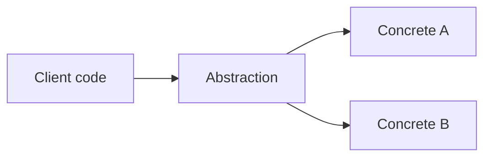
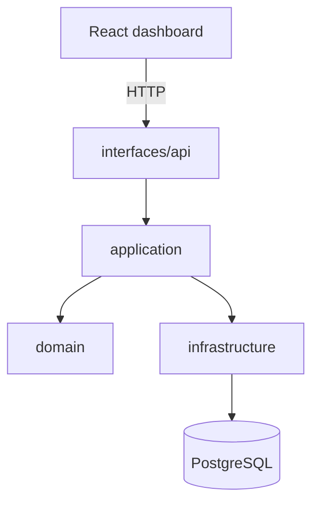

# Guide 01 — Welcome, design patterns & the project skeleton

**Lab:** [Requirements](../../phases/phase-01/requirements.md) · [Guided check](../../phases/phase-01/guided-check.md) · [Questions](../../phases/phase-01/questions.md)

## Chapter 1: "Welcome to PatternLab"

Congratulations — you are joining a course where you will grow a **smart greenhouse control system**: sensors and actuators, location-based zones, automation decisions, and an operator dashboard. The product story is about greenhouses. In the data model you will often say **location** and `location_id`—a site (bay, room, campus greenhouse) that owns zones. Same domain, clearer naming for APIs and tables.

Before you write irrigation logic, though, you need two things: a shared **vocabulary for design**, and a **runnable skeleton** so later phases do not fight setup debt.

---

## Learning Objectives

By the end of this guide and Phase 1, you will be able to:

- Describe the course goal and how guides relate to labs
- Explain what a design pattern is (and what it is not)
- Name the three GoF pattern families and place this course’s patterns on a roadmap
- Spot a recurring design problem in “before” code and name the family it belongs to
- Justify a layered backend layout and an “empty but running” first increment
- Point to health checks, migrations tooling, Scalar docs, and Tailwind as part of the skeleton

---

# Part A — Welcome to the course

## 1. What you are building

You build a **modular monolith**: one Python backend, PostgreSQL, and a React + TypeScript dashboard. Patterns are not bolted on as toys—they show up as real seams in that system.

| Layer    | Choices you will use                  |
| -------- | ------------------------------------- |
| Backend  | Python, FastAPI, SQLAlchemy, Alembic  |
| Database | PostgreSQL (often via Docker Compose) |
| API docs | Scalar (`/scalar`) + OpenAPI JSON     |
| Frontend | React, TypeScript, Vite, Tailwind CSS |

## 2. How the course works

1. **Read** the learning guide for the phase (this folder) — start with the **Theory** section.
2. **Follow along** (Part 2) — run problem demos and complete pattern scripts (stdlib Python in Guides 02–11).
3. **Implement** from the matching lab **requirements** under `docs/phases/` (use the guided check only to verify shapes).
4. **Reflect** — from Phase 2 onward, a short note in `docs/patterns/` helps you own the idea.

Phases introduce topics **one at a time**. Early phases may use thin APIs and grow the schema with Alembic migrations. Phase 12 hardens routes, adds WebSockets, and tightens the schema—that is the **required course completion** point. Optional Phases 13–14 add dashboard polish and proof-and-demo rigor if you want to go further.

Treat guides as **coaching**, lab **requirements** as the assignment, and the guided check as extra help—not a complete solution. If something in a guide conflicts with a lab detail, follow the requirements for outcomes—and ask your instructor when unsure.

**Important:** Teaching examples in later guides use _other_ domains (couriers, tickets, auctions, and so on) so you learn the pattern without copying a ready-made greenhouse solution. Each guide ends with **Bridge to your lab** (mapping table + one seam rule).

**Try this (Part A):** In one sentence each, write: (1) what the app does for an operator, (2) what _you_ will learn beyond “making it work.”

---

## Theory — Design patterns

### Intent

A **design pattern** is a named, reusable approach to a _recurring_ object-oriented design problem. It is not a library you install. It is not “more classes for the sake of classes.” It is a vocabulary for discussing design and a starting point for code that can change without collapsing.

As Refactoring Guru puts it, patterns are typical solutions to common problems in software design—templates you customize, not finished code you paste ([Design Patterns catalog](https://refactoring.guru/design-patterns)).

### The problem in plain language

You have written features that worked… until the next requirement arrived. Suddenly every screen knows how playlists shuffle, how tracks are priced, and how notifications are fired. Changing one vendor API means hunting through half the codebase.

That pain is not a personal failure. It is a **recurring design problem**. The symptom is always the same: behavior that should vary independently is trapped inside a single class, a single function, or a web of `if`/`elif` branches. Every new requirement edits the same hotspot. Tests become brittle because they must know every branch. Teammates collide in the same file.

Patterns give those problems **names** and **known shapes** so you can say “this smells like Strategy” instead of “this file is cursed.”

_Head First Design Patterns_ opens by showing how hard-wired behavior becomes brittle when requirements change (Chapter 1: “Welcome to Design Patterns”). The book’s famous ducks are one story; this course uses a tiny **playlist** service in Part 2 so the idea sticks without overlapping with the greenhouse lab.

### Analogy — a music player with glued-in behavior

Imagine a portable music player where “how to pick the next track” is hard-coded as a string mode: `"sequential"`, `"repeat_one"`, and so on. The player works until product asks for weighted shuffle, party mode, and “never play the same artist twice in a row.”

Each new mode is not a small tweak—it is surgery on the `next_track` method. The player’s **what** (hold a playlist, advance playback) is mixed with **how** (the algorithm for choosing the next index). Design patterns help you **separate stable collaboration from varying behavior**. In this analogy, the play-mode algorithms are the part that should vary; the player shell is the part that should stay stable. That separation is the heart of many behavioral patterns—and Strategy (Guide 06) makes it explicit.

### Solution structure — three GoF families

Classic catalogs group patterns into three families (Gang of Four):

| Family         | Rough question                                                        | Playlist-flavored example                                                                      |
| -------------- | --------------------------------------------------------------------- | ---------------------------------------------------------------------------------------------- |
| **Creational** | How do we create objects without hard-wiring constructors everywhere? | Different track importers; export kits; multi-step playlist config                             |
| **Structural** | How do we compose interfaces and responsibilities?                    | Legacy music APIs behind ports; a simple façade for “play now”; wrapping a stream with logging |
| **Behavioral** | How do objects collaborate and vary behavior?                         | Shuffle vs sequential play; playback lifecycle; undoable edits; broadcasting “now playing”     |

Patterns within a family share a **kind of variation**. Creational patterns answer “who constructs this, and with what defaults?” Structural patterns answer “how do we fit these pieces together without rewriting callers?” Behavioral patterns answer “how do these objects talk, and what can change at runtime?”

### How collaboration works (conceptual)

At runtime, well-patterned code usually looks like this:

1. A **client** (application service, handler, UI action) depends on an **abstraction** (interface, protocol, base class).
2. Concrete implementations are chosen once—via configuration, factory, or dependency injection—and then used polymorphically.
3. Extension means **adding a new implementation** and registering it, not editing every caller.



The playlist preview in Part 2 shows this with `PlayMode` strategies plugged into `PlaylistPlayer`.

### When to use patterns / when to skip

**Use a pattern when:**

- The same design problem appears in multiple places (or you can see it coming).
- A single change reliably forces edits across unrelated modules.
- You need a shared vocabulary with teammates or reviewers.

**Skip or simplify when:**

- The feature is small and unlikely to grow—YAGNI applies.
- A plain function or data structure solves the problem with less ceremony.
- You are pattern-matching by name instead of by pain (“we need Observer because we read Chapter 11”).

**Mindset (please steal this):**

- **Let the problem pull the pattern.** If a simpler design works, use it.
- **Name the trade-off.** Patterns add structure; structure has cost.
- **Compare siblings.** Factory Method vs Abstract Factory, Strategy vs State, Command vs a plain method call—those contrasts are half the learning.

### Patterns you will meet in this course

| Phase | Pattern / topic  |
| ----- | ---------------- |
| 2     | Factory Method   |
| 3     | Abstract Factory |
| 4     | Builder          |
| 5     | Adapter          |
| 6     | Strategy         |
| 7     | Facade           |
| 8     | State            |
| 9     | Decorator        |
| 10    | Command          |
| 11    | Observer         |

Phase 12 (required) covers production API, WebSocket, and schema hardening—still design-minded, but not a new GoF label. **Optional** Phases 13–14 add dashboard polish and tests/docs/demo for students who want enrichment beyond the required track.

---

## Theory — Layered architecture & the skeleton

### Intent

Phase 1 is not about business rules yet. It is about shipping a **vertical slice that does almost nothing**—but proves the stack: database connectivity, an API process, a frontend shell, and a place for domain code to grow. The organizing idea is **layered architecture**: separate concerns so each phase can add behavior without rewriting the foundation.

### The problem in plain language

You want to “start coding sensors.” Tempting. Then someone asks: Where does PostgreSQL live? How does React talk to the API? Where do migrations go? Why is every file importing everything?

Without a **skeleton**, every later phase fights setup debt. Domain logic ends up beside SQL beside HTTP beside React fetch calls. Patterns introduced in later guides have nowhere clean to live.

### Analogy — building a greenhouse before planting

You would not install irrigation timers and crop schedules before the greenhouse has walls, power, and a water main. The skeleton is the **empty structure**: foundations, utilities, doors that open, a control panel that lights up. Phase 1 proves the structure works—`GET /health` is the “power indicator.” Sensors, actuators, and automation arrive in later phases when the rooms exist.

### Solution structure — backend layers

Organize the backend so **policy** (what the system should do) does not depend on **mechanism** (how it is stored or exposed):

| Layer | Responsibility | Examples in this course |
| ----- | -------------- | ------------------------ |
| `domain/` | Business concepts, pattern interfaces, entities | `Sensor`, `ActuatorPort`, state objects |
| `application/` | Use cases, orchestration, DTOs | `SensorService`, mappers, command invoker |
| `infrastructure/` | Database, adapters, external I/O | SQLAlchemy models, repositories, vendor adapters |
| `interfaces/api/` | HTTP routes, request/response wiring | FastAPI routers, WebSocket endpoints |

**Dependency direction** flows inward: interface and application layers may call domain abstractions; domain should not import FastAPI or SQLAlchemy details. That rule is related to ideas you will meet with Adapter (ports) and Facade (simplified entry points)—Phase 1 establishes the folders so those patterns have a home.

### How collaboration works (Phase 1)



On day one the domain folder may be nearly empty. That is correct. The value is that **every later feature knows where it belongs**.

### Structural tooling choices (not patterns, but part of the skeleton)

| Tool | Role in Phase 1 |
| ---- | ---------------- |
| **Alembic** | Migration history from day one—even if the first revision is a baseline with no business tables |
| **Scalar** | Living API contract at `/scalar`; operators and frontend devs share one source of truth |
| **Tailwind CSS** | Consistent layout and spacing in the React shell before feature components arrive |
| **Docker Compose** | Repeatable PostgreSQL for every developer machine |

A health endpoint that reports API and database status is more valuable on day one than a half-finished domain model:

```python
# Illustrative shape — follow the lab for exact paths and response fields
@app.get("/health")
def health(db_ok: bool) -> dict:
    return {
        "status": "ok" if db_ok else "degraded",
        "database": "up" if db_ok else "down",
    }
```

### When to invest in the skeleton / when “just code” fails

| Approach                         | Feeling early  | Feeling at Phase 10 |
| -------------------------------- | -------------- | ------------------- |
| Dump everything in one `main.py` | Fast           | Painful             |
| Empty layers + health + UI shell | Slower day one | Room to grow        |

Phase 1 succeeds when you can start **DB → migrate → backend → frontend** from documented steps and see a healthy dashboard shell—not when you have premature sensor models.

---

# Part 2 — Follow along

> **Follow along:** Part 2 uses stdlib Python for the playlist preview and illustrative snippets for the skeleton. The Phase 1 lab uses the full stack—follow the [requirements](../../phases/phase-01/requirements.md) for exact paths and commands.

## 1. Design patterns in code — playlist sandbox (Strategy preview)

Behavior glued into one class with conditionals is the recurring pain patterns address—here especially **Strategy** (full deep-dive in Guide 06).

> **Follow along:** Save as `playlist_before.py`, run `python playlist_before.py`.

```python
"""Problem demo: play modes trapped in if/elif."""


class PlaylistPlayer:
    def __init__(self, mode: str = "sequential") -> None:
        self.mode = mode
        self.tracks: list[str] = []
        self.index = 0

    def next_track(self) -> str:
        if not self.tracks:
            raise RuntimeError("empty playlist")
        # Smell: every new mode edits this method
        if self.mode == "sequential":
            self.index = (self.index + 1) % len(self.tracks)
        elif self.mode == "repeat_one":
            pass
        else:
            raise ValueError(f"unknown mode: {self.mode}")
        return self.tracks[self.index]


if __name__ == "__main__":
    p = PlaylistPlayer("sequential")
    p.tracks = ["A", "B", "C"]
    print(p.next_track(), p.next_track())
    try:
        PlaylistPlayer("weighted").next_track()
    except ValueError as exc:
        print(f"PAIN: {exc}")
```

**Expected output (problem):**

```text
B C
PAIN: unknown mode: weighted
```

## 2. Pattern in practice

The runnable example below applies the theory from above: extract varying play-mode logic behind a `PlayMode` interface and inject it into `PlaylistPlayer`.

### Complete mini-solution (runnable)

> **Follow along:** Save as `playlist_strategy_preview.py`, run `python playlist_strategy_preview.py`.

```python
"""Strategy preview — interchangeable play modes (stdlib only)."""

from abc import ABC, abstractmethod


class PlayMode(ABC):
    @abstractmethod
    def choose_next(self, tracks: list[str], index: int) -> int:
        ...


class SequentialMode(PlayMode):
    def choose_next(self, tracks: list[str], index: int) -> int:
        return (index + 1) % len(tracks)


class RepeatOneMode(PlayMode):
    def choose_next(self, tracks: list[str], index: int) -> int:
        return index


class PlaylistPlayer:
    def __init__(self, mode: PlayMode) -> None:
        self.mode = mode
        self.tracks: list[str] = []
        self.index = 0

    def set_mode(self, mode: PlayMode) -> None:
        self.mode = mode

    def next_track(self) -> str:
        if not self.tracks:
            raise RuntimeError("empty playlist")
        self.index = self.mode.choose_next(self.tracks, self.index)
        return self.tracks[self.index]


if __name__ == "__main__":
    player = PlaylistPlayer(SequentialMode())
    player.tracks = ["A", "B", "C"]
    print("seq:", player.next_track(), player.next_track())
    player.set_mode(RepeatOneMode())
    print("rep:", player.next_track(), player.next_track())
```

**Expected output (solution):**

```text
seq: B C
rep: C C
```

You did not install a “patterns package.” You named a variation point and gave it an interface.

**Try this:** Pick one past project pain of yours. Which family (creational / structural / behavioral) sounds closest? You do not need the exact pattern name yet.

---

## 3. Skeleton — what “empty but running” looks like

Phase 1 asks you to:

- Run PostgreSQL and prove migration tooling (Alembic) with a baseline revision—**no business tables yet**
- Expose `GET /health` with a database status signal
- Serve API docs via **Scalar** (not as a substitute for thinking—as a living contract)
- Boot a React dashboard with layout, placeholder sections, and Tailwind
- Document how to start DB → migrate → backend → frontend

## 4. Watch out for these traps

- Building full domain models “because we will need them” in Phase 1
- Skipping migrations tooling and creating tables by hand later
- Leaving CORS/proxy broken and blaming patterns when the UI cannot reach `/health`
- Treating the skeleton as optional documentation instead of a runnable system
- Copying teaching-example class names from later guides into the greenhouse project

## 5. Try this (skeleton)

Sketch (on paper) which layer would own: (a) irrigation decision logic, (b) SQL insert, (c) `POST /api/...` route. No code required.

---

## Key Terms

| Term                          | Definition                                                             |
| ----------------------------- | ---------------------------------------------------------------------- |
| **Design pattern**            | A named, reusable approach to a recurring OO design problem            |
| **GoF**                       | “Gang of Four” — authors of the classic design patterns catalog        |
| **Creational pattern**        | Pattern focused on flexible object creation                            |
| **Structural pattern**        | Pattern focused on composing interfaces and responsibilities           |
| **Behavioral pattern**        | Pattern focused on collaboration and varying behavior                  |
| **Modular monolith**          | One deployable app with clear internal module boundaries               |
| **Layered architecture**      | Separating domain, application, infrastructure, and interface concerns |
| **Skeleton / vertical slice** | Minimal runnable path through the whole stack                          |
| **Alembic**                   | Migration tool used with SQLAlchemy in this course                     |

---

## Reading Assignments

**Required:**

- _Head First Design Patterns_ — Chapter 1: “Welcome to Design Patterns”
- Phase lab: [Requirements](../../phases/phase-01/requirements.md) · [Guided check](../../phases/phase-01/guided-check.md) · [Questions](../../phases/phase-01/questions.md)

**Further reading:**

- [Refactoring Guru — Design Patterns](https://refactoring.guru/design-patterns)
- [Refactoring Guru — Strategy](https://refactoring.guru/design-patterns/strategy) (preview of the playlist-style idea)
- FastAPI, Alembic, Vite, and Tailwind docs as needed for tooling—not for patterns yet

---

## Bridge to your lab

This guide’s playlist snippets are **not** part of Phase 1. The playlist is a **Strategy** preview; the lab is an empty-but-running stack.

| Teaching (this guide) | Your lab (greenhouse) |
| --------------------- | --------------------- |
| Playlist / `next_track` modes | Not implemented in Phase 1 |
| “Empty but running” layers | `backend/` + `frontend/` + Compose PostgreSQL |
| Health as a contract | `GET /health` + Scalar |
| Migration tooling without business tables | Alembic baseline only |

**Do / don’t:** **Do** create the layered folders so later patterns have a home. **Don’t** copy the playlist types into the greenhouse codebase.

Follow the [requirements](../../phases/phase-01/requirements.md) first; use the [guided check](../../phases/phase-01/guided-check.md) · [Questions](../../phases/phase-01/questions.md) for tooling snippets and expected JSON.

---

## Summary

- The course product is a smart greenhouse / location system; guides teach patterns with separate domains so labs stay yours to solve.
- A design pattern is a named shape for a recurring problem—not a library and not complexity for its own sake.
- Creational, structural, and behavioral families organize the catalog you will walk through in Phases 2–11.
- Phase 1 succeeds when the stack runs end-to-end with almost no business logic yet.

**Next:** [Guide 02 — Factory Method](./02-factory-method.md)
