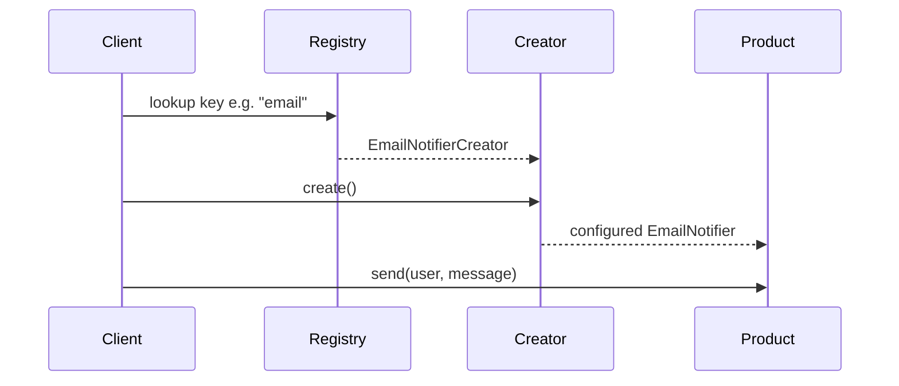

# Guide 02 — Factory Method

**Lab:** [Requirements](../../phases/phase-02/requirements.md) · [Guided check](../../phases/phase-02/guided-check.md) · [Questions](../../phases/phase-02/questions.md)

## Chapter 2: "Dispatch at SwiftParcel"

You have joined **SwiftParcel**, a courier startup that notifies customers when a parcel moves: picked up, out for delivery, delivered. Marketing wants **email**, **SMS**, and **push** notifications—each with different defaults (subject lines, character limits, deep links).

The first engineer wired constructors directly into the handler. It worked for two channels. The third channel broke three call sites. Your job is to understand **Factory Method**: let specialized creators own “how we build this kind of notifier,” while callers only ask for a product.

Teaching domain here is courier notifications—not your greenhouse sensors. The shape transfers; the class names do not.

---

## Learning Objectives

By the end of this guide you will be able to:

- State the intent of Factory Method in plain language
- Explain why callers should not scatter concrete constructors across the app
- Recognize creators, products, and the factory method in code
- Contrast Factory Method with a giant `if type == ...` helper and with Abstract Factory
- Map the idea (not the courier classes) onto your Phase 2 lab

---

## Theory

### Intent

**Factory Method** defines an interface for creating an object, but lets subclasses (or specialized creators) decide which concrete class to instantiate and how to configure it. The Gang of Four intent emphasizes deferring instantiation to subclasses; in practice you often implement creators as separate classes with a shared `create()` method rather than literal inheritance.

Refactoring Guru paraphrases this as: provide an interface for creating objects in a superclass, while allowing subclasses to alter the type of objects that will be created ([Factory Method](https://refactoring.guru/design-patterns/factory-method)). *Head First Design Patterns* covers Factory Method in Chapter 4 (“the Factory Pattern”), alongside Abstract Factory.

### The problem in plain language

Object creation sounds trivial until it is not. Each new product type brings constructor arguments, defaults, environment-specific configuration, and validation rules. When every caller constructs objects with `new ConcreteType(...)` or scattered `if channel == ...` branches, three problems appear:

1. **Coupling** — callers depend on concrete classes and their configuration details.
2. **Duplication** — the same defaults appear in multiple services, APIs, and tests.
3. **Fragile extension** — adding a variant means editing every hotspot instead of adding one class.

The smell is not “we used `new`.” The smell is “creation is not an extension point.”

### Analogy — a dispatch desk

Picture a courier company’s notification dispatch desk. Callers do not walk to the email room, SMS gateway, and push console themselves—they say “notify this customer.” Behind the desk, **channel specialists** know the defaults: email subject prefixes, SMS sender IDs, push app identifiers.

The desk (application service) depends on “something that can produce a notifier,” not on every channel’s wiring. When marketing adds Slack, you hire a Slack specialist (new creator) and add them to the roster (registry). The desk’s script for handling a request stays the same.

### Solution structure

| Role | Responsibility | In this course’s Phase 2 lab |
| ---- | -------------- | ---------------------------- |
| **Product** | Common interface clients use after creation | `Sensor` (or shared device interface) |
| **Concrete product** | Specific implementation | `MoistureSensor`, `LightSensor`, … |
| **Creator** | Declares the factory method | `SensorCreator` with `create()` |
| **Concrete creator** | Knows defaults for one product | `MoistureSensorCreator`, … |
| **Client** | Uses product interface; asks creator to build | `SensorService`, API handler |

Dependency rule: the client depends on the **creator abstraction** and the **product abstraction**, not on concrete constructors.

### How collaboration works



1. Client receives a type key (or already holds a creator reference).
2. Client calls `creator.create()` — the **factory method**.
3. Creator returns a fully configured product.
4. Client uses only the product interface from that point forward.

### When to use / when to skip

**Use Factory Method when:**

- You create objects whose concrete type or configuration varies, but usage after creation is uniform.
- New variants appear regularly (new sensor types, new notification channels).
- You want defaults colocated with the type they belong to.

**Skip or simplify when:**

- There is only one implementation and no foreseeable variants—a plain constructor is fine.
- A single registry function with two branches is still readable (do not over-pattern early).
- You need a **family** of related products to stay consistent—consider Abstract Factory (Guide 03) instead.

### Related patterns

- **Abstract Factory** — Factory Method creates **one** product at a time; Abstract Factory creates a **kit** of related products that must match (PDF cover + PDF TOC + PDF body). Factory Method often appears *inside* Abstract Factory implementations.
- **Simple Factory** — one function with `if type` is not polymorphic extension; it centralizes pain instead of distributing it. Better than scattered constructors, weaker than real creators.
- **Builder** — when the object is one complex aggregate built in steps with validation at the end, Builder fits better than a single `create()` (Guide 04).

---

# Part 2 — Follow along

> **Follow along:** Use any folder and a terminal. You only need stdlib Python (`python your_file.py`). Run the problem demo first, then build the solution in steps, then run the complete script and match the expected output.

## 1. The sticky problem

Operators need to send notifications of different kinds. Defaults differ. If every handler constructs notifiers with raw constructors, adding a new channel means editing the same hotspot over and over.

### 1.1 Smell: the caller owns every constructor

```python
# Smell: this function knows EVERY concrete type and EVERY default
def notify_customer(channel: str, user_id: str, message: str) -> None:
    if channel == "email":
        notifier = EmailNotifier(  # defaults live in the caller
            from_addr="noreply@swiftparcel.example",
            subject_prefix="[SwiftParcel]",
        )
    elif channel == "sms":
        notifier = SmsNotifier(max_length=160, sender_id="SWIFT")
    else:
        raise ValueError(channel)  # every new channel edits THIS function
    notifier.send(user_id, message)
```

**Root cause:** Creation is not an extension point. The caller is coupled to products *and* their configuration.

### 1.2 Runnable problem demo

> **Follow along:** Save as `swiftparcel_before.py`, then run `python swiftparcel_before.py`.

```python
"""Problem demo: creation logic trapped inside the caller."""


class EmailNotifier:
    def __init__(self, from_addr: str, subject_prefix: str) -> None:
        self.from_addr = from_addr
        self.subject_prefix = subject_prefix

    def send(self, user_id: str, message: str) -> None:
        print(f"EMAIL to={user_id} from={self.from_addr} "
              f"subject={self.subject_prefix} {message[:40]}")


class SmsNotifier:
    def __init__(self, max_length: int, sender_id: str) -> None:
        self.max_length = max_length
        self.sender_id = sender_id

    def send(self, user_id: str, message: str) -> None:
        print(f"SMS to={user_id} sender={self.sender_id} "
              f"body={message[: self.max_length]}")


def notify_customer(channel: str, user_id: str, message: str) -> None:
    # Hotspot: add "push" here AND teach every other caller the same if/elif
    if channel == "email":
        notifier = EmailNotifier(
            from_addr="noreply@swiftparcel.example",
            subject_prefix="[SwiftParcel]",
        )
    elif channel == "sms":
        notifier = SmsNotifier(max_length=160, sender_id="SWIFT")
    else:
        raise ValueError(f"unsupported channel: {channel}")
    notifier.send(user_id, message)


if __name__ == "__main__":
    notify_customer("email", "u-1", "Parcel out for delivery")
    notify_customer("sms", "u-1", "Parcel out for delivery")
    try:
        notify_customer("push", "u-1", "Parcel out for delivery")
    except ValueError as exc:
        print(f"PAIN: {exc}")  # push exists in the product roadmap, not in code
```

**Expected output (problem):**

```text
EMAIL to=u-1 from=noreply@swiftparcel.example subject=[SwiftParcel] Parcel out for delivery
SMS to=u-1 sender=SWIFT body=Parcel out for delivery
PAIN: unsupported channel: push
```

### What goes wrong when requirements change

Marketing adds push with `app_id` and `priority`. You must edit `notify_customer` (and every duplicate of it). Defaults drift between call sites. Tests must mock constructors instead of swapping a creator.

---

## 2. Pattern in practice

The runnable SwiftParcel example below shows the theory in action: specialized creators own channel defaults; `notify_customer` only looks up a creator and calls `create()`. Adding push required a new creator—not a new `elif` full of constructor knobs.

---

## 3. Building the solution (step by step)

These pieces are explanatory. The full runnable file is in section 4.

### Step A — Product interface

Clients should depend on “something that can `send`,” not on email vs SMS details.

```python
from abc import ABC, abstractmethod


class Notifier(ABC):
    @abstractmethod
    def send(self, user_id: str, message: str) -> None:
        """Product interface: one verb all channels share."""
        ...
```

### Step B — One concrete product

Defaults still exist—but they will move *out* of the caller next.

```python
class EmailNotifier(Notifier):
    def __init__(self, from_addr: str, subject_prefix: str) -> None:
        self.from_addr = from_addr
        self.subject_prefix = subject_prefix

    def send(self, user_id: str, message: str) -> None:
        print(f"EMAIL to={user_id} from={self.from_addr} "
              f"subject={self.subject_prefix} {message[:40]}")
```

### Step C — Creator + factory method

The **factory method** is `create()`. Each concrete creator owns defaults for one product.

```python
class NotifierCreator(ABC):
    @abstractmethod
    def create(self) -> Notifier:
        """Factory method: subclasses choose type + defaults."""
        ...


class EmailNotifierCreator(NotifierCreator):
    def create(self) -> Notifier:
        # Defaults live NEXT to the product that needs them
        return EmailNotifier(
            from_addr="noreply@swiftparcel.example",
            subject_prefix="[SwiftParcel]",
        )
```

### Step D — Thin caller + registry

The application looks up a creator by key, then asks it to create. No constructors in the handler.

```python
CREATORS: dict[str, NotifierCreator] = {
    "email": EmailNotifierCreator(),
    "sms": SmsNotifierCreator(),  # defined like EmailNotifierCreator
}


def notify_customer(channel: str, user_id: str, message: str) -> None:
    creator = CREATORS.get(channel)
    if creator is None:
        raise ValueError(f"unsupported channel: {channel}")
    notifier = creator.create()  # polymorphism: which product is the creator's job
    notifier.send(user_id, message)
```

**Why this helps:** New channel = new product class + new creator + one registry line. The body of `notify_customer` stays stable.

---

## 4. Complete worked solution (runnable)

Same code as the steps above, assembled so you can run it end-to-end. Includes **push** via Factory Method—without rewriting the caller body.

> **Follow along:** Save as `swiftparcel_factory_method.py`, run `python swiftparcel_factory_method.py`, and match the expected output.

```python
"""Factory Method demo — SwiftParcel notifiers (stdlib only)."""

from abc import ABC, abstractmethod


# --- Product hierarchy ---

class Notifier(ABC):
    @abstractmethod
    def send(self, user_id: str, message: str) -> None:
        ...


class EmailNotifier(Notifier):
    def __init__(self, from_addr: str, subject_prefix: str) -> None:
        self.from_addr = from_addr
        self.subject_prefix = subject_prefix

    def send(self, user_id: str, message: str) -> None:
        print(f"EMAIL to={user_id} from={self.from_addr} "
              f"subject={self.subject_prefix} {message[:40]}")


class SmsNotifier(Notifier):
    def __init__(self, max_length: int, sender_id: str) -> None:
        self.max_length = max_length
        self.sender_id = sender_id

    def send(self, user_id: str, message: str) -> None:
        print(f"SMS to={user_id} sender={self.sender_id} "
              f"body={message[: self.max_length]}")


class PushNotifier(Notifier):
    def __init__(self, app_id: str, priority: str) -> None:
        self.app_id = app_id
        self.priority = priority

    def send(self, user_id: str, message: str) -> None:
        print(f"PUSH to={user_id} app={self.app_id} "
              f"priority={self.priority} {message[:40]}")


# --- Creator hierarchy (factory methods) ---

class NotifierCreator(ABC):
    @abstractmethod
    def create(self) -> Notifier:
        ...


class EmailNotifierCreator(NotifierCreator):
    def create(self) -> Notifier:
        return EmailNotifier(
            from_addr="noreply@swiftparcel.example",
            subject_prefix="[SwiftParcel]",
        )


class SmsNotifierCreator(NotifierCreator):
    def create(self) -> Notifier:
        return SmsNotifier(max_length=160, sender_id="SWIFT")


class PushNotifierCreator(NotifierCreator):
    def create(self) -> Notifier:
        # Extension: new channel without editing notify_customer
        return PushNotifier(app_id="swiftparcel", priority="high")


CREATORS: dict[str, NotifierCreator] = {
    "email": EmailNotifierCreator(),
    "sms": SmsNotifierCreator(),
    "push": PushNotifierCreator(),
}


def notify_customer(channel: str, user_id: str, message: str) -> None:
    creator = CREATORS.get(channel)
    if creator is None:
        raise ValueError(f"unsupported channel: {channel}")
    notifier = creator.create()
    notifier.send(user_id, message)


if __name__ == "__main__":
    notify_customer("email", "u-1", "Parcel out for delivery")
    notify_customer("sms", "u-1", "Parcel out for delivery")
    notify_customer("push", "u-1", "Parcel out for delivery")  # works now
```

**Expected output (solution):**

```text
EMAIL to=u-1 from=noreply@swiftparcel.example subject=[SwiftParcel] Parcel out for delivery
SMS to=u-1 sender=SWIFT body=Parcel out for delivery
PUSH to=u-1 app=swiftparcel priority=high Parcel out for delivery
```

Compare with the problem demo: push no longer raises—and `notify_customer` did not grow a new `elif` full of constructor knobs.

---

## 5. Compare & contrast

| | Factory Method | Abstract Factory (Guide 03) |
|--|----------------|-----------------------------|
| Focus | One product family member at a time | A **kit** of related products that must match |
| Example | “Make an SMS notifier” | “Make a whole PDF export kit: report + cover + TOC” |
| Extension | New creator for a new product | New factory for a new product line |

| Approach | Smell |
|----------|--------|
| Polymorphic creators | Extension by adding a class |
| One `create_notifier(type)` with a huge `if` | Extension by editing a shared function (weaker) |

---

## 6. Watch out for these traps

- A giant `if type == ...` in one “factory” function with no extension story
- Putting HTTP or SQL inside creators
- Confusing “static helper that returns objects” with a real creation polymorphism story
- Copying SwiftParcel class names into the greenhouse lab

---

## 7. Try this

In `swiftparcel_factory_method.py`, add a `SlackNotifier` + `SlackNotifierCreator`, register `"slack"`, and call `notify_customer("slack", ...)`. Re-run. The body of `notify_customer` should stay unchanged.

---

## Key Terms

| Term | Definition |
|------|------------|
| **Factory Method** | Creation pattern: creator subclasses decide the concrete product |
| **Product** | The interface clients depend on after creation |
| **Creator** | Type that declares the factory method |
| **Concrete creator** | Implements the factory method for one product |
| **Extension point** | Place you add behavior without rewriting callers |

---

## Reading Assignments

**Required:**

- *Head First Design Patterns* — Chapter 4 (Factory Method portions)
- [Refactoring Guru — Factory Method](https://refactoring.guru/design-patterns/factory-method)
- Lab: [Requirements](../../phases/phase-02/requirements.md) · [Guided check](../../phases/phase-02/guided-check.md) · [Questions](../../phases/phase-02/questions.md)

**Further reading:**

- [Refactoring Guru — Factory Method (Python)](https://refactoring.guru/design-patterns/factory-method/python/example)

---

## Bridge to your lab

In Phase 2 you apply the same idea to **sensor creation**: specialized creators own type-specific defaults; the API accepts a type key and persists the result.

| Teaching (this guide) | Your lab (greenhouse) |
| --------------------- | --------------------- |
| `Notifier` product | Sensor `Device` (moisture, light, …) |
| `NotifierCreator.create()` | `SensorCreator.create_sensor()` (name may vary; same role) |
| Registry keys `email` / `sms` / `push` | Type keys `moisture` / `light` (lab list) |
| Courier notification payload | Device defaults + persist via repository |

**Do / don’t:** **Do** add a new sensor type by adding a creator + registry entry. **Don’t** paste `EmailNotifier` into the lab, and don’t put `if type ==` in the HTTP router.

Do not reuse the courier types above—follow the lab’s domain model and routes.

---

## Summary

- Scattering constructors couples every caller to every concrete type and its defaults.
- Factory Method moves creation into specialized creators behind a shared product interface.
- New variants should mean new creators (plus registration), not rewrites of application services.

**Next:** [Guide 03 — Abstract Factory](./03-abstract-factory.md)
