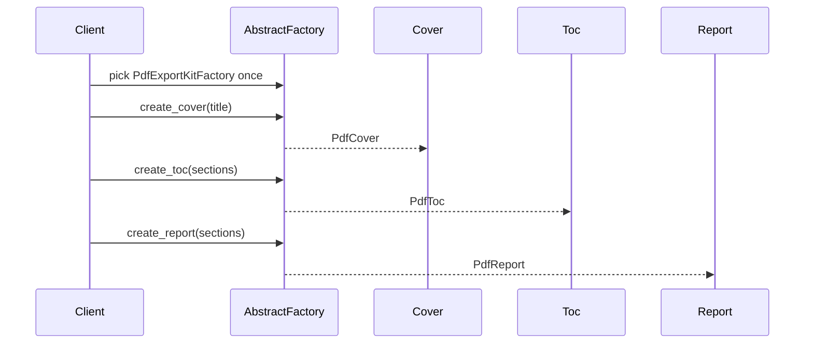

# Guide 03 — Abstract Factory

**Lab:** [Requirements](../../phases/phase-03/requirements.md) · [Guided check](../../phases/phase-03/guided-check.md) · [Questions](../../phases/phase-03/questions.md)

## Chapter 3: "Export night at PageCraft"

**PageCraft** sells analytics to publishers. Customers export a monthly package: a **cover page**, a **table of contents**, and the **report body**. Formats are either **PDF** or **HTML**. Mixing a PDF cover with an HTML body looks broken and fails compliance checks.

Last quarter someone wrote `if format == "pdf"` in five places and accidentally shipped an HTML TOC inside a PDF zip. Your mission is **Abstract Factory**: one factory produces a _consistent kit_ of related products.

Teaching domain here is export kits—not your greenhouse device families. The shape transfers; the class names do not.

---

## Learning Objectives

By the end of this guide you will be able to:

- State the intent of Abstract Factory in plain language
- Explain when a _family_ of products must stay consistent
- Distinguish Abstract Factory from Factory Method
- Sketch factories, abstract products, and concrete families in code
- Bridge the idea to Phase 3 without copying PageCraft types into the lab

---

## Theory

### Intent

**Abstract Factory** provides an interface for creating **families** of related or dependent objects without specifying their concrete classes. The client works with abstract products; a concrete factory guarantees every product in a kit belongs to the same family.

*Head First Design Patterns* presents Abstract Factory in Chapter 4 after Factory Method—emphasizing products that must work together. Refactoring Guru: create families of related objects without specifying concrete classes ([Abstract Factory](https://refactoring.guru/design-patterns/abstract-factory)).

### The problem in plain language

Sometimes the hard part is not creating one object—it is ensuring **several objects stay consistent**. A PDF export needs a PDF cover, PDF table of contents, and PDF body. An HTML export needs the HTML variants. If each piece is chosen with its own `if format == ...`, nothing stops an HTML cover from riding next to a PDF TOC. The bug is silent until compliance—or a customer—rejects the package.

Independent conditionals also multiply: a third format means editing every selection point. Copy-paste “reuse” of one family’s class into another family’s path is tempting and dangerous.

### Analogy — interior design suites

Furnishing a living room from a catalog, you pick a **style suite**: Scandinavian, industrial, or coastal. The sofa, lamp, and rug are designed to match. You do not buy a Scandinavian sofa, an industrial lamp, and a coastal rug because each was “on sale” in isolation—the room looks wrong and the materials clash.

An Abstract Factory is the **showroom for one style**. You walk in, say “Scandinavian,” and every piece you order from that factory coordinates. Switching styles means switching factories—not re-deciding each item with separate `if` branches.

### Solution structure

| Role | Responsibility | In Phase 3 lab |
| ---- | -------------- | -------------- |
| **Abstract product** | Interface for each kind in the family | Sensor port, actuator port (conceptually) |
| **Concrete product** | Family-specific implementation | Simulation sensor vs edge sensor |
| **Abstract factory** | Methods to create each product in the kit | `DeviceFamilyFactory` |
| **Concrete factory** | One coherent family | `SimulationDeviceFactory`, `EdgeHardwareFactory` |
| **Client** | Uses abstract products only; picks factory once | `DeviceFamilyService` |

Factory Method often appears **inside** concrete factories: `create_sensor()` may delegate to a `SensorCreator`.

### How collaboration works



The client never names `PdfCover` directly—it only knows `Cover`. The factory choice at the start **commits** the whole session to one family.

### When to use / when to skip

**Use Abstract Factory when:**

- Products naturally group into **families** that must not be mixed (simulation vs hardware, PDF vs HTML, Windows vs macOS widgets).
- The application configures the environment once and then creates many related objects.
- You want compile-time or startup-time guarantees about consistency.

**Skip or simplify when:**

- You only ever create **one** product type per request—Factory Method is enough.
- Families are not a real constraint (mixing implementations is valid).
- Two families and three products already feel like overkill—a typed configuration object may suffice.

### Related patterns

- **Factory Method** — creates one product; Abstract Factory orchestrates **multiple** factory methods for a kit. Abstract Factory is often “Factory Method at suite scale.”
- **Builder** — builds **one** complex object stepwise; Abstract Factory produces **several** related objects. They can coexist (Builder for a location config, Abstract Factory for device families).
- **Prototype** — clone existing instances instead of factory-per-family; useful when construction is expensive and families are instance-based.

---

# Part 2 — Follow along

> **Follow along:** Use any folder and a terminal. You only need stdlib Python (`python your_file.py`). Run the problem demo first, then build the solution in steps, then run the complete script and match the expected output.

## 1. The sticky problem

Exporters need a matching kit: cover + TOC + report, all PDF or all HTML. If each piece is chosen with its own `if`, nothing stops an HTML cover from riding next to a PDF TOC.

### 1.1 Smell: each piece chosen independently

```python
# Smell: related products selected with independent conditionals
def export_package(fmt: str, title: str, sections: list[str]) -> dict:
    if fmt == "pdf":
        cover = PdfCover(title)
        toc = PdfToc(sections)
        body = PdfReport(sections)
    elif fmt == "html":
        cover = HtmlCover(title)
        # Bug waiting to happen: someone reuses PdfToc "because it already works"
        toc = PdfToc(sections)
        body = HtmlReport(sections)
    else:
        raise ValueError(fmt)
    return {"cover": cover.render(), "toc": toc.render(), "body": body.render()}
```

**Root cause:** Related products are selected with independent conditionals. Nothing enforces “all PDF” or “all HTML.”

### 1.2 Runnable problem demo

> **Follow along:** Save as `pagecraft_before.py`, then run `python pagecraft_before.py`.

```python
"""Problem demo: mismatched export kit — HTML cover + PDF TOC."""


class PdfCover:
    def __init__(self, title: str) -> None:
        self.title = title

    def render(self) -> str:
        return f"[PDF cover] {self.title}"


class PdfToc:
    def __init__(self, sections: list[str]) -> None:
        self.sections = sections

    def render(self) -> str:
        return "[PDF TOC] " + " | ".join(self.sections)


class HtmlCover:
    def __init__(self, title: str) -> None:
        self.title = title

    def render(self) -> str:
        return f"<h1>{self.title}</h1>"


class HtmlReport:
    def __init__(self, sections: list[str]) -> None:
        self.sections = sections

    def render(self) -> str:
        return "".join(f"<p>{s}</p>" for s in self.sections)


def export_package_buggy(title: str, sections: list[str]) -> None:
    # Accidental mix: HTML cover + PDF TOC + HTML body
    cover = HtmlCover(title)
    toc = PdfToc(sections)  # wrong family — still "works"
    body = HtmlReport(sections)
    print(cover.render())
    print(toc.render())
    print(body.render())
    print("PAIN: mixed HTML cover with PDF TOC — compliance will reject this kit")


if __name__ == "__main__":
    export_package_buggy(
        "March Analytics",
        ["Traffic", "Revenue", "Retention"],
    )
```

**Expected output (problem):**

```text
<h1>March Analytics</h1>
[PDF TOC] Traffic | Revenue | Retention
<p>Traffic</p><p>Revenue</p><p>Retention</p>
PAIN: mixed HTML cover with PDF TOC — compliance will reject this kit
```

### What goes wrong when requirements change

A third format (Markdown) means yet more independent branches. Copy-paste “reuse” of one family’s TOC into another family’s path is easy and silent. Tests must assert every combination instead of trusting one factory.

---

## 2. Pattern in practice

The PageCraft runnable example below fixes the mixed-kit bug: pick one `ExportKitFactory` (PDF or HTML), then ask it for cover, TOC, and report. Every product comes from the same family by construction.

---

## 3. Building the solution (step by step)

These pieces are explanatory. The full runnable file is in section 4.

### Step A — Abstract products

Clients should depend on “something that can `render`,” not on PDF vs HTML markup.

```python
from abc import ABC, abstractmethod


class Cover(ABC):
    @abstractmethod
    def render(self) -> str:
        """Product interface shared by every cover in every family."""
        ...


class Toc(ABC):
    @abstractmethod
    def render(self) -> str:
        ...


class Report(ABC):
    @abstractmethod
    def render(self) -> str:
        ...
```

### Step B — One concrete family (PDF)

Products in a family share a visual/format language. Keep them together.

```python
class PdfCover(Cover):
    def __init__(self, title: str) -> None:
        self.title = title

    def render(self) -> str:
        return f"[PDF cover] {self.title}"


class PdfToc(Toc):
    def __init__(self, sections: list[str]) -> None:
        self.sections = sections

    def render(self) -> str:
        return "[PDF TOC] " + " | ".join(self.sections)


class PdfReport(Report):
    def __init__(self, sections: list[str]) -> None:
        self.sections = sections

    def render(self) -> str:
        return "[PDF body] " + " / ".join(self.sections)
```

### Step C — Abstract factory + one concrete factory

Creation methods travel together. A PDF factory never returns an HTML TOC.

```python
class ExportKitFactory(ABC):
    @abstractmethod
    def create_cover(self, title: str) -> Cover:
        ...

    @abstractmethod
    def create_toc(self, sections: list[str]) -> Toc:
        ...

    @abstractmethod
    def create_report(self, sections: list[str]) -> Report:
        ...


class PdfExportKitFactory(ExportKitFactory):
    def create_cover(self, title: str) -> Cover:
        return PdfCover(title)

    def create_toc(self, sections: list[str]) -> Toc:
        return PdfToc(sections)

    def create_report(self, sections: list[str]) -> Report:
        return PdfReport(sections)
```

### Step D — Thin client that takes a factory

The exporter never mixes families: one factory for the whole kit.

```python
def export_package(factory: ExportKitFactory, title: str, sections: list[str]) -> None:
    cover = factory.create_cover(title)
    toc = factory.create_toc(sections)
    body = factory.create_report(sections)
    print(cover.render())
    print(toc.render())
    print(body.render())
```

**Why this helps:** New format = new product trio + new concrete factory. The body of `export_package` stays stable.

---

## 4. Complete worked solution (runnable)

Same code as the steps above, assembled so you can run it end-to-end. Demonstrates **PDF** and **HTML** kits—each consistent.

> **Follow along:** Save as `pagecraft_abstract_factory.py`, run `python pagecraft_abstract_factory.py`, and match the expected output.

```python
"""Abstract Factory demo — PageCraft export kits (stdlib only)."""

from abc import ABC, abstractmethod


# --- Abstract products ---

class Cover(ABC):
    @abstractmethod
    def render(self) -> str:
        ...


class Toc(ABC):
    @abstractmethod
    def render(self) -> str:
        ...


class Report(ABC):
    @abstractmethod
    def render(self) -> str:
        ...


# --- PDF family ---

class PdfCover(Cover):
    def __init__(self, title: str) -> None:
        self.title = title

    def render(self) -> str:
        return f"[PDF cover] {self.title}"


class PdfToc(Toc):
    def __init__(self, sections: list[str]) -> None:
        self.sections = sections

    def render(self) -> str:
        return "[PDF TOC] " + " | ".join(self.sections)


class PdfReport(Report):
    def __init__(self, sections: list[str]) -> None:
        self.sections = sections

    def render(self) -> str:
        return "[PDF body] " + " / ".join(self.sections)


# --- HTML family ---

class HtmlCover(Cover):
    def __init__(self, title: str) -> None:
        self.title = title

    def render(self) -> str:
        return f"<h1>{self.title}</h1>"


class HtmlToc(Toc):
    def __init__(self, sections: list[str]) -> None:
        self.sections = sections

    def render(self) -> str:
        items = "".join(f"<li>{s}</li>" for s in self.sections)
        return f"<ul>{items}</ul>"


class HtmlReport(Report):
    def __init__(self, sections: list[str]) -> None:
        self.sections = sections

    def render(self) -> str:
        return "".join(f"<p>{s}</p>" for s in self.sections)


# --- Abstract factory + concrete factories ---

class ExportKitFactory(ABC):
    @abstractmethod
    def create_cover(self, title: str) -> Cover:
        ...

    @abstractmethod
    def create_toc(self, sections: list[str]) -> Toc:
        ...

    @abstractmethod
    def create_report(self, sections: list[str]) -> Report:
        ...


class PdfExportKitFactory(ExportKitFactory):
    def create_cover(self, title: str) -> Cover:
        return PdfCover(title)

    def create_toc(self, sections: list[str]) -> Toc:
        return PdfToc(sections)

    def create_report(self, sections: list[str]) -> Report:
        return PdfReport(sections)


class HtmlExportKitFactory(ExportKitFactory):
    def create_cover(self, title: str) -> Cover:
        return HtmlCover(title)

    def create_toc(self, sections: list[str]) -> Toc:
        return HtmlToc(sections)

    def create_report(self, sections: list[str]) -> Report:
        return HtmlReport(sections)


FACTORIES: dict[str, ExportKitFactory] = {
    "pdf": PdfExportKitFactory(),
    "html": HtmlExportKitFactory(),
}


def export_package(factory: ExportKitFactory, title: str, sections: list[str]) -> None:
    # Client never mixes families: one factory for the whole kit
    cover = factory.create_cover(title)
    toc = factory.create_toc(sections)
    body = factory.create_report(sections)
    print(cover.render())
    print(toc.render())
    print(body.render())


if __name__ == "__main__":
    sections = ["Traffic", "Revenue", "Retention"]
    print("--- PDF kit ---")
    export_package(FACTORIES["pdf"], "March Analytics", sections)
    print("--- HTML kit ---")
    export_package(FACTORIES["html"], "March Analytics", sections)
```

**Expected output (solution):**

```text
--- PDF kit ---
[PDF cover] March Analytics
[PDF TOC] Traffic | Revenue | Retention
[PDF body] Traffic / Revenue / Retention
--- HTML kit ---
<h1>March Analytics</h1>
<ul><li>Traffic</li><li>Revenue</li><li>Retention</li></ul>
<p>Traffic</p><p>Revenue</p><p>Retention</p>
```

Compare with the problem demo: each kit is internally consistent—no HTML cover next to a PDF TOC.

---

## 5. Compare & contrast

| | Factory Method (Guide 02) | Abstract Factory |
|--|---------------------------|------------------|
| Question | “Which one product?” | “Which product _line_?” |
| Method count | Often one factory method | Multiple creation methods that travel together |
| Risk without it | Wrong defaults | Mismatched siblings in a kit |

Abstract Factory often _uses_ Factory Method-style methods inside each concrete factory—but the pattern’s point is the **family**, not a single product.

---

## 6. Watch out for these traps

- Selecting each product with separate `if format` blocks
- Letting DTOs or HTTP layers construct concrete PDF/HTML types directly
- Growing a “god factory” that creates unrelated objects “just because”
- Porting PageCraft names into the greenhouse device-family lab

---

## 7. Try this

In `pagecraft_abstract_factory.py`, add a **Markdown** family (`MdCover`, `MdToc`, `MdReport` + `MdExportKitFactory`), register `"md"` in `FACTORIES`, and export a kit. Re-run. The body of `export_package` should stay unchanged.

---

## Key Terms

| Term | Definition |
|------|------------|
| **Abstract Factory** | Creational pattern for families of related products |
| **Product family** | Set of products that must be used together (e.g. all PDF) |
| **Concrete factory** | Implements creation methods for one family |
| **Consistency constraint** | Business rule that siblings must match |

---

## Reading Assignments

**Required:**

- *Head First Design Patterns* — Chapter 4 (Abstract Factory portions)
- [Refactoring Guru — Abstract Factory](https://refactoring.guru/design-patterns/abstract-factory)
- Lab: [Requirements](../../phases/phase-03/requirements.md) · [Guided check](../../phases/phase-03/guided-check.md) · [Questions](../../phases/phase-03/questions.md)

**Further reading:**

- Compare with [Factory Method](https://refactoring.guru/design-patterns/factory-method) side by side

---

## Bridge to your lab

Phase 3 asks you to provision a **matching kit of related devices** for a simulation vs edge (or similar) family. Use Abstract Factory so callers cannot mix incompatible siblings.

| Teaching (this guide) | Your lab (greenhouse) |
| --------------------- | --------------------- |
| `Cover` + `Toc` + `Report` family | Matching kit: sensor + actuator siblings for one family |
| `ExportKitFactory` / `PdfExportKitFactory` | Device-kit factory for `simulation` vs `edge` (lab names) |
| PDF vs HTML — do not mix siblings | Do not pair a simulation sensor with an edge actuator from another kit |
| PageCraft export | Persist provisioned devices; return DTOs from the lab |

**Do / don’t:** **Do** create the whole kit through one factory. **Don’t** paste PageCraft export classes, and don’t assemble kits with independent `if` branches per device role.

---

## Summary

- Independent `if` branches per product invite mismatched kits.
- Abstract Factory gives one entry point that creates an entire consistent family.
- Prefer this when products must travel together; prefer Factory Method when you create one variant at a time.

**Next:** [Guide 04 — Builder](./04-builder.md)
