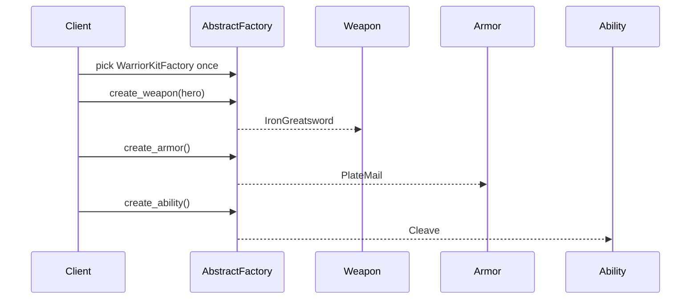

# Guide 03 — Abstract Factory

**Lab:** [Requirements](../../phases/phase-03/requirements.md) · [Guided check](../../phases/phase-03/guided-check.md) · [Questions](../../phases/phase-03/questions.md)

## Chapter 3: "Character creation at Ironspire"

**Ironspire** is a fantasy RPG. New heroes spawn with a class kit: a **weapon**, **armor**, and a **signature ability**. Classes are either **Warrior** or **Mage**. Mixing a mage staff with plate mail looks wrong and fails the class-set check.

Last sprint someone wrote `if class_name == "warrior"` in five places and accidentally shipped plate mail on a mage. Your mission is **Abstract Factory**: one factory produces a _consistent kit_ of related products.

Teaching domain here is class kits—not your greenhouse device families. The shape transfers; the class names do not.

---

## Learning Objectives

By the end of this guide you will be able to:

- State the intent of Abstract Factory in plain language
- Explain when a _family_ of products must stay consistent
- Distinguish Abstract Factory from Factory Method
- Sketch factories, abstract products, and concrete families in code
- Bridge the idea to Phase 3 without copying Ironspire types into the lab

---

## Theory

### Intent

**Abstract Factory** provides an interface for creating **families** of related or dependent objects without specifying their concrete classes. The client works with abstract products; a concrete factory guarantees every product in a kit belongs to the same family.

*Head First Design Patterns* presents Abstract Factory in Chapter 4 after Factory Method—emphasizing products that must work together. Refactoring Guru: create families of related objects without specifying concrete classes ([Abstract Factory](https://refactoring.guru/design-patterns/abstract-factory)).

### The problem in plain language

Sometimes the hard part is not creating one object—it is ensuring **several objects stay consistent**. A warrior needs a warrior weapon, warrior armor, and a warrior ability. A mage needs the mage variants. If each piece is chosen with its own `if class_name == ...`, nothing stops a mage staff from riding next to plate mail. The bug is silent until the class-set check—or a player—rejects the loadout.

Independent conditionals also multiply: a third class means editing every selection point. Copy-paste “reuse” of one family’s armor into another family’s path is tempting and dangerous.

### Analogy — interior design suites

Furnishing a living room from a catalog, you pick a **style suite**: Scandinavian, industrial, or coastal. The sofa, lamp, and rug are designed to match. You do not buy a Scandinavian sofa, an industrial lamp, and a coastal rug because each was “on sale” in isolation—the room looks wrong and the materials clash.

An Abstract Factory is the **showroom for one style**. You walk in, say “Scandinavian,” and every piece you order from that factory coordinates. Switching styles means switching factories—not re-deciding each item with separate `if` branches.

### Solution structure

| Role | Responsibility | In Phase 3 lab |
| ---- | -------------- | -------------- |
| **Abstract product** | Interface for each kind in the family | Sensor port, actuator port (conceptually) |
| **Concrete product** | Family-specific implementation | Simulation sensor vs edge sensor |
| **Abstract factory** | Methods to create each product in the kit | `DeviceFamilyFactory` |
| **Concrete factory** | One coherent family | `SimulationDeviceFactory`, `EdgeHardwareFactory` |
| **Client** | Uses abstract products only; picks factory once | `DeviceFamilyService` |

Factory Method often appears **inside** concrete factories: `create_sensor()` may delegate to a `SensorCreator`.

### How collaboration works



The client never names `IronGreatsword` directly—it only knows `Weapon`. The factory choice at the start **commits** the whole session to one family.

### When to use / when to skip

**Use Abstract Factory when:**

- Products naturally group into **families** that must not be mixed (simulation vs hardware, warrior vs mage kits, Windows vs macOS widgets).
- The application configures the environment once and then creates many related objects.
- You want compile-time or startup-time guarantees about consistency.

**Skip or simplify when:**

- You only ever create **one** product type per request—Factory Method is enough.
- Families are not a real constraint (mixing implementations is valid).
- Two families and three products already feel like overkill—a typed configuration object may suffice.

### Related patterns

- **Factory Method** — creates one product; Abstract Factory orchestrates **multiple** factory methods for a kit. Abstract Factory is often “Factory Method at suite scale.”
- **Builder** — builds **one** complex object stepwise; Abstract Factory produces **several** related objects. They can coexist (Builder for a location config, Abstract Factory for device families).
- **Prototype** — clone existing instances instead of factory-per-family; useful when construction is expensive and families are instance-based.

---

# Part 2 — Follow along

> **Follow along:** Use any folder and a terminal. You only need stdlib Python (`python your_file.py`). Run the problem demo first, then build the solution in steps, then run the complete script and match the expected output.

## 1. The sticky problem

Character creation needs a matching kit: weapon + armor + ability, all warrior or all mage. If each piece is chosen with its own `if`, nothing stops a mage staff from riding next to plate mail.

### 1.1 Smell: each piece chosen independently

```python
# Smell: related products selected with independent conditionals
def equip_hero(class_name: str, hero: str) -> dict:
    if class_name == "warrior":
        weapon = IronGreatsword(hero)
        armor = PlateMail()
        ability = Cleave()
    elif class_name == "mage":
        weapon = OakStaff(hero)
        # Bug waiting to happen: someone reuses PlateMail "because it already works"
        armor = PlateMail()
        ability = Fireball()
    else:
        raise ValueError(class_name)
    return {
        "weapon": weapon.describe(),
        "armor": armor.describe(),
        "ability": ability.describe(),
    }
```

**Root cause:** Related products are selected with independent conditionals. Nothing enforces “all warrior” or “all mage.”

### 1.2 Runnable problem demo

> **Follow along:** Save as `ironspire_before.py`, then run `python ironspire_before.py`.

```python
"""Problem demo: mismatched class kit — mage weapon + warrior armor."""


class OakStaff:
    def __init__(self, hero: str) -> None:
        self.hero = hero

    def describe(self) -> str:
        return f"[Mage weapon] Oak Staff — for {self.hero}"


class PlateMail:
    def describe(self) -> str:
        return "[Warrior armor] Plate Mail"


class Fireball:
    def describe(self) -> str:
        return "[Mage ability] Fireball"


def equip_hero_buggy(hero: str) -> None:
    # Accidental mix: mage weapon + warrior armor + mage ability
    weapon = OakStaff(hero)
    armor = PlateMail()  # wrong family — still "works"
    ability = Fireball()
    print(weapon.describe())
    print(armor.describe())
    print(ability.describe())
    print("PAIN: mixed mage weapon with warrior armor — the class set will reject this kit")


if __name__ == "__main__":
    equip_hero_buggy("Lyra")
```

**Expected output (problem):**

```text
[Mage weapon] Oak Staff — for Lyra
[Warrior armor] Plate Mail
[Mage ability] Fireball
PAIN: mixed mage weapon with warrior armor — the class set will reject this kit
```

### What goes wrong when requirements change

A third class (Rogue) means yet more independent branches. Copy-paste “reuse” of one family’s armor into another family’s path is easy and silent. Tests must assert every combination instead of trusting one factory.

---

## 2. Pattern in practice

The Ironspire runnable example below fixes the mixed-kit bug: pick one `ClassKitFactory` (Warrior or Mage), then ask it for weapon, armor, and ability. Every product comes from the same family by construction.

---

## 3. Building the solution (step by step)

These pieces are explanatory. The full runnable file is in section 4.

### Step A — Abstract products

Clients should depend on “something that can `describe`,” not on warrior vs mage gear.

```python
from abc import ABC, abstractmethod


class Weapon(ABC):
    @abstractmethod
    def describe(self) -> str:
        """Product interface shared by every weapon in every family."""
        ...


class Armor(ABC):
    @abstractmethod
    def describe(self) -> str:
        ...


class Ability(ABC):
    @abstractmethod
    def describe(self) -> str:
        ...
```

### Step B — One concrete family (Warrior)

Products in a family share a combat style. Keep them together.

```python
class IronGreatsword(Weapon):
    def __init__(self, hero: str) -> None:
        self.hero = hero

    def describe(self) -> str:
        return f"[Warrior weapon] Iron Greatsword — for {self.hero}"


class PlateMail(Armor):
    def describe(self) -> str:
        return "[Warrior armor] Plate Mail"


class Cleave(Ability):
    def describe(self) -> str:
        return "[Warrior ability] Cleave"
```

### Step C — Abstract factory + one concrete factory

Creation methods travel together. A warrior factory never returns a mage ability.

```python
class ClassKitFactory(ABC):
    @abstractmethod
    def create_weapon(self, hero: str) -> Weapon:
        ...

    @abstractmethod
    def create_armor(self) -> Armor:
        ...

    @abstractmethod
    def create_ability(self) -> Ability:
        ...


class WarriorKitFactory(ClassKitFactory):
    def create_weapon(self, hero: str) -> Weapon:
        return IronGreatsword(hero)

    def create_armor(self) -> Armor:
        return PlateMail()

    def create_ability(self) -> Ability:
        return Cleave()
```

### Step D — Thin client that takes a factory

The spawner never mixes families: one factory for the whole kit.

```python
def equip_hero(factory: ClassKitFactory, hero: str) -> None:
    weapon = factory.create_weapon(hero)
    armor = factory.create_armor()
    ability = factory.create_ability()
    print(weapon.describe())
    print(armor.describe())
    print(ability.describe())
```

**Why this helps:** New class = new product trio + new concrete factory. The body of `equip_hero` stays stable.

---

## 4. Complete worked solution (runnable)

Same code as the steps above, assembled so you can run it end-to-end. Demonstrates **Warrior** and **Mage** kits—each consistent.

> **Follow along:** Save as `ironspire_abstract_factory.py`, run `python ironspire_abstract_factory.py`, and match the expected output.

```python
"""Abstract Factory demo — Ironspire class kits (stdlib only)."""

from abc import ABC, abstractmethod


# --- Abstract products ---

class Weapon(ABC):
    @abstractmethod
    def describe(self) -> str:
        ...


class Armor(ABC):
    @abstractmethod
    def describe(self) -> str:
        ...


class Ability(ABC):
    @abstractmethod
    def describe(self) -> str:
        ...


# --- Warrior family ---

class IronGreatsword(Weapon):
    def __init__(self, hero: str) -> None:
        self.hero = hero

    def describe(self) -> str:
        return f"[Warrior weapon] Iron Greatsword — for {self.hero}"


class PlateMail(Armor):
    def describe(self) -> str:
        return "[Warrior armor] Plate Mail"


class Cleave(Ability):
    def describe(self) -> str:
        return "[Warrior ability] Cleave"


# --- Mage family ---

class OakStaff(Weapon):
    def __init__(self, hero: str) -> None:
        self.hero = hero

    def describe(self) -> str:
        return f"[Mage weapon] Oak Staff — for {self.hero}"


class SpellRobe(Armor):
    def describe(self) -> str:
        return "[Mage armor] Spell Robe"


class Fireball(Ability):
    def describe(self) -> str:
        return "[Mage ability] Fireball"


# --- Abstract factory + concrete factories ---

class ClassKitFactory(ABC):
    @abstractmethod
    def create_weapon(self, hero: str) -> Weapon:
        ...

    @abstractmethod
    def create_armor(self) -> Armor:
        ...

    @abstractmethod
    def create_ability(self) -> Ability:
        ...


class WarriorKitFactory(ClassKitFactory):
    def create_weapon(self, hero: str) -> Weapon:
        return IronGreatsword(hero)

    def create_armor(self) -> Armor:
        return PlateMail()

    def create_ability(self) -> Ability:
        return Cleave()


class MageKitFactory(ClassKitFactory):
    def create_weapon(self, hero: str) -> Weapon:
        return OakStaff(hero)

    def create_armor(self) -> Armor:
        return SpellRobe()

    def create_ability(self) -> Ability:
        return Fireball()


FACTORIES: dict[str, ClassKitFactory] = {
    "warrior": WarriorKitFactory(),
    "mage": MageKitFactory(),
}


def equip_hero(factory: ClassKitFactory, hero: str) -> None:
    # Client never mixes families: one factory for the whole kit
    weapon = factory.create_weapon(hero)
    armor = factory.create_armor()
    ability = factory.create_ability()
    print(weapon.describe())
    print(armor.describe())
    print(ability.describe())


if __name__ == "__main__":
    print("--- Warrior kit ---")
    equip_hero(FACTORIES["warrior"], "Lyra")
    print("--- Mage kit ---")
    equip_hero(FACTORIES["mage"], "Lyra")
```

**Expected output (solution):**

```text
--- Warrior kit ---
[Warrior weapon] Iron Greatsword — for Lyra
[Warrior armor] Plate Mail
[Warrior ability] Cleave
--- Mage kit ---
[Mage weapon] Oak Staff — for Lyra
[Mage armor] Spell Robe
[Mage ability] Fireball
```

Compare with the problem demo: each kit is internally consistent—no mage staff next to plate mail.

---

## 5. Compare & contrast

| | Factory Method (Guide 02) | Abstract Factory |
|--|---------------------------|------------------|
| Question | “Which one product?” | “Which product _line_?” |
| Method count | Often one factory method | Multiple creation methods that travel together |
| Risk without it | Wrong defaults | Mismatched siblings in a kit |

Abstract Factory often _uses_ Factory Method-style methods inside each concrete factory—but the pattern’s point is the **family**, not a single product.

---

## 6. Watch out for these traps

- Selecting each product with separate `if class_name` blocks
- Letting spawn scripts or UI layers construct concrete warrior/mage types directly
- Growing a “god factory” that creates unrelated objects “just because”
- Porting Ironspire names into the greenhouse device-family lab

---

## 7. Try this

In `ironspire_abstract_factory.py`, add a **Rogue** family (`ShadowDagger`, `LeatherArmor`, `Backstab` + `RogueKitFactory`), register `"rogue"` in `FACTORIES`, and equip a hero. Re-run. The body of `equip_hero` should stay unchanged.

---

## Key Terms

| Term | Definition |
|------|------------|
| **Abstract Factory** | Creational pattern for families of related products |
| **Product family** | Set of products that must be used together (e.g. all warrior) |
| **Concrete factory** | Implements creation methods for one family |
| **Consistency constraint** | Business rule that siblings must match |

---

## Reading Assignments

**Required:**

- *Head First Design Patterns* — Chapter 4 (Abstract Factory portions)
- [Refactoring Guru — Abstract Factory](https://refactoring.guru/design-patterns/abstract-factory)
- Lab: [Requirements](../../phases/phase-03/requirements.md) · [Guided check](../../phases/phase-03/guided-check.md) · [Questions](../../phases/phase-03/questions.md)

**Further reading:**

- Compare with [Factory Method](https://refactoring.guru/design-patterns/factory-method) side by side

---

## Bridge to your lab

Phase 3 asks you to provision a **matching kit of related devices** for a simulation vs edge (or similar) family. Use Abstract Factory so callers cannot mix incompatible siblings.

| Teaching (this guide) | Your lab (greenhouse) |
| --------------------- | --------------------- |
| `Weapon` + `Armor` + `Ability` family | Matching kit: sensor + actuator siblings for one family |
| `ClassKitFactory` / `WarriorKitFactory` | Device-kit factory for `simulation` vs `edge` (lab names) |
| Warrior vs mage — do not mix siblings | Do not pair a simulation sensor with an edge actuator from another kit |
| Ironspire class kit | Persist provisioned devices; return DTOs from the lab |

**Do / don’t:** **Do** create the whole kit through one factory. **Don’t** paste Ironspire class-kit classes, and don’t assemble kits with independent `if` branches per device role.

---

## Summary

- Independent `if` branches per product invite mismatched kits.
- Abstract Factory gives one entry point that creates an entire consistent family.
- Prefer this when products must travel together; prefer Factory Method when you create one variant at a time.

**Next:** [Guide 04 — Builder](./04-builder.md)
