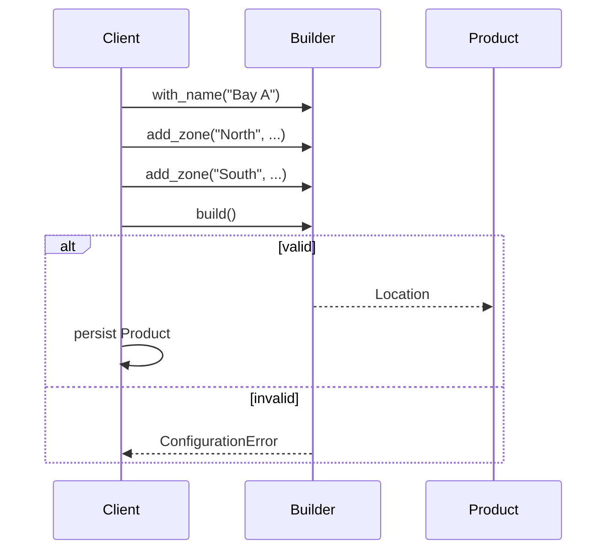

# Guide 04 — Builder

**Lab:** [Requirements](../../phases/phase-04/requirements.md) · [Guided check](../../phases/phase-04/guided-check.md) · [Questions](../../phases/phase-04/questions.md)

## Chapter 4: "Tickets at Miso Lane"

**Miso Lane** is a ramen shop. An order needs a guest, at least one topping, a broth, a spice level, and whether to add an egg. The kitchen insists invalid tickets never reach the pass: zero toppings, a topping whose prep is just a copy of the item name, or a negative spice level.

A 12-argument constructor appeared. Half-built dicts snuck into the ticket printer. You need **Builder**: accumulate steps, then `build()` validates and returns a finished order—or fails loudly.

Teaching domain here is ramen orders—not your greenhouse location/zone configs. The shape transfers; the class names do not.

---

## Learning Objectives

By the end of this guide you will be able to:

- Explain Builder as stepwise construction with validation at the end
- Separate builder (domain) from DTOs (API) and storage rows
- Contrast Builder with Factory Method and Abstract Factory
- List invalid configurations a `build()` must reject
- Bridge the idea to Phase 4 location/zone configuration without copying Miso Lane types

---

## Theory

### Intent

**Builder** separates the construction of a complex object from its representation so that the same construction process can create different representations—or, more commonly in business software, so that **stepwise assembly** and **final validation** happen in one well-defined place.

*Head First Design Patterns* lists Builder among the appendix patterns. Refactoring Guru is an excellent primary deep dive ([Builder](https://refactoring.guru/design-patterns/builder)): construct objects step by step, defer validation until `build()`, and return an immutable product.

### The problem in plain language

Complex domain objects rarely arrive fully formed in one constructor call. A ramen order needs a guest, toppings, broth, spice, an egg flag, and cross-field rules (“at least one topping,” “item ≠ prep”). Telescoping constructors with many optional parameters produce **half-valid objects** that slip into the kitchen because nothing rejected them at construction time.

Scattering validation across the counter, the ticket printer, and scripts means the rules drift. One code path sends empty bowls; another catches them. The domain never owns “what counts as valid.”

### Analogy — custom pizza order

At a build-your-own pizza counter, you add crust, sauce, toppings, and extras step by step. The order ticket accumulates choices. Only when you hand it to the oven does the shop enforce rules: you cannot bake an empty pizza, you cannot pick mutually exclusive crust options, and vegan cheese cannot pair with meat toppings if that is house policy.

The **builder** is the order ticket; `build()` is the oven gate. Until `build()` succeeds, you do not have a pizza—only intermediate state that must not be treated as shippable product.

### Solution structure

| Role | Responsibility | In Phase 4 lab |
| ---- | -------------- | -------------- |
| **Product** | Immutable finished aggregate | `Location` with `Zone` list |
| **Builder** | Fluent steps + internal accumulator | `LocationConfigBuilder` |
| **Parts** | Intermediate pieces assembled into product | zone names, thresholds, metadata |
| **Director** (optional) | Predefined build sequences | wizard steps in UI/service |
| **Domain error** | Raised from `build()` on invalid config | `ConfigurationError` |

Separate **builder** (domain construction) from **DTO** (API wire format) and **ORM row** (persistence). The API maps into builder steps; `build()` returns domain; repository saves rows.

### How collaboration works



Steps are idempotent in intent but may reject illegal transitions. Only `build()` produces a product reference that downstream code should trust.

### When to use / when to skip

**Use Builder when:**

- The object has many optional parts and **cross-field validation**.
- Construction happens in stages (wizard UI, multi-step API, batch import).
- You must prevent half-built aggregates from entering the domain or database.

**Skip or simplify when:**

- The object has two or three required fields—a constructor or dataclass with validation is enough.
- You are building **families** of related products—Abstract Factory fits better.
- You only need one immutable snapshot from a form—mapping DTO → entity in one function may suffice.

### Related patterns

- **Factory Method / Abstract Factory** — create fully formed products in one call; Builder **defers** the finished object until validation passes.
- **Composite** — Builder often assembles trees (location containing zones); Composite describes the result structure, Builder describes how you construct it safely.
- **Fluent interface** — Builder often uses method chaining (`builder.add_topping(...).with_broth(...)`); chaining is a style, not the pattern itself.

---

# Part 2 — Follow along

> **Follow along:** Use any folder and a terminal. You only need stdlib Python (`python your_file.py`). Run the problem demo first, then build the solution in steps, then run the complete script and match the expected output.

## 1. The sticky problem

The kitchen needs a complete ramen order: guest, toppings, broth, spice, egg. If the constructor is permissive and “save” trusts whatever it got, empty tickets land in the kitchen.

### 1.1 Smell: telescoping constructor + silent half-objects

```python
# Smell: construction and validation are separated — or validation never happens
class RamenOrder:
    def __init__(
        self,
        guest: str,
        toppings: list[dict] | None = None,
        broth: str = "tonkotsu",
        spice: int = 0,
        egg: bool = False,
        notes: str = "",
    ) -> None:
        self.guest = guest
        self.toppings = toppings or []  # empty list is "valid" here — until the pass
        self.broth = broth
        self.spice = spice
        self.egg = egg
        self.notes = notes


# Call site accidentally sends an empty bowl
order = RamenOrder(guest="Alex")
save(order)  # oops — zero toppings, still sent
```

**Root cause:** Construction and validation are separated in time—or validation never happens in the domain.

### 1.2 Runnable problem demo

> **Follow along:** Save as `misolane_before.py`, then run `python misolane_before.py`.

```python
"""Problem demo: empty ramen order 'saved' without validation."""


class RamenOrder:
    def __init__(
        self,
        guest: str,
        toppings: list[dict] | None = None,
        broth: str = "tonkotsu",
        spice: int = 0,
        egg: bool = False,
    ) -> None:
        self.guest = guest
        self.toppings = toppings or []
        self.broth = broth
        self.spice = spice
        self.egg = egg


def save(order: RamenOrder) -> None:
    # The pass trusts the caller — no domain gate
    print(
        f"SAVED guest={order.guest} toppings={len(order.toppings)} "
        f"broth={order.broth} spice={order.spice}"
    )


if __name__ == "__main__":
    order = RamenOrder(guest="Alex Rivera")  # no toppings, no validation
    save(order)
    print("PAIN: empty ramen order persisted — the kitchen will reject it later")
```

**Expected output (problem):**

```text
SAVED guest=Alex Rivera toppings=0 broth=tonkotsu spice=0
PAIN: empty ramen order persisted — the kitchen will reject it later
```

### What goes wrong when requirements change

The kitchen adds “at least one topping,” “item ≠ prep,” and “spice ≥ 0.” Those rules scatter across the counter, scripts, and one lucky service method. Half-built orders keep getting sent wherever someone forgets a check.

---

## 2. Pattern in practice

The Miso Lane runnable example below applies the theory: `RamenOrderBuilder` accumulates toppings and options, then `build()` validates and returns a frozen `RamenOrder`—or raises before anything is sent to the kitchen.

---

## 3. Building the solution (step by step)

These pieces are explanatory. The full runnable file is in section 4.

### Step A — Immutable product + parts

The finished object should not be a mutable half-dict. Prefer a frozen product returned only from `build()`.

```python
from dataclasses import dataclass


@dataclass(frozen=True)
class Topping:
    item: str
    prep: str


@dataclass(frozen=True)
class RamenOrder:
    guest: str
    toppings: tuple[Topping, ...]
    broth: str
    spice: int
    egg: bool
```

### Step B — Builder with fluent steps

Steps return `self` so callers can chain. State lives on the builder until `build()`.

```python
class RamenOrderBuilder:
    def __init__(self) -> None:
        self._guest: str | None = None
        self._toppings: list[Topping] = []
        self._broth = "tonkotsu"
        self._spice = 0
        self._egg = False

    def for_guest(self, name: str) -> "RamenOrderBuilder":
        self._guest = name.strip()
        return self

    def add_topping(self, item: str, prep: str) -> "RamenOrderBuilder":
        self._toppings.append(Topping(item=item.strip(), prep=prep.strip()))
        return self
```

### Step C — Optional knobs still return self

Broth, spice, and egg are optional steps—validation still happens in `build()`.

```python
    def with_broth(self, broth: str) -> "RamenOrderBuilder":
        self._broth = broth
        return self

    def with_spice(self, level: int) -> "RamenOrderBuilder":
        self._spice = level
        return self

    def with_egg(self, enabled: bool = True) -> "RamenOrderBuilder":
        self._egg = enabled
        return self
```

### Step D — `build()` validates, then returns the product

Invalid ticket input dies here—not after a silent send to the kitchen.

```python
class ConfigurationError(ValueError):
    pass


# inside RamenOrderBuilder:
def build(self) -> RamenOrder:
    if not self._guest:
        raise ConfigurationError("guest is required")
    if not self._toppings:
        raise ConfigurationError("at least one topping is required")
    if self._spice < 0:
        raise ConfigurationError("spice cannot be negative")
    for topping in self._toppings:
        if topping.item.casefold() == topping.prep.casefold():
            raise ConfigurationError(
                f"topping {topping.item} uses the same word for item and prep"
            )
    return RamenOrder(
        guest=self._guest,
        toppings=tuple(self._toppings),
        broth=self._broth,
        spice=self._spice,
        egg=self._egg,
    )
```

**Why this helps:** Callers can only send what survived `build()`. Rules live in one place.

---

## 4. Complete worked solution (runnable)

Same code as the steps above, assembled so you can run it end-to-end. A valid build prints; an invalid build is caught and reported.

> **Follow along:** Save as `misolane_builder.py`, run `python misolane_builder.py`, and match the expected output.

```python
"""Builder demo — Miso Lane ramen orders (stdlib only)."""

from dataclasses import dataclass


@dataclass(frozen=True)
class Topping:
    item: str
    prep: str


@dataclass(frozen=True)
class RamenOrder:
    guest: str
    toppings: tuple[Topping, ...]
    broth: str
    spice: int
    egg: bool


class ConfigurationError(ValueError):
    pass


class RamenOrderBuilder:
    def __init__(self) -> None:
        self._guest: str | None = None
        self._toppings: list[Topping] = []
        self._broth = "tonkotsu"
        self._spice = 0
        self._egg = False

    def for_guest(self, name: str) -> "RamenOrderBuilder":
        self._guest = name.strip()
        return self

    def add_topping(self, item: str, prep: str) -> "RamenOrderBuilder":
        self._toppings.append(Topping(item=item.strip(), prep=prep.strip()))
        return self

    def with_broth(self, broth: str) -> "RamenOrderBuilder":
        self._broth = broth
        return self

    def with_spice(self, level: int) -> "RamenOrderBuilder":
        self._spice = level
        return self

    def with_egg(self, enabled: bool = True) -> "RamenOrderBuilder":
        self._egg = enabled
        return self

    def build(self) -> RamenOrder:
        if not self._guest:
            raise ConfigurationError("guest is required")
        if not self._toppings:
            raise ConfigurationError("at least one topping is required")
        if self._spice < 0:
            raise ConfigurationError("spice cannot be negative")
        for topping in self._toppings:
            if topping.item.casefold() == topping.prep.casefold():
                raise ConfigurationError(
                    f"topping {topping.item} uses the same word for item and prep"
                )
        return RamenOrder(
            guest=self._guest,
            toppings=tuple(self._toppings),
            broth=self._broth,
            spice=self._spice,
            egg=self._egg,
        )


def describe(order: RamenOrder) -> None:
    toppings = ", ".join(
        f"{topping.item}/{topping.prep}" for topping in order.toppings
    )
    print(
        f"OK guest={order.guest} toppings=[{toppings}] "
        f"broth={order.broth} spice={order.spice} egg={order.egg}"
    )


if __name__ == "__main__":
    valid = (
        RamenOrderBuilder()
        .for_guest("Alex Rivera")
        .add_topping("chashu", "sliced")
        .add_topping("ajitama", "jammy")
        .with_broth("tonkotsu")
        .with_spice(2)
        .with_egg()
        .build()
    )
    describe(valid)

    try:
        (
            RamenOrderBuilder()
            .for_guest("Alex Rivera")
            # no toppings — must fail
            .with_broth("shoyu")
            .build()
        )
    except ConfigurationError as exc:
        print(f"PAIN: rejected — {exc}")
```

**Expected output (solution):**

```text
OK guest=Alex Rivera toppings=[chashu/sliced, ajitama/jammy] broth=tonkotsu spice=2 egg=True
PAIN: rejected — at least one topping is required
```

Compare with the problem demo: empty orders no longer “save”—`build()` rejects them before they reach the kitchen.

---

## 5. Compare & contrast

| Pattern | Best at |
| ------- | ------- |
| Factory Method | One product with type-specific defaults |
| Abstract Factory | Matching kit of products |
| Builder | One complex aggregate built in steps with validation |

Factories answer “which type?” Builder answers “how do we assemble this valid whole?”

---

## 6. Watch out for these traps

- Validating only in the HTTP layer while domain `build()` stays empty
- Allowing callers to mutate builder fields after `build()` and thinking the product is immutable
- Saving nested parts without a transaction when persistence spans multiple tables
- Using Miso Lane `RamenOrderBuilder` names in the location/zone lab

---

## 7. Try this

In `misolane_builder.py`, add a rejection case that calls `add_topping("ajitama", "ajitama")` (same word for item and prep) and catch `ConfigurationError`. Re-run. You should see another `PAIN: rejected — ...` line; the valid build should still print first.

---

## Key Terms

| Term | Definition |
| ---- | ---------- |
| **Builder** | Creational pattern for stepwise construction of a complex object |
| **Fluent interface** | Methods that return `self` to chain calls |
| **Product** | The finished object returned by `build()` |
| **Domain validation** | Rules enforced in the model, not only at the HTTP edge |

---

## Reading Assignments

**Required:**

- [Refactoring Guru — Builder](https://refactoring.guru/design-patterns/builder)
- *Head First Design Patterns* — Appendix: leftover patterns (Builder)
- Lab: [Requirements](../../phases/phase-04/requirements.md) · [Guided check](../../phases/phase-04/guided-check.md) · [Questions](../../phases/phase-04/questions.md)

**Further reading:**

- Guided check is optional extra help after you have a design — not a complete solution.

---

## Bridge to your lab

Phase 4 uses Builder for a **location configuration** with zones: guided steps, then `build()` before persistence. Devices already exist. Assignment is a later update, not a builder step. Naming in the course model prefers **location** / `location_id`.

| Teaching (this guide) | Your lab (greenhouse) |
| --------------------- | --------------------- |
| `Topping` | Zone (thresholds, not toppings) |
| `RamenOrder` | Location configuration aggregate |
| `RamenOrderBuilder.build()` | `LocationConfigBuilder.build()` (validate, then return). No `add_device` |
| Miso Lane order id | `location_id` — never `greenhouse_id` |
| A guest added after the ticket exists | Assign a device after the zone row exists: set `zone_id` and copy `location_id` from that zone, or clear both |

**Do / don’t:** **Do** persist **after** a successful `build()`, not inside the builder. **Don’t** add `add_device` to the builder, and don’t implement ramen toppings in the project.

---

## Summary

- Complex aggregates invite invalid half-built objects when constructors stay permissive.
- Builder accumulates steps and centralizes validation in `build()`.
- Prefer Builder when construction is multi-step; prefer factories when the main question is which variant to create.

**Next:** [Guide 05 — Adapter](./05-adapter.md)
