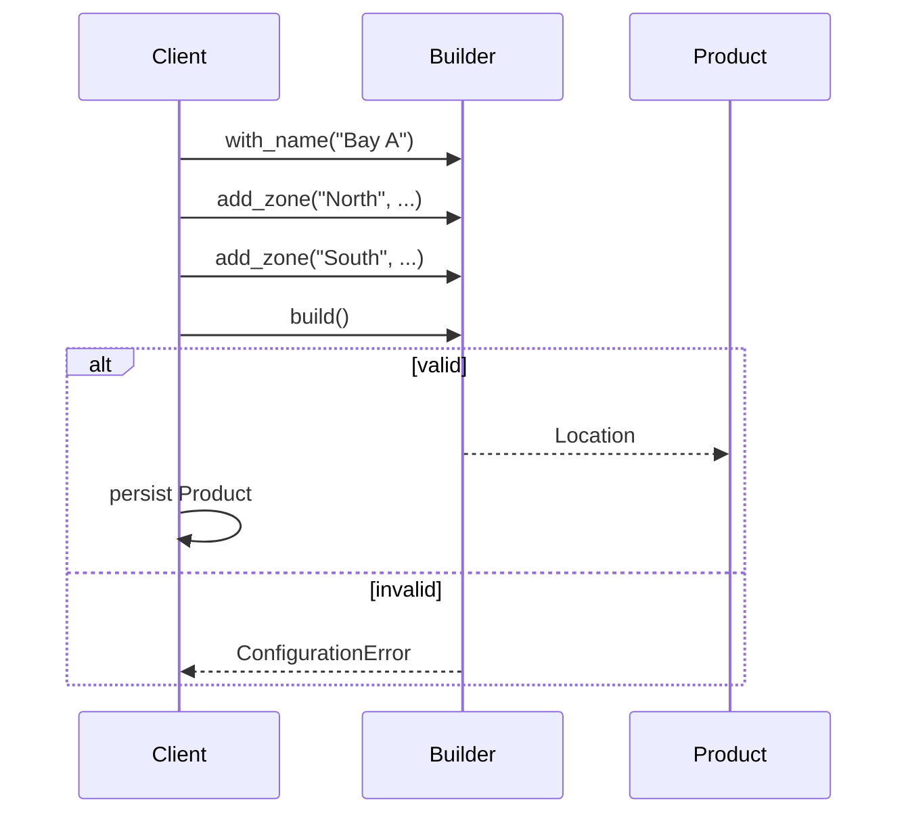

# Guide 04 — Builder

**Lab:** [Requirements](../../phases/phase-04/requirements.md) · [Guided check](../../phases/phase-04/guided-check.md) · [Questions](../../phases/phase-04/questions.md)

## Chapter 4: "Itineraries at SkyLedger"

**SkyLedger** books multi-city trips for corporate travelers. An itinerary needs a passenger, at least one flight leg, seat preferences, and baggage options. Product insists invalid trips never reach the database: zero legs, overlapping airports that make no sense, or a return before the outbound.

A 12-argument constructor appeared. Half-built dicts snuck into persistence. You need **Builder**: accumulate steps, then `build()` validates and returns a finished itinerary—or fails loudly.

Teaching domain here is flight itineraries—not your greenhouse location/zone configs. The shape transfers; the class names do not.

---

## Learning Objectives

By the end of this guide you will be able to:

- Explain Builder as stepwise construction with validation at the end
- Separate builder (domain) from DTOs (API) and storage rows
- Contrast Builder with Factory Method and Abstract Factory
- List invalid configurations a `build()` must reject
- Bridge the idea to Phase 4 location/zone configuration without copying SkyLedger types

---

## Theory

### Intent

**Builder** separates the construction of a complex object from its representation so that the same construction process can create different representations—or, more commonly in business software, so that **stepwise assembly** and **final validation** happen in one well-defined place.

*Head First Design Patterns* lists Builder among the appendix patterns. Refactoring Guru is an excellent primary deep dive ([Builder](https://refactoring.guru/design-patterns/builder)): construct objects step by step, defer validation until `build()`, and return an immutable product.

### The problem in plain language

Complex domain objects rarely arrive fully formed in one constructor call. A corporate itinerary needs passenger, legs, seat preferences, baggage, insurance flags, and cross-field rules (“at least one leg,” “origin ≠ destination”). Telescoping constructors with many optional parameters produce **half-valid objects** that slip into persistence because nothing rejected them at construction time.

Scattering validation across HTTP handlers, repositories, and scripts means the rules drift. One code path saves empty trips; another catches them. The domain never owns “what counts as valid.”

### Analogy — custom pizza order

At a build-your-own pizza counter, you add crust, sauce, toppings, and extras step by step. The order ticket accumulates choices. Only when you hand it to the oven does the shop enforce rules: you cannot bake an empty pizza, you cannot pick mutually exclusive crust options, and vegan cheese cannot pair with meat toppings if that is house policy.

The **builder** is the order ticket; **`build()`** is the oven gate. Until `build()` succeeds, you do not have a pizza—only intermediate state that must not be treated as shippable product.

### Solution structure

| Role | Responsibility | In Phase 4 lab |
| ---- | -------------- | -------------- |
| **Product** | Immutable finished aggregate | `Location` with `Zone` list |
| **Builder** | Fluent steps + internal accumulator | `LocationConfigBuilder` |
| **Parts** | Intermediate pieces assembled into product | zone names, thresholds, metadata |
| **Director** (optional) | Predefined build sequences | wizard steps in UI/service |
| **Domain error** | Raised from `build()` on invalid config | `ConfigurationError` |

Separate **builder** (domain construction) from **DTO** (API wire format) and **ORM row** (persistence). The API maps into builder steps; `build()` returns domain; repository saves rows.

### How collaboration works



Steps are idempotent in intent but may reject illegal transitions. Only `build()` produces a product reference that downstream code should trust.

### When to use / when to skip

**Use Builder when:**

- The object has many optional parts and **cross-field validation**.
- Construction happens in stages (wizard UI, multi-step API, batch import).
- You must prevent half-built aggregates from entering the domain or database.

**Skip or simplify when:**

- The object has two or three required fields—a constructor or dataclass with validation is enough.
- You are building **families** of related products—Abstract Factory fits better.
- You only need one immutable snapshot from a form—mapping DTO → entity in one function may suffice.

### Related patterns

- **Factory Method / Abstract Factory** — create fully formed products in one call; Builder **defers** the finished object until validation passes.
- **Composite** — Builder often assembles trees (location containing zones); Composite describes the result structure, Builder describes how you construct it safely.
- **Fluent interface** — Builder often uses method chaining (`builder.add_leg(...).with_seat(...)`); chaining is a style, not the pattern itself.

---

# Part 2 — Follow along

> **Follow along:** Use any folder and a terminal. You only need stdlib Python (`python your_file.py`). Run the problem demo first, then build the solution in steps, then run the complete script and match the expected output.

## 1. The sticky problem

Travel ops need complex itineraries: passenger, legs, seat, bags, insurance. If the constructor is permissive and “save” trusts whatever it got, empty trips land in the database.

### 1.1 Smell: telescoping constructor + silent half-objects

```python
# Smell: construction and validation are separated — or validation never happens
class Itinerary:
    def __init__(
        self,
        passenger: str,
        legs: list[dict] | None = None,
        seat: str = "any",
        bags: int = 0,
        insurance: bool = False,
        notes: str = "",
    ) -> None:
        self.passenger = passenger
        self.legs = legs or []  # empty list is "valid" here — until checkout
        self.seat = seat
        self.bags = bags
        self.insurance = insurance
        self.notes = notes


# Call site accidentally persists an empty trip
trip = Itinerary(passenger="Alex")
save(trip)  # oops — zero legs, still saved
```

**Root cause:** Construction and validation are separated in time—or validation never happens in the domain.

### 1.2 Runnable problem demo

> **Follow along:** Save as `skyledger_before.py`, then run `python skyledger_before.py`.

```python
"""Problem demo: empty itinerary 'saved' without validation."""


class Itinerary:
    def __init__(
        self,
        passenger: str,
        legs: list[dict] | None = None,
        seat: str = "any",
        bags: int = 0,
        insurance: bool = False,
    ) -> None:
        self.passenger = passenger
        self.legs = legs or []
        self.seat = seat
        self.bags = bags
        self.insurance = insurance


def save(trip: Itinerary) -> None:
    # Persistence trusts the caller — no domain gate
    print(
        f"SAVED passenger={trip.passenger} legs={len(trip.legs)} "
        f"seat={trip.seat} bags={trip.bags}"
    )


if __name__ == "__main__":
    trip = Itinerary(passenger="Alex Rivera")  # no legs, no validation
    save(trip)
    print("PAIN: empty itinerary persisted — checkout will fail later")
```

**Expected output (problem):**

```text
SAVED passenger=Alex Rivera legs=0 seat=any bags=0
PAIN: empty itinerary persisted — checkout will fail later
```

### What goes wrong when requirements change

Product adds “at least one leg,” “origin ≠ destination,” and “bags ≥ 0.” Those rules scatter across HTTP validators, scripts, and one lucky service method. Half-built objects keep getting saved wherever someone forgets a check.

---

## 2. Pattern in practice

The SkyLedger runnable example below applies the theory: `ItineraryBuilder` accumulates legs and options, then `build()` validates and returns a frozen `Itinerary`—or raises before anything is saved.

---

## 3. Building the solution (step by step)

These pieces are explanatory. The full runnable file is in section 4.

### Step A — Immutable product + parts

The finished object should not be a mutable half-dict. Prefer a frozen product returned only from `build()`.

```python
from dataclasses import dataclass


@dataclass(frozen=True)
class FlightLeg:
    origin: str
    destination: str
    flight_no: str


@dataclass(frozen=True)
class Itinerary:
    passenger: str
    legs: tuple[FlightLeg, ...]
    seat: str
    bags: int
    insurance: bool
```

### Step B — Builder with fluent steps

Steps return `self` so callers can chain. State lives on the builder until `build()`.

```python
class ItineraryBuilder:
    def __init__(self) -> None:
        self._passenger: str | None = None
        self._legs: list[FlightLeg] = []
        self._seat = "any"
        self._bags = 0
        self._insurance = False

    def for_passenger(self, name: str) -> "ItineraryBuilder":
        self._passenger = name.strip()
        return self

    def add_leg(self, origin: str, destination: str, flight_no: str) -> "ItineraryBuilder":
        self._legs.append(
            FlightLeg(
                origin=origin.upper(),
                destination=destination.upper(),
                flight_no=flight_no,
            )
        )
        return self
```

### Step C — Optional knobs still return self

Seat, bags, and insurance are optional steps—validation still happens in `build()`.

```python
    def with_seat(self, seat: str) -> "ItineraryBuilder":
        self._seat = seat
        return self

    def with_bags(self, count: int) -> "ItineraryBuilder":
        self._bags = count
        return self

    def with_insurance(self, enabled: bool = True) -> "ItineraryBuilder":
        self._insurance = enabled
        return self
```

### Step D — `build()` validates, then returns the product

Invalid wizard input dies here—not after a silent insert.

```python
class ConfigurationError(ValueError):
    pass


# inside ItineraryBuilder:
def build(self) -> Itinerary:
    if not self._passenger:
        raise ConfigurationError("passenger is required")
    if not self._legs:
        raise ConfigurationError("at least one flight leg is required")
    if self._bags < 0:
        raise ConfigurationError("bags cannot be negative")
    for leg in self._legs:
        if leg.origin == leg.destination:
            raise ConfigurationError(
                f"leg {leg.flight_no} has same origin and destination"
            )
    return Itinerary(
        passenger=self._passenger,
        legs=tuple(self._legs),
        seat=self._seat,
        bags=self._bags,
        insurance=self._insurance,
    )
```

**Why this helps:** Callers can only persist what survived `build()`. Rules live in one place.

---

## 4. Complete worked solution (runnable)

Same code as the steps above, assembled so you can run it end-to-end. A valid build prints; an invalid build is caught and reported.

> **Follow along:** Save as `skyledger_builder.py`, run `python skyledger_builder.py`, and match the expected output.

```python
"""Builder demo — SkyLedger flight itineraries (stdlib only)."""

from dataclasses import dataclass


@dataclass(frozen=True)
class FlightLeg:
    origin: str
    destination: str
    flight_no: str


@dataclass(frozen=True)
class Itinerary:
    passenger: str
    legs: tuple[FlightLeg, ...]
    seat: str
    bags: int
    insurance: bool


class ConfigurationError(ValueError):
    pass


class ItineraryBuilder:
    def __init__(self) -> None:
        self._passenger: str | None = None
        self._legs: list[FlightLeg] = []
        self._seat = "any"
        self._bags = 0
        self._insurance = False

    def for_passenger(self, name: str) -> "ItineraryBuilder":
        self._passenger = name.strip()
        return self

    def add_leg(self, origin: str, destination: str, flight_no: str) -> "ItineraryBuilder":
        self._legs.append(
            FlightLeg(
                origin=origin.upper(),
                destination=destination.upper(),
                flight_no=flight_no,
            )
        )
        return self

    def with_seat(self, seat: str) -> "ItineraryBuilder":
        self._seat = seat
        return self

    def with_bags(self, count: int) -> "ItineraryBuilder":
        self._bags = count
        return self

    def with_insurance(self, enabled: bool = True) -> "ItineraryBuilder":
        self._insurance = enabled
        return self

    def build(self) -> Itinerary:
        if not self._passenger:
            raise ConfigurationError("passenger is required")
        if not self._legs:
            raise ConfigurationError("at least one flight leg is required")
        if self._bags < 0:
            raise ConfigurationError("bags cannot be negative")
        for leg in self._legs:
            if leg.origin == leg.destination:
                raise ConfigurationError(
                    f"leg {leg.flight_no} has same origin and destination"
                )
        return Itinerary(
            passenger=self._passenger,
            legs=tuple(self._legs),
            seat=self._seat,
            bags=self._bags,
            insurance=self._insurance,
        )


def describe(trip: Itinerary) -> None:
    legs = ", ".join(f"{leg.origin}->{leg.destination}({leg.flight_no})" for leg in trip.legs)
    print(
        f"OK passenger={trip.passenger} legs=[{legs}] "
        f"seat={trip.seat} bags={trip.bags} insurance={trip.insurance}"
    )


if __name__ == "__main__":
    valid = (
        ItineraryBuilder()
        .for_passenger("Alex Rivera")
        .add_leg("HEL", "ARN", "AY901")
        .add_leg("ARN", "LHR", "SK527")
        .with_seat("aisle")
        .with_bags(1)
        .with_insurance()
        .build()
    )
    describe(valid)

    try:
        (
            ItineraryBuilder()
            .for_passenger("Alex Rivera")
            # no legs — must fail
            .with_seat("window")
            .build()
        )
    except ConfigurationError as exc:
        print(f"PAIN: rejected — {exc}")
```

**Expected output (solution):**

```text
OK passenger=Alex Rivera legs=[HEL->ARN(AY901), ARN->LHR(SK527)] seat=aisle bags=1 insurance=True
PAIN: rejected — at least one flight leg is required
```

Compare with the problem demo: empty trips no longer “save”—`build()` rejects them before persistence.

---

## 5. Compare & contrast

| Pattern | Best at |
|---------|---------|
| Factory Method | One product with type-specific defaults |
| Abstract Factory | Matching kit of products |
| Builder | One complex aggregate built in steps with validation |

Factories answer “which type?” Builder answers “how do we assemble this valid whole?”

---

## 6. Watch out for these traps

- Validating only in the HTTP layer while domain `build()` stays empty
- Allowing callers to mutate builder fields after `build()` and thinking the product is immutable
- Saving nested parts without a transaction when persistence spans multiple tables
- Using SkyLedger `ItineraryBuilder` names in the location/zone lab

---

## 7. Try this

In `skyledger_builder.py`, add a rejection case that calls `add_leg("HEL", "HEL", "AY000")` (same origin and destination) and catch `ConfigurationError`. Re-run. You should see another `PAIN: rejected — ...` line; the valid build should still print first.

---

## Key Terms

| Term | Definition |
|------|------------|
| **Builder** | Creational pattern for stepwise construction of a complex object |
| **Fluent interface** | Methods that return `self` to chain calls |
| **Product** | The finished object returned by `build()` |
| **Domain validation** | Rules enforced in the model, not only at the HTTP edge |

---

## Reading Assignments

**Required:**

- [Refactoring Guru — Builder](https://refactoring.guru/design-patterns/builder)
- *Head First Design Patterns* — Appendix: leftover patterns (Builder)
- Lab: [Requirements](../../phases/phase-04/requirements.md) · [Guided check](../../phases/phase-04/guided-check.md) · [Questions](../../phases/phase-04/questions.md)

**Further reading:**

- Guided check is optional extra help after you have a design — not a complete solution.

---

## Bridge to your lab

Phase 4 uses Builder for a **location configuration** with zones: guided steps, then `build()` before persistence. Devices already exist. Assignment is a later update, not a builder step. Naming in the course model prefers **location** / **`location_id`**.

| Teaching (this guide) | Your lab (greenhouse) |
| --------------------- | --------------------- |
| `FlightLeg` | Zone (thresholds, not airports) |
| `Itinerary` | Location configuration aggregate |
| `ItineraryBuilder.build()` | `LocationConfigBuilder.build()` (validate, then return). No `add_device` |
| SkyLedger itinerary id | `location_id` — never `greenhouse_id` |
| A passenger added after the ticket exists | Assign a device after the zone row exists: set `zone_id` and copy `location_id` from that zone, or clear both |

**Do / don’t:** **Do** persist **after** a successful `build()`, not inside the builder. **Don’t** add `add_device` to the builder, and don’t implement flight legs in the project.

---

## Summary

- Complex aggregates invite invalid half-built objects when constructors stay permissive.
- Builder accumulates steps and centralizes validation in `build()`.
- Prefer Builder when construction is multi-step; prefer factories when the main question is which variant to create.

**Next:** [Guide 05 — Adapter](./05-adapter.md)
