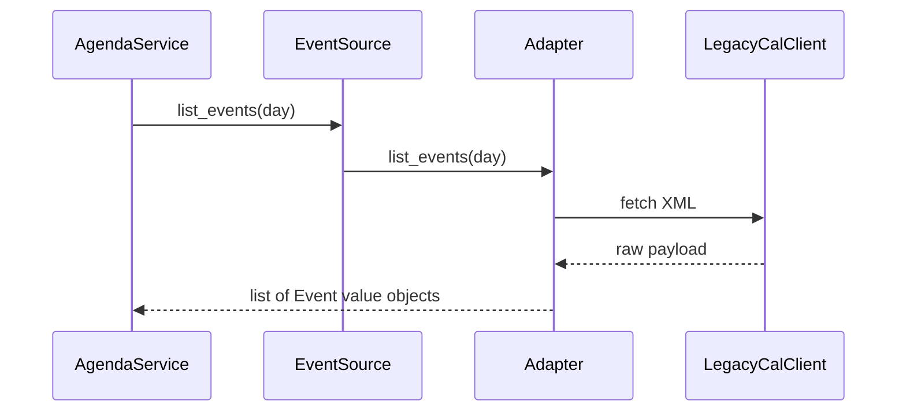

# Guide 05 — Adapter

**Lab:** [Requirements](../../phases/phase-05/requirements.md) · [Guided check](../../phases/phase-05/guided-check.md) · [Questions](../../phases/phase-05/questions.md)

## Chapter 5: "The calendar that speaks XML"

**MeetSync** is a modern scheduling app. Your product team wants a single `EventSource` port: `list_events(day) -> list[Event]`. Finance still runs **LegacyCal**, a 2009 service that returns XML with odd field names (`evt_start_epoch`, `subj`).

You cannot rewrite LegacyCal. You also cannot let every service parse XML. You need an **Adapter**: a thin translator that makes the old API look like the new port.

*Head First Design Patterns* covers Adapter in Chapter 7. Refactoring Guru: convert one interface into another clients expect ([Adapter](https://refactoring.guru/design-patterns/adapter)).

---

## Learning Objectives

By the end of this guide you will be able to:

- State Adapter’s intent and when to use it
- Separate a domain port from a vendor/legacy SDK
- Write a small adapter that translates data without embedding business rules
- Contrast Adapter with Facade
- Bridge the idea to Phase 5 without copying MeetSync types

---

## Theory

### Intent

**Adapter** converts the interface of a class into another interface clients expect. Adapter lets classes work together that could not otherwise because of incompatible interfaces. The Gang of Four distinguishes **object adapter** (composition: adapter holds adaptee) and **class adapter** (inheritance); most modern code uses composition.

*Head First Design Patterns* covers Adapter in Chapter 7. Refactoring Guru: wrap an existing object with a new interface ([Adapter](https://refactoring.guru/design-patterns/adapter)).

### The problem in plain language

Integration reality: vendors ship SDKs with odd method names, XML payloads, blocking I/O, or status codes your domain should never see. Rewriting the vendor is rarely an option. Letting every service import the legacy client spreads the pain—business rules get tangled with parsing, unit conversion, and retry logic.

The smell is **business code speaking a foreign protocol**. `AgendaService` should not know about `evt_start_epoch` or XPath.

### Analogy — travel power plug adapter

Your laptop expects a grounded Type F outlet. The hotel wall delivers something else. You do not rewire the hotel; you use a **plug adapter** that presents the interface your device expects on one side and speaks the wall’s interface on the other.

The adapter does not decide your meeting schedule—that is domain logic. It only **translates shape and protocol** so your app can call `list_events(day)` while LegacyCal still returns XML internally.

### Solution structure

| Role | Responsibility | In Phase 5 lab |
| ---- | -------------- | -------------- |
| **Target (port)** | Interface the application expects | `SensorPort`, `ActuatorPort` |
| **Adaptee** | Existing incompatible API | Vendor stub payload, simulation driver, MQTT payload dict |
| **Adapter** | Translates calls and data | Simulation, vendor-stub, and MQTT translators |
| **Client** | Depends only on the port | One ingest writer (manual read, sampler, later device HTTP or broker) |

Keep adapters **thin**: map fields, convert units, handle errors at the boundary. Irrigation rules and automation policies stay outside.

### How collaboration works



The client sees only `EventSource`. The adapter is the only place that imports LegacyCal.

### When to use / when to skip

**Use Adapter when:**

- You must integrate a third-party or legacy component whose interface does not match your domain ports.
- Multiple callers would otherwise duplicate translation logic.
- You want to swap vendors by changing adapters, not rewriting services.

**Skip or simplify when:**

- The external API already matches your port—a direct implementation is fine.
- You need to **simplify** a complex subsystem for callers—that is Facade’s job, not Adapter’s.
- The “adapter” starts containing business rules—it has grown into a god service.

### Related patterns

- **Facade** — simplifies **how to use** a subsystem; Adapter **changes the interface shape** so two sides can talk. Facade can sit on top of adapters.
- **Bridge** — separates abstraction from implementation at design time; Adapter fixes mismatch after the fact. Bridge is planned; Adapter is retrofit.
- **Decorator** — same interface, added behavior; Adapter **different** interface, translation.

---

# Part 2 — Follow along

> **Follow along:** Stdlib Python only. Run the problem demo first, then the complete adapter script.

## 1. The sticky problem

### 1.1 Smell: business code speaks XML

```python
# Smell: AgendaService imports XML and knows LegacyCal field names
raw_xml = self.legacy.fetch_day_xml(day)
for node in ET.fromstring(raw_xml).findall("evt"):
    titles.append(node.attrib["subj"])  # vendor dialect leaked upward
```

**Root cause:** Application services depend on a foreign interface. Changing vendors means rewriting business code.

### 1.2 Runnable problem demo

> **Follow along:** Save as `meetsync_before.py`, run `python meetsync_before.py`.

```python
"""Problem demo: every feature parses LegacyCal XML."""

import xml.etree.ElementTree as ET


class LegacyCalClient:
    def fetch_day_xml(self, day: str) -> str:
        return (
            f'<day date="{day}">'
            f'<evt subj="Budget review" evt_start_epoch="1714564800"/>'
            f'<evt subj="Team sync" evt_start_epoch="1714572000"/>'
            f"</day>"
        )


class AgendaService:
    def __init__(self, legacy: LegacyCalClient) -> None:
        self.legacy = legacy

    def morning_titles(self, day: str) -> list[str]:
        # Hotspot: XML + epoch math belong at the edge, not here
        root = ET.fromstring(self.legacy.fetch_day_xml(day))
        return [node.attrib["subj"] for node in root.findall("evt")]


if __name__ == "__main__":
    titles = AgendaService(LegacyCalClient()).morning_titles("2024-05-01")
    print("titles:", titles)
    print("PAIN: AgendaService is coupled to XML and LegacyCal field names")
```

**Expected output (problem):**

```text
titles: ['Budget review', 'Team sync']
PAIN: AgendaService is coupled to XML and LegacyCal field names
```

### What goes wrong when requirements change

Swap LegacyCal for a CSV dump or Google Calendar SDK and you rewrite `AgendaService`. Add a second feature that needs start times and you duplicate XML parsing.

---

## 2. Pattern in practice

The MeetSync runnable example below wraps LegacyCal’s XML client behind an `EventSource` port—`AgendaService` never parses `evt_start_epoch` itself.

---

## 3. Building the solution (step by step)

### Step A — Stable port + value type

```python
from abc import ABC, abstractmethod
from dataclasses import dataclass
from datetime import datetime


@dataclass(frozen=True)
class Event:
    title: str
    starts_at: datetime


class EventSource(ABC):
    @abstractmethod
    def list_events(self, day: str) -> list[Event]:
        """Application-facing port — no XML here."""
        ...
```

### Step B — Adapter translates only

```python
class LegacyCalEventAdapter(EventSource):
    def __init__(self, legacy: LegacyCalClient) -> None:
        self._legacy = legacy

    def list_events(self, day: str) -> list[Event]:
        # Translation only: field names, types — not scheduling policy
        root = ET.fromstring(self._legacy.fetch_day_xml(day))
        ...
```

### Step C — Thin service

```python
class AgendaService:
    def __init__(self, source: EventSource) -> None:
        self.source = source  # depends on port, not LegacyCal

    def morning_titles(self, day: str) -> list[str]:
        return [e.title for e in self.source.list_events(day)]
```

---

## 4. Complete worked solution (runnable)

> **Follow along:** Save as `meetsync_adapter.py`, run `python meetsync_adapter.py`.

```python
"""Adapter demo — MeetSync legacy calendar (stdlib only)."""

from abc import ABC, abstractmethod
from dataclasses import dataclass
from datetime import datetime, timezone
import xml.etree.ElementTree as ET


@dataclass(frozen=True)
class Event:
    title: str
    starts_at: datetime


class EventSource(ABC):
    @abstractmethod
    def list_events(self, day: str) -> list[Event]:
        ...


class LegacyCalClient:
    """Third-party / legacy SDK — we do not control this."""

    def fetch_day_xml(self, day: str) -> str:
        return (
            f'<day date="{day}">'
            f'<evt subj="Budget review" evt_start_epoch="1714564800"/>'
            f'<evt subj="Team sync" evt_start_epoch="1714572000"/>'
            f"</day>"
        )


class LegacyCalEventAdapter(EventSource):
    def __init__(self, legacy: LegacyCalClient) -> None:
        self._legacy = legacy

    def list_events(self, day: str) -> list[Event]:
        root = ET.fromstring(self._legacy.fetch_day_xml(day))
        events: list[Event] = []
        for node in root.findall("evt"):
            epoch = int(node.attrib["evt_start_epoch"])
            events.append(
                Event(
                    title=node.attrib["subj"],
                    starts_at=datetime.fromtimestamp(epoch, tz=timezone.utc),
                )
            )
        return events


class AgendaService:
    def __init__(self, source: EventSource) -> None:
        self.source = source

    def morning_titles(self, day: str) -> list[str]:
        return [e.title for e in self.source.list_events(day)]


if __name__ == "__main__":
    source: EventSource = LegacyCalEventAdapter(LegacyCalClient())
    service = AgendaService(source)
    print("titles:", service.morning_titles("2024-05-01"))
    events = source.list_events("2024-05-01")
    print("first starts_at:", events[0].starts_at.isoformat())
```

**Expected output (solution):**

```text
titles: ['Budget review', 'Team sync']
first starts_at: 2024-05-01T12:00:00+00:00
```

(`starts_at` may shift by timezone on your machine if you change the adapter; with UTC as above it stays stable.)

---

## 5. Compare & contrast

| | Adapter | Facade (Guide 07) |
|--|---------|-------------------|
| Goal | Make an *existing* interface usable | Make a *subsystem* simpler |
| Typical shape | One adaptee → one port | Many classes → one method |
| Smell if wrong | Adapter grows business rules | Facade becomes a god object |

---

## 6. Watch out for these traps

- Putting scheduling policy inside the adapter
- Leaking XML types through the port
- Reusing MeetSync names in the greenhouse vendor-adapter lab

---

## 7. Try this

Add a `CsvDumpEventAdapter` that reads a multiline string `title,start_iso` and implements `EventSource`. Wire it into `AgendaService` without changing `morning_titles`. Re-run.

---

## Key Terms

| Term | Definition |
|------|------------|
| **Adapter** | Structural pattern that translates one interface to another |
| **Port** | Application-facing interface (target) |
| **Adaptee** | Existing class/SDK being wrapped |

---

## Reading Assignments

**Required:**

- *Head First Design Patterns* — Chapter 7 (Adapter)
- [Refactoring Guru — Adapter](https://refactoring.guru/design-patterns/adapter)
- Lab: [Requirements](../../phases/phase-05/requirements.md) · [Guided check](../../phases/phase-05/guided-check.md) · [Questions](../../phases/phase-05/questions.md)

---

## Bridge to your lab

Phase 5 wraps vendor, simulation, or MQTT payloads behind ports. Keep adapters thin: translate, don’t decide irrigation policy. One ingest writer persists `sensor_readings` for a manual read, the simulation sampler, and (later) a device HTTP route or an optional broker.

| Teaching (this guide) | Your lab (greenhouse) |
| --------------------- | --------------------- |
| `LegacyCalClient` (foreign shape) | Simulation driver, vendor stub payload, or an MQTT payload dict |
| `EventSource` port | `SensorPort` (`read`) and `ActuatorPort` (`apply`) |
| `LegacyCalEventAdapter` | `SimulationSensorAdapter` / `VendorStubSensorAdapter` / MQTT translator (`source` `mqtt`; no broker) |
| `Event` (normalized) | `Reading` (value, unit, source, time) |
| `AgendaService` | One ingest writer. Phase 12 may pass the same dict in from device HTTP or from the optional broker |

**Do / don’t:** **Do** depend on `SensorPort` in application code, and sample only when tracking is on and the device protocol is simulation. **Don’t** decide irrigation in an adapter (that is Strategy), don’t open a broker socket in this phase, and don’t leak vendor XML/JSON types into routers. Sensor cards poll the latest stored reading until Phase 12.

---

## Summary

- Foreign SDKs should not dictate your application interfaces.
- Adapter translates onto a port your services already understand.
- Keep business rules out of adapters.

**Next:** [Guide 06 — Strategy](./06-strategy.md)
