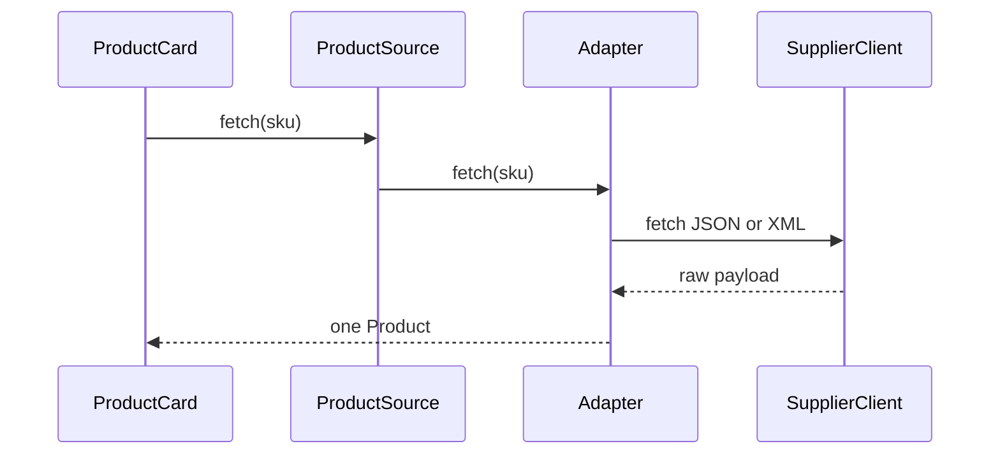

# Guide 05 — Adapter

**Lab:** [Requirements](../../phases/phase-05/requirements.md) · [Guided check](../../phases/phase-05/guided-check.md) · [Questions](../../phases/phase-05/questions.md)

## Chapter 5: "The product card that speaks two APIs"

A shopper opens the oak lamp page on **BrightCart**. The product card wants one shape: `ProductSource.fetch(sku) -> Product` — a name, a price in euros, and whether the lamp can be ordered. **BulkNest** answers in JSON (`item_title`, `price_cents`, `on_hand`). **Atelier** answers in XML (`label`, `price="45,90"`, `stock="yes"`).

BrightCart cannot rewrite either supplier. It also cannot let the product card parse both dialects. It needs an **Adapter** for each API: a thin translator that makes that supplier look like the port the card already speaks.

*Head First Design Patterns* covers Adapter in Chapter 7. Refactoring Guru: convert one interface into another clients expect ([Adapter](https://refactoring.guru/design-patterns/adapter)).

---

## Learning Objectives

By the end of this guide you will be able to:

- State Adapter’s intent and when to use it
- Separate a domain port from a vendor/legacy SDK
- Write a small adapter that translates data without embedding business rules
- Contrast Adapter with Facade
- Bridge the idea to Phase 5 without copying BrightCart types

---

## Theory

### Intent

**Adapter** converts the interface of a class into another interface clients expect. Adapter lets classes work together that could not otherwise because of incompatible interfaces. The Gang of Four distinguishes **object adapter** (composition: adapter holds adaptee) and **class adapter** (inheritance); most modern code uses composition.

*Head First Design Patterns* covers Adapter in Chapter 7. Refactoring Guru: wrap an existing object with a new interface ([Adapter](https://refactoring.guru/design-patterns/adapter)).

### The problem in plain language

Integration reality: vendors ship SDKs with odd method names, XML payloads, blocking I/O, or status codes your domain should never see. Rewriting the vendor is rarely an option. Letting every service import the legacy client spreads the pain—business rules get tangled with parsing, unit conversion, and retry logic.

The smell is **business code speaking a foreign protocol**. `ProductCard` should not know about `price_cents` or `price="45,90"`.

### Analogy — travel power plug adapter

Your laptop expects a grounded Type F outlet. The hotel wall delivers something else. You do not rewire the hotel; you use a **plug adapter** that presents the interface your device expects on one side and speaks the wall’s interface on the other. Two different wall sockets still need the same plug on the laptop side — one adapter per socket, not a new laptop.

The adapter does not set the lamp’s markup or VAT — that is domain logic. It only **translates shape and protocol** so the product card can call `fetch(sku)` while BulkNest still returns cents and Atelier still returns XML.

### Solution structure

| Role | Responsibility | In Phase 5 lab |
| ---- | -------------- | -------------- |
| **Target (port)** | Interface the application expects | `SensorPort`, `ActuatorPort` |
| **Adaptee** | Existing incompatible API | Vendor stub payload, simulation driver, MQTT payload dict |
| **Adapter** | Translates calls and data | Simulation, vendor-stub, and MQTT translators |
| **Client** | Depends only on the port | One ingest writer (manual read, sampler, later device HTTP or broker) |

Keep adapters **thin**: map fields, convert units, handle errors at the boundary. Irrigation rules and automation policies stay outside.

### How collaboration works



The client sees only `ProductSource`. Each adapter is the only place that imports its supplier client.

### When to use / when to skip

**Use Adapter when:**

- You must integrate a third-party or legacy component whose interface does not match your domain ports.
- Multiple callers would otherwise duplicate translation logic.
- You want to swap vendors by changing adapters, not rewriting services.

**Skip or simplify when:**

- The external API already matches your port—a direct implementation is fine.
- You need to **simplify** a complex subsystem for callers—that is Facade’s job, not Adapter’s.
- The “adapter” starts containing business rules—it has grown into a god service.

### Related patterns

- **Facade** — simplifies **how to use** a subsystem; Adapter **changes the interface shape** so two sides can talk. Facade can sit on top of adapters.
- **Bridge** — separates abstraction from implementation at design time; Adapter fixes mismatch after the fact. Bridge is planned; Adapter is retrofit.
- **Decorator** — same interface, added behavior; Adapter **different** interface, translation.

---

# Part 2 — Follow along

> **Follow along:** Stdlib Python only. Run the problem demo first, then the complete adapter script.

## 1. The sticky problem

Same morning. The shopper is still waiting on the oak lamp page. The card has no translator, so it walks up to both counters itself.

### 1.1 Smell: the card speaks both dialects

```python
# The card leans over BulkNest's counter and reads price_cents itself.
raw = json.loads(self.bulk.fetch_json(sku))
title = raw["item_title"]
# Then it leans over Atelier's counter and parses the comma price itself.
node = ET.fromstring(self.atelier.fetch_xml(sku))
price = node.attrib["price"]  # "45,90" — supplier dialect leaked upward
```

**Root cause:** Application services depend on a foreign interface. Changing suppliers means rewriting the product card.

### 1.2 Runnable problem demo

> **Follow along:** Save as `brightcart_before.py`, run `python brightcart_before.py`.

```python
"""Monday morning at BrightCart. The product card speaks two supplier dialects."""

import json
import xml.etree.ElementTree as ET


class BulkNestClient:
    """Adaptee. BulkNest's counter — BrightCart does not control this JSON."""

    def fetch_json(self, sku: str) -> str:
        return json.dumps(
            {
                "sku": sku,
                "item_title": "Oak lamp",
                "price_cents": 4590,
                "on_hand": 12,
            }
        )


class AtelierClient:
    """Adaptee. Atelier's counter — BrightCart does not control this XML."""

    def fetch_xml(self, sku: str) -> str:
        return f'<item sku="{sku}" label="Oak lamp" price="45,90" stock="yes"/>'


class ProductCard:
    def __init__(self, bulk: BulkNestClient, atelier: AtelierClient) -> None:
        self.bulk = bulk
        self.atelier = atelier

    def line(self, sku: str) -> str:
        # No port yet. The card itself is the one who knows both dialects.
        raw = json.loads(self.bulk.fetch_json(sku))
        node = ET.fromstring(self.atelier.fetch_xml(sku))
        return f"{raw['item_title']} @ {raw['price_cents']} cents / {node.attrib['price']}"


if __name__ == "__main__":
    card = ProductCard(BulkNestClient(), AtelierClient())
    card.line("LAMP-OAK")  # both dialects run; the tangle stays off the page
    print("A shopper opens the oak lamp page.")
    print("The card asks BulkNest and reads item_title and price_cents itself.")
    print('The card asks Atelier and parses price="45,90" itself.')
    print("PAIN: the product card speaks two supplier dialects.")
```

**Expected output (problem):**

```text
A shopper opens the oak lamp page.
The card asks BulkNest and reads item_title and price_cents itself.
The card asks Atelier and parses price="45,90" itself.
PAIN: the product card speaks two supplier dialects.
```

### What goes wrong when requirements change

Swap BulkNest for another JSON shop, or add a second page that needs `available`, and you rewrite `ProductCard`. A third feature that shows the euro price duplicates the cents math and the comma-to-decimal parse.

---

## 2. Pattern in practice

The translators arrive before lunch. Each one stands at one counter. The card asks only for a `Product`.

---

## 3. Building the solution (step by step)

### Step A — The card names the product it already understands

```python
from abc import ABC, abstractmethod
from dataclasses import dataclass
from decimal import Decimal


@dataclass(frozen=True)
class Product:
    name: str
    price_eur: Decimal
    available: bool


class ProductSource(ABC):
    @abstractmethod
    def fetch(self, sku: str) -> Product:
        """The port the card trusts — no cents, no XML, no commas."""
        ...
```

### Step B — A translator stands at BulkNest's counter

```python
class BulkNestAdapter(ProductSource):
    def __init__(self, bulk: BulkNestClient) -> None:
        self._bulk = bulk  # composition: the adapter holds the adaptee

    def fetch(self, sku: str) -> Product:
        # Translation only: cents and on_hand — not markup, not VAT
        raw = json.loads(self._bulk.fetch_json(sku))
        ...
```

### Step C — The card talks only to the port

```python
class ProductCard:
    def __init__(self, source: ProductSource) -> None:
        self.source = source  # the card never imports BulkNest or Atelier

    def line(self, sku: str) -> str:
        product = self.source.fetch(sku)
        return f"{product.name} — {product.price_eur} EUR, available={product.available}"
```

---

## 4. Complete worked solution (runnable)

> **Follow along:** Save as `brightcart_adapter.py`, run `python brightcart_adapter.py`.

```python
"""Later that morning. Two translators, one product card (stdlib only)."""

from abc import ABC, abstractmethod
from dataclasses import dataclass
from decimal import Decimal
import json
import xml.etree.ElementTree as ET


@dataclass(frozen=True)
class Product:
    name: str
    price_eur: Decimal
    available: bool


class ProductSource(ABC):
    """Port. The only language the product card speaks."""

    @abstractmethod
    def fetch(self, sku: str) -> Product:
        ...


class BulkNestClient:
    """Adaptee. BulkNest still answers in cents. We do not control this JSON."""

    def fetch_json(self, sku: str) -> str:
        return json.dumps(
            {
                "sku": sku,
                "item_title": "Oak lamp",
                "price_cents": 4590,
                "on_hand": 12,
            }
        )


class AtelierClient:
    """Adaptee. Atelier still answers in XML. We do not control this document."""

    def fetch_xml(self, sku: str) -> str:
        return f'<item sku="{sku}" label="Oak lamp" price="45,90" stock="yes"/>'


class BulkNestAdapter(ProductSource):
    """Translator at BulkNest's counter. The card never sees cents."""

    def __init__(self, bulk: BulkNestClient) -> None:
        self._bulk = bulk

    def fetch(self, sku: str) -> Product:
        raw = json.loads(self._bulk.fetch_json(sku))
        price = (Decimal(raw["price_cents"]) / Decimal(100)).quantize(Decimal("0.01"))
        return Product(
            name=raw["item_title"],
            price_eur=price,
            available=int(raw["on_hand"]) > 0,
        )


class AtelierAdapter(ProductSource):
    """Translator at Atelier's counter. The card never sees XML."""

    def __init__(self, atelier: AtelierClient) -> None:
        self._atelier = atelier

    def fetch(self, sku: str) -> Product:
        node = ET.fromstring(self._atelier.fetch_xml(sku))
        price = Decimal(node.attrib["price"].replace(",", ".")).quantize(Decimal("0.01"))
        return Product(
            name=node.attrib["label"],
            price_eur=price,
            available=node.attrib["stock"] == "yes",
        )


class ProductCard:
    """Client. Written once. It asks the port and reads the reply aloud."""

    def __init__(self, source: ProductSource) -> None:
        self.source = source

    def line(self, sku: str) -> str:
        product = self.source.fetch(sku)
        return f"{product.name} — {product.price_eur} EUR, available={product.available}"


if __name__ == "__main__":
    print("The shopper opens the oak lamp page again.")
    bulk_card = ProductCard(BulkNestAdapter(BulkNestClient()))
    atelier_card = ProductCard(AtelierAdapter(AtelierClient()))
    print(
        "BulkNest still answers in cents. A translator speaks to the card: "
        + bulk_card.line("LAMP-OAK")
    )
    print(
        "Atelier still answers in XML. Another translator speaks to the card: "
        + atelier_card.line("LAMP-OAK")
    )
    print("The card never learned either dialect.")
```

**Expected output (solution):**

```text
The shopper opens the oak lamp page again.
BulkNest still answers in cents. A translator speaks to the card: Oak lamp — 45.90 EUR, available=True
Atelier still answers in XML. Another translator speaks to the card: Oak lamp — 45.90 EUR, available=True
The card never learned either dialect.
```

---

## 5. Compare & contrast

| | Adapter | Facade (Guide 07) |
|--|---------|-------------------|
| Goal | Make an *existing* interface usable | Make a *subsystem* simpler |
| Typical shape | One adaptee → one port | Many classes → one method |
| Smell if wrong | Adapter grows business rules | Facade becomes a god object |

---

## 6. Watch out for these traps

- Putting markup, VAT, or “hide if out of stock” inside the adapter
- Leaking JSON or XML types through the port
- Reusing BrightCart names in the greenhouse vendor-adapter lab

---

## 7. Try this

A third supplier emails a spreadsheet before close of day. Add a `CsvCatalogAdapter` that reads one line, `Oak lamp,45.90,yes`, and implements `ProductSource`. Wire it into the same `ProductCard` without changing `line`. Re-run. The card should speak the same sentence. The spreadsheet dialect stays inside the new translator.

---

## Key Terms

| Term | Definition |
|------|------------|
| **Adapter** | Structural pattern that translates one interface to another |
| **Port** | Application-facing interface (target) |
| **Adaptee** | Existing class/SDK being wrapped |

---

## Reading Assignments

**Required:**

- *Head First Design Patterns* — Chapter 7 (Adapter)
- [Refactoring Guru — Adapter](https://refactoring.guru/design-patterns/adapter)
- Lab: [Requirements](../../phases/phase-05/requirements.md) · [Guided check](../../phases/phase-05/guided-check.md) · [Questions](../../phases/phase-05/questions.md)

---

## Bridge to your lab

Phase 5 wraps vendor, simulation, or MQTT payloads behind ports. Keep adapters thin: translate, don’t decide irrigation policy. One ingest writer persists `sensor_readings` for a manual read, the simulation sampler, and (later) a device HTTP route or an optional broker.

| Teaching (this guide) | Your lab (greenhouse) |
| --------------------- | --------------------- |
| BulkNest JSON / Atelier XML (foreign shape) | Simulation driver, vendor stub payload, or an MQTT payload dict |
| `ProductSource` port | `SensorPort` (`read`) and `ActuatorPort` (`apply`) |
| `BulkNestAdapter` / `AtelierAdapter` | `SimulationSensorAdapter` / `VendorStubSensorAdapter` / MQTT translator (`source` `mqtt`; no broker) |
| `Product` (normalized) | `Reading` (value, unit, source, time) |
| `ProductCard` | One ingest writer. Phase 12 may pass the same dict in from device HTTP or from the optional broker |

**Do / don’t:** **Do** depend on `SensorPort` in application code, and sample only when tracking is on and the device protocol is simulation. **Don’t** decide irrigation in an adapter (that is Strategy), don’t open a broker socket in this phase, and don’t leak vendor XML/JSON types into routers. Sensor cards poll the latest stored reading until Phase 12.

---

## Summary

- Foreign SDKs should not dictate your application interfaces.
- Adapter translates onto a port your services already understand.
- Keep business rules out of adapters.

**Next:** [Guide 06 — Strategy](./06-strategy.md)
