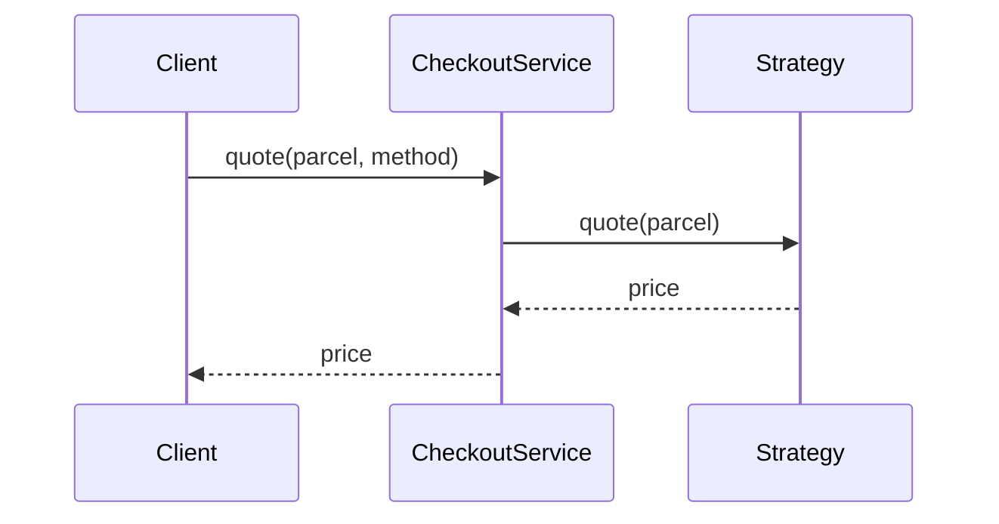

# Guide 06 — Strategy

**Lab:** [Requirements](../../phases/phase-06/requirements.md) · [Guided check](../../phases/phase-06/guided-check.md) · [Questions](../../phases/phase-06/questions.md)

## Chapter 6: "Shipping quotes at CartNest"

**CartNest** checkout must price shipping: **standard**, **express**, and **economy**. The first build stuffed every formula into `CheckoutService` with `if method == ...`. Finance asked for “green shipping” and three developers collided in the same method.

You need **Strategy**: interchangeable algorithms behind one interface.

*Head First Design Patterns* introduces Strategy in Chapter 1. Refactoring Guru: ([Strategy](https://refactoring.guru/design-patterns/strategy)).

---

## Learning Objectives

By the end of this guide you will be able to:

- State Strategy’s intent
- Separate “decide which algorithm” from “run the algorithm”
- Swap policies without rewriting the context
- Contrast Strategy with State
- Bridge the idea to Phase 6 without copying CartNest types

---

## Theory

### Intent

**Strategy** defines a family of algorithms, encapsulates each one, and makes them interchangeable. Strategy lets the algorithm vary independently from clients that use it. The context object holds a reference to a strategy and delegates work to it.

*Head First Design Patterns* introduces Strategy in Chapter 1. Refactoring Guru: extract varying behavior into objects you can swap at runtime ([Strategy](https://refactoring.guru/design-patterns/strategy)).

### The problem in plain language

A service method grows a column of `if method == "standard"` / `elif method == "express"` branches. Each branch encodes a different formula, policy, or ruleset. New requirements—green shipping, regional pricing, loyalty discounts—force edits to the same hotspot. Tests must cover every branch combination. Two developers cannot extend different policies without merge conflicts.

The recurring issue: **algorithms and selection logic are fused**. The context knows too much about how each variant works.

### Analogy — GPS routing apps

You open a navigation app and tap “Navigate to the airport.” The UI stays the same; behind the scenes you pick a **route strategy**: fastest, avoid tolls, scenic, or eco-friendly. Each strategy computes a path differently using the same map data. Switching strategies does not rewrite the “start navigation” button—it swaps the engine plugged into a stable shell.

In software, the **context** is the navigation shell; each **strategy** is a route algorithm selected by configuration or user choice.

### Solution structure

| Role | Responsibility | In Phase 6 lab |
| ---- | -------------- | -------------- |
| **Strategy** | Interface for the varying algorithm | `IrrigationPolicy`, `LightingPolicy`, … |
| **Concrete strategy** | One algorithm implementation | Conservative vs aggressive moisture rules |
| **Context** | Holds strategy; delegates | `GreenhouseContext` (uses `location_id`) |
| **Client** | Configures or swaps strategy | API setting automation mode per zone |

The context should not contain `if conservative ... elif aggressive ...` for the core calculation—it calls `strategy.decide(readings, thresholds)`.

### How collaboration works



Swapping strategy means injecting a different object—often at startup, per request, or when the operator changes policy in the UI.

### When to use / when to skip

**Use Strategy when:**

- Multiple algorithms implement the same conceptual operation (price shipping, choose irrigation, rank search results).
- The algorithm should change at runtime without modifying the context class.
- You want each policy in its own testable class.

**Skip or simplify when:**

- Behavior varies because of **lifecycle mode** (open vs closed ticket)—State may fit better (Guide 08).
- Only one algorithm exists and will never vary.
- The “strategies” are tiny one-liners—a dict of functions can be enough until complexity grows.

### Related patterns

- **State** — structurally similar (delegate to a polymorphic object), but State objects represent **modes** that change as the machine evolves; Strategy objects are usually **chosen by the client** and represent interchangeable policies. Confusing them is common—ask “who changes the active object?”
- **Template Method** — fixed skeleton in a base class, varying steps in subclasses; inheritance-based rather than composition-based swapping.
- **Command** — encapsulates a request as an object; Strategy encapsulates an algorithm. Command can carry undo/history; Strategy focuses on calculation.

---

# Part 2 — Follow along

> **Follow along:** Stdlib Python only. Run the problem demo, then the complete strategy script.

## 1. The sticky problem

### 1.1 Smell: algorithms trapped in conditionals

```python
# Smell: every new shipping method edits this hotspot
if method == "standard":
    return 5.0 + 0.02 * parcel.distance_km
if method == "express":
    return 12.0 + ...
```

**Root cause:** Algorithms and selection live in one class.

### 1.2 Runnable problem demo

> **Follow along:** Save as `cartnest_before.py`, run `python cartnest_before.py`.

```python
"""Problem demo: shipping formulas buried in if/elif."""

from dataclasses import dataclass


@dataclass
class Parcel:
    weight_kg: float
    distance_km: float


class CheckoutService:
    def shipping_quote(self, parcel: Parcel, method: str) -> float:
        if method == "standard":
            return 5.0 + 0.02 * parcel.distance_km
        if method == "express":
            return 12.0 + 0.05 * parcel.distance_km + 0.5 * parcel.weight_kg
        if method == "economy":
            return max(3.0, 0.01 * parcel.distance_km + 0.2 * parcel.weight_kg)
        raise ValueError(method)


if __name__ == "__main__":
    parcel = Parcel(weight_kg=2, distance_km=100)
    svc = CheckoutService()
    print("standard:", svc.shipping_quote(parcel, "standard"))
    print("express:", svc.shipping_quote(parcel, "express"))
    try:
        print(svc.shipping_quote(parcel, "green"))
    except ValueError as exc:
        print(f"PAIN: {exc} — adding green means editing CheckoutService again")
```

**Expected output (problem):**

```text
standard: 7.0
express: 18.0
PAIN: green — adding green means editing CheckoutService again
```

### What goes wrong when requirements change

Every new method is a merge conflict in one function. Testing one formula requires constructing the whole checkout service.

---

## 2. Pattern in practice

The CartNest runnable example below moves shipping formulas into `ShippingStrategy` implementations; `CheckoutService` only selects a strategy and delegates `quote()`.

---

## 3. Building the solution (step by step)

### Step A — Strategy interface + one algorithm

```python
class ShippingStrategy(ABC):
    @abstractmethod
    def quote(self, parcel: Parcel) -> float:
        ...


class StandardShipping(ShippingStrategy):
    def quote(self, parcel: Parcel) -> float:
        return 5.0 + 0.02 * parcel.distance_km
```

### Step B — Context delegates

```python
class CheckoutService:
    def __init__(self, strategy: ShippingStrategy) -> None:
        self._strategy = strategy

    def shipping_quote(self, parcel: Parcel) -> float:
        return self._strategy.quote(parcel)  # no if/elif on method names
```

### Step C — Selection outside the algorithm

```python
STRATEGIES = {"standard": StandardShipping(), "express": ExpressShipping(), ...}
strategy = STRATEGIES[method]
CheckoutService(strategy).shipping_quote(parcel)
```

---

## 4. Complete worked solution (runnable)

> **Follow along:** Save as `cartnest_strategy.py`, run `python cartnest_strategy.py`.

```python
"""Strategy demo — CartNest shipping quotes (stdlib only)."""

from abc import ABC, abstractmethod
from dataclasses import dataclass


@dataclass(frozen=True)
class Parcel:
    weight_kg: float
    distance_km: float


class ShippingStrategy(ABC):
    @abstractmethod
    def quote(self, parcel: Parcel) -> float:
        ...


class StandardShipping(ShippingStrategy):
    def quote(self, parcel: Parcel) -> float:
        return 5.0 + 0.02 * parcel.distance_km


class ExpressShipping(ShippingStrategy):
    def quote(self, parcel: Parcel) -> float:
        return 12.0 + 0.05 * parcel.distance_km + 0.5 * parcel.weight_kg


class EconomyShipping(ShippingStrategy):
    def quote(self, parcel: Parcel) -> float:
        return max(3.0, 0.01 * parcel.distance_km + 0.2 * parcel.weight_kg)


class GreenShipping(ShippingStrategy):
    def quote(self, parcel: Parcel) -> float:
        # Extension: new class + registry entry — not a new elif in checkout
        return EconomyShipping().quote(parcel) + 1.50


class CheckoutService:
    def __init__(self, strategy: ShippingStrategy) -> None:
        self._strategy = strategy

    def set_strategy(self, strategy: ShippingStrategy) -> None:
        self._strategy = strategy

    def shipping_quote(self, parcel: Parcel) -> float:
        return self._strategy.quote(parcel)


STRATEGIES: dict[str, ShippingStrategy] = {
    "standard": StandardShipping(),
    "express": ExpressShipping(),
    "economy": EconomyShipping(),
    "green": GreenShipping(),
}


def quote_for(method: str, parcel: Parcel) -> float:
    return CheckoutService(STRATEGIES[method]).shipping_quote(parcel)


if __name__ == "__main__":
    parcel = Parcel(weight_kg=2, distance_km=100)
    for name in ("standard", "express", "economy", "green"):
        print(f"{name}: {quote_for(name, parcel)}")
```

**Expected output (solution):**

```text
standard: 7.0
express: 18.0
economy: 3.0
green: 4.5
```

---

## 5. Compare & contrast

| | Strategy | State (Guide 08) |
|--|----------|------------------|
| Why behavior changes | Client chose a policy | Object’s internal mode changed |
| Example | Express vs economy quote | Ticket open vs closed actions |

---

## 6. Watch out for these traps

- Strategies that secretly charge cards / call actuators
- One mega-strategy with internal `if`s
- Porting `ShippingStrategy` names into irrigation policies

---

## 7. Try this

Add `OvernightShipping` (flat €25 + €1/kg). Register it, print a quote, re-run. `CheckoutService.shipping_quote` should stay unchanged.

---

## Key Terms

| Term | Definition |
|------|------------|
| **Strategy** | Behavioral pattern for interchangeable algorithms |
| **Context** | Object that delegates to a strategy |

---

## Reading Assignments

**Required:**

- *Head First Design Patterns* — Chapter 1 (Strategy intro)
- [Refactoring Guru — Strategy](https://refactoring.guru/design-patterns/strategy)
- Lab: [Requirements](../../phases/phase-06/requirements.md) · [Guided check](../../phases/phase-06/guided-check.md) · [Questions](../../phases/phase-06/questions.md)

---

## Bridge to your lab

Phase 6 uses Strategy for automation decision policies. Keep “decide” separate from “execute” (Command comes later).

| Teaching (this guide) | Your lab (greenhouse) |
| --------------------- | --------------------- |
| `ShippingStrategy.quote` / `decide` | `AutomationStrategy.decide(context)` |
| `StandardShipping` / `ExpressShipping` | Conservative vs aggressive moisture (lab keys) |
| `Parcel` (input to the algorithm) | `LocationAutomationContext` (latest readings + zone band) |
| `CheckoutService` picking a strategy | Automation service: load key from DB, build context, call `decide` |

**Do / don’t:** **Do** build context from persisted readings and `zones` (not hardcoded thresholds). **Don’t** import SQLAlchemy into strategy classes, and don’t run pumps inside `decide()` — Command is Phase 10.

---

## Summary

- Algorithms buried in conditionals fight change.
- Strategy extracts each algorithm behind one interface.
- Prefer Strategy for selectable policies; State for lifecycles.

**Next:** [Guide 07 — Facade](./07-facade.md)
