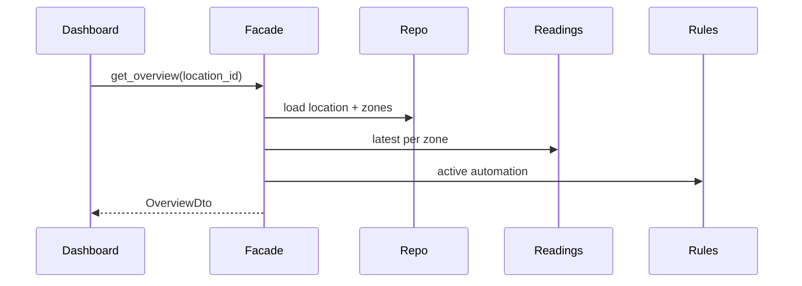

# Guide 07 — Facade

**Lab:** [Requirements](../../phases/phase-07/requirements.md) · [Guided check](../../phases/phase-07/guided-check.md) · [Questions](../../phases/phase-07/questions.md)

## Chapter 7: "One button for ClipRiver"

**ClipRiver** hosts short videos. Uploading currently means: transcode, thumbnail, CDN, DB row, notify. The dashboard team copied that dance into three handlers. When CDN order changed, three bugs shipped.

You need a **Facade**: one operation—`publish_clip(...)`—that orchestrates the subsystem.

*Head First Design Patterns* pairs Facade with Adapter in Chapter 7. Refactoring Guru: provide a simplified interface to a set of subsystems ([Facade](https://refactoring.guru/design-patterns/facade)).

---

## Learning Objectives

By the end of this guide you will be able to:

- State Facade’s intent
- Design a small façade that orchestrates without owning all domain logic
- Contrast Facade with Adapter
- Bridge the idea to Phase 7 overview APIs

---

## Theory

### Intent

**Facade** provides a unified, higher-level interface to a set of interfaces in a subsystem. Facade defines a new simplified entry point; it does not necessarily change subsystem classes—it **orchestrates** them so clients do not need to know call order, error handling, or which collaborator to invoke.

*Head First Design Patterns* pairs Facade with Adapter in Chapter 7. Refactoring Guru: hide complexity behind one door ([Facade](https://refactoring.guru/design-patterns/facade)).

### The problem in plain language

A real feature touches many parts: repositories, adapters, policies, logging, notifications. Without a façade, every HTTP handler, CLI command, and test duplicates the same five-step dance. When step order changes (CDN before DB, or vice versa), every copy breaks differently.

The smell is **orchestration leakage**: callers know too much about subsystem choreography. The dashboard should ask “give me location overview,” not “join these four queries and map these six DTO fields.”

### Analogy — hotel concierge

A guest wants “dinner reservations and a taxi at 8.” They speak to the **concierge** once. Behind the desk, housekeeping, billing, restaurant booking, and valet coordinate. The guest does not visit each department, know internal extension numbers, or enforce the correct order of operations.

A Facade is that concierge for code: one method (`publish_clip`, `get_location_overview`) that coordinates subsystems while keeping their classes intact.

### Solution structure

| Role | Responsibility | In Phase 7 lab |
| ---- | -------------- | -------------- |
| **Facade** | Simplified entry; orchestrates collaborators | `GreenhouseControlFacade` |
| **Subsystem classes** | Existing services/repos the façade calls | location repo, readings, devices, rules |
| **Client** | Depends on façade only | `GET /api/locations/:id/overview` handler |

The façade **coordinates**; it should not absorb all domain rules. Heavy policy stays in domain/services—the façade wires them together for a use case.

### How collaboration works



One round trip for the client; multiple collaborators inside the façade.

### When to use / when to skip

**Use Facade when:**

- A common use case requires multiple subsystem calls in a stable order.
- You want a stable API surface (`overview`, `publish`, `onboard`) over evolving internals.
- Tests for HTTP handlers should mock one façade instead of six services.

**Skip or simplify when:**

- The operation is a single repository call—a façade adds indirection without value.
- The façade becomes a **god class** with hundreds of methods—split by use case or apply application services per bounded context.
- You need to **translate incompatible interfaces**—that is Adapter’s job first.

### Related patterns

- **Adapter** — makes one component fit an expected interface; Facade **simplifies using many** components. You may use adapters inside a façade.
- **Mediator** — centralizes complex many-to-many communication; Facade is usually **one-way** simplification for external clients.
- **Application service** — in layered architecture, an application-layer service often *is* a façade for a use case. The pattern name describes the shape; the layer name describes where it lives.

---

# Part 2 — Follow along

> **Follow along:** Stdlib Python only. Run the problem demo, then the complete façade script.

## 1. The sticky problem

### 1.1 Smell: every caller wires the pipeline

```python
# Smell: order + collaborators duplicated at every call site
job = Transcoder().enqueue(file_path)
thumb = ThumbnailService().from_file(file_path)
url = CdnClient().put(job.output_path)
ClipRepository().insert(creator_id, url, thumb.path)
Notifier().clip_ready(creator_id, url)
```

**Root cause:** Clients know too many moving parts.

### 1.2 Runnable problem demo

> **Follow along:** Save as `clipriver_before.py`, run `python clipriver_before.py`.

```python
"""Problem demo: upload endpoint duplicates the pipeline."""


class Transcoder:
    def enqueue(self, file_path: str):
        print(f"transcode {file_path}")
        return type("Job", (), {"output_path": file_path + ".mp4"})()


class ThumbnailService:
    def from_file(self, file_path: str):
        print(f"thumb {file_path}")
        return type("Thumb", (), {"path": file_path + ".jpg"})()


class CdnClient:
    def put(self, path: str) -> str:
        url = f"https://cdn.clipriver.example/{path}"
        print(f"cdn {url}")
        return url


class ClipRepository:
    def insert(self, creator_id: str, url: str, thumb: str) -> None:
        print(f"db save creator={creator_id}")


class Notifier:
    def clip_ready(self, creator_id: str, url: str) -> None:
        print(f"notify {creator_id}")


def upload_endpoint(file_path: str, creator_id: str) -> dict:
    # Hotspot: copy this into batch import + admin reprocess = three sources of truth
    job = Transcoder().enqueue(file_path)
    thumb = ThumbnailService().from_file(file_path)
    url = CdnClient().put(job.output_path)
    ClipRepository().insert(creator_id, url, thumb.path)
    Notifier().clip_ready(creator_id, url)
    return {"url": url, "thumb": thumb.path}


if __name__ == "__main__":
    print(upload_endpoint("clip.mov", "creator-9"))
    print("PAIN: every new entry point must repeat all five steps in order")
```

**Expected output (problem):**

```text
transcode clip.mov
thumb clip.mov
cdn https://cdn.clipriver.example/clip.mov.mp4
db save creator=creator-9
notify creator-9
{'url': 'https://cdn.clipriver.example/clip.mov.mp4', 'thumb': 'clip.mov.jpg'}
PAIN: every new entry point must repeat all five steps in order
```

### What goes wrong when requirements change

Insert “virus scan before CDN” in one handler and forget the other two. Ops gets inconsistent publishes.

---

## 2. Pattern in practice

The ClipRiver runnable example below centralizes upload orchestration in `ClipPublishFacade` so dashboard handlers call one method instead of wiring transcode, thumbnail, CDN, and DB steps themselves.

---

## 3. Building the solution (step by step)

### Step A — One entry method

```python
class ClipPublishFacade:
    def publish_clip(self, file_path: str, creator_id: str) -> PublishResult:
        # Orchestration lives once; handlers stay thin
        ...
```

### Step B — Thin HTTP/application edge

```python
def upload_endpoint(facade: ClipPublishFacade, file_path: str, creator_id: str) -> dict:
    result = facade.publish_clip(file_path, creator_id)
    return {"url": result.url, "thumb": result.thumb_path}
```

---

## 4. Complete worked solution (runnable)

> **Follow along:** Save as `clipriver_facade.py`, run `python clipriver_facade.py`.

```python
"""Facade demo — ClipRiver publish pipeline (stdlib only)."""

from dataclasses import dataclass


@dataclass
class PublishResult:
    url: str
    thumb_path: str


class Transcoder:
    def enqueue(self, file_path: str):
        print(f"transcode {file_path}")
        return type("Job", (), {"output_path": file_path + ".mp4"})()


class ThumbnailService:
    def from_file(self, file_path: str):
        print(f"thumb {file_path}")
        return type("Thumb", (), {"path": file_path + ".jpg"})()


class CdnClient:
    def put(self, path: str) -> str:
        url = f"https://cdn.clipriver.example/{path}"
        print(f"cdn {url}")
        return url


class ClipRepository:
    def insert(self, creator_id: str, url: str, thumb: str) -> None:
        print(f"db save creator={creator_id}")


class Notifier:
    def clip_ready(self, creator_id: str, url: str) -> None:
        print(f"notify {creator_id}")


class ClipPublishFacade:
    def __init__(
        self,
        transcoder: Transcoder,
        thumbs: ThumbnailService,
        cdn: CdnClient,
        repo: ClipRepository,
        notifier: Notifier,
    ) -> None:
        self._transcoder = transcoder
        self._thumbs = thumbs
        self._cdn = cdn
        self._repo = repo
        self._notifier = notifier

    def publish_clip(self, file_path: str, creator_id: str) -> PublishResult:
        # Single place for publish order
        job = self._transcoder.enqueue(file_path)
        thumb = self._thumbs.from_file(file_path)
        url = self._cdn.put(job.output_path)
        self._repo.insert(creator_id, url, thumb.path)
        self._notifier.clip_ready(creator_id, url)
        return PublishResult(url=url, thumb_path=thumb.path)


def upload_endpoint(facade: ClipPublishFacade, file_path: str, creator_id: str) -> dict:
    result = facade.publish_clip(file_path, creator_id)
    return {"url": result.url, "thumb": result.thumb_path}


if __name__ == "__main__":
    facade = ClipPublishFacade(
        Transcoder(), ThumbnailService(), CdnClient(), ClipRepository(), Notifier()
    )
    # Two entry points, one orchestration
    print("http:", upload_endpoint(facade, "clip.mov", "creator-9"))
    print("batch:", facade.publish_clip("batch.mov", "creator-9"))
```

**Expected output (solution):**

```text
transcode clip.mov
thumb clip.mov
cdn https://cdn.clipriver.example/clip.mov.mp4
db save creator=creator-9
notify creator-9
http: {'url': 'https://cdn.clipriver.example/clip.mov.mp4', 'thumb': 'clip.mov.jpg'}
transcode batch.mov
thumb batch.mov
cdn https://cdn.clipriver.example/batch.mov.mp4
db save creator=creator-9
notify creator-9
batch: PublishResult(url='https://cdn.clipriver.example/batch.mov.mp4', thumb_path='batch.mov.jpg')
```

---

## 5. Compare & contrast

| | Facade | Adapter (Guide 05) |
|--|--------|---------------------|
| Input | Many classes / steps | One mismatched interface |
| Output | Simpler API | Compatible API |

---

## 6. Watch out for these traps

- A façade that becomes the entire application layer
- Hiding errors so callers cannot tell CDN failure from DB failure
- Porting `ClipPublishFacade` into the greenhouse lab by name

---

## 7. Try this

Add a `VirusScanner.scan(file_path)` step before CDN inside `publish_clip`. Re-run both entry points—both should scan without duplicating the call.

---

## Key Terms

| Term | Definition |
|------|------------|
| **Facade** | Structural pattern providing a simplified entry to a subsystem |
| **God object** | Anti-pattern: one type that knows/does too much |

---

## Reading Assignments

**Required:**

- *Head First Design Patterns* — Chapter 7 (Facade)
- [Refactoring Guru — Facade](https://refactoring.guru/design-patterns/facade)
- Lab: [Requirements](../../phases/phase-07/requirements.md) · [Guided check](../../phases/phase-07/guided-check.md) · [Questions](../../phases/phase-07/questions.md)

---

## Bridge to your lab

Phase 7 introduces a façade so the dashboard overview does not stitch many repositories by hand.

| Teaching (this guide) | Your lab (greenhouse) |
| --------------------- | --------------------- |
| Transcoder + thumbnail + CDN + repo + notifier | Devices, latest readings, strategy, last recommendation |
| `ClipPublishFacade` | `LocationOverviewFacade.get_overview(location_id)` |
| `PublishResult` | `LocationOverviewDto` (stable JSON) |
| ClipRiver HTTP handler calling five services | Overview router injects **only** the facade |

**Do / don’t:** **Do** hide N+1 joins and subsystem calls behind one door. **Don’t** turn the facade into a warehouse of unrelated features, and don’t re-implement Strategy inside the overview method—delegate.

---

## Summary

- Repeated multi-step dances belong behind a façade.
- Facades simplify; adapters translate.
- Keep façades as doors, not warehouses.

**Next:** [Guide 08 — State](./08-state.md)
