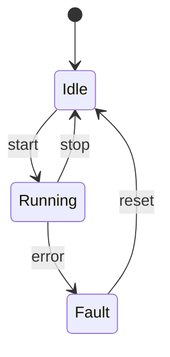

# Guide 08 — State

**Lab:** [Requirements](../../phases/phase-08/requirements.md) · [Guided check](../../phases/phase-08/guided-check.md) · [Questions](../../phases/phase-08/questions.md)

## Chapter 8: "Tickets at HelpHarbor"

**HelpHarbor** tracks support tickets: `open` → `in_progress` → `waiting_on_customer` → `closed`. Booleans (`is_closed`, `is_waiting`) and scattered guards let illegal moves slip through.

You need the **State** pattern: each mode is an object that knows which transitions are legal.

*Head First Design Patterns* Chapter 10. Refactoring Guru: ([State](https://refactoring.guru/design-patterns/state)).

---

## Learning Objectives

By the end of this guide you will be able to:

- Replace flag spaghetti with explicit states and transitions
- Explain how State differs from Strategy
- List allowed commands per state
- Bridge the idea to Phase 8 without copying HelpHarbor types

---

## Theory

### Intent

**State** allows an object to alter its behavior when its internal state changes. The object will appear to change its class. Each state encapsulates behavior for commands in that mode and knows which states are reachable next.

*Head First Design Patterns* dedicates Chapter 10 to State. Refactoring Guru: turn branching over modes into polymorphic state objects ([State](https://refactoring.guru/design-patterns/state)).

### The problem in plain language

Lifecycle-heavy entities—support tickets, actuators, orders—accumulate boolean flags (`is_closed`, `is_waiting`, `is_running`) and `if` guards at the start of every method. Illegal transitions slip through when a new code path forgets a guard. Allowed commands are documented in wiki tables but not enforced in code. Adding a state means editing every method instead of one class.

The root issue: **behavior and transition rules are scattered** instead of colocated with the mode they belong to.

### Analogy — support ticket lifecycle

A ticket in `open` can be assigned or closed. In `waiting_on_customer`, only a customer reply or escalation makes sense—assigning to an agent might be illegal. Each status is not just a label; it is a **bundle of permitted actions and next statuses**.

State pattern models each status as an object. The ticket (context) delegates `assign()`, `close()`, `escalate()` to the current state object. Illegal moves raise domain errors or no-op consistently—rules live with the state, not sprinkled across the context.

### Solution structure

| Role | Responsibility | In Phase 8 lab |
| ---- | -------------- | -------------- |
| **Context** | Holds current state; delegates commands | `ActuatorContext` |
| **State** | Interface for mode-specific behavior | `ActuatorState` |
| **Concrete state** | Implements allowed transitions | `IdleState`, `RunningState`, … |
| **Client** | Sends commands; reads `state` + `allowedCommands` | API / actuator controls |

Persist the current state name (or enum) in `actuator_states`; hydrate to state objects on load.

### How collaboration works



At runtime: `context.handle(command)` → `current_state.handle(context, command)` → state may call `context.transition(NewState())`.

### When to use / when to skip

**Use State when:**

- The object has a clear lifecycle with **mode-specific behavior and transitions**.
- Guards and allowed commands repeat across many methods.
- You expose `allowedCommands` to UIs so operators only see legal actions.

**Skip or simplify when:**

- Behavior varies by **configurable policy** but not lifecycle mode—Strategy fits better (Guide 06).
- Only two states with trivial rules—a boolean and one guard may suffice.
- States number in the dozens with identical behavior—consider a transition table instead.

### Related patterns

- **Strategy** — same delegation shape; Strategy is usually **injected** and swapped by client config; State **changes itself** as the context evolves. Ask: “Does the object’s mode change as part of its lifecycle?”
- **Command** — commands trigger transitions; State decides if they are legal. They compose well in Phase 10.
- **State machine libraries** — for complex graphs, explicit tables or libraries can complement or replace hand-rolled State classes.

---

# Part 2 — Follow along

> **Follow along:** Stdlib Python only. Run the problem demo, then the complete state machine.

## 1. The sticky problem

### 1.1 Smell: implicit mode in booleans

```python
# Smell: mode is a puzzle of flags; guards duplicated per method
if self.is_closed:
    raise RuntimeError("cannot start a closed ticket")
```

**Root cause:** Mode is implicit; transition rules are scattered.

### 1.2 Runnable problem demo

> **Follow along:** Save as `helpharbor_before.py`, run `python helpharbor_before.py`.

```python
"""Problem demo: boolean flags hide illegal transitions poorly."""


class Ticket:
    def __init__(self) -> None:
        self.is_closed = False
        self.is_waiting = False
        self.assignee: str | None = None

    def start(self, agent: str) -> None:
        if self.is_closed:
            raise RuntimeError("cannot start a closed ticket")
        self.assignee = agent
        self.is_waiting = False

    def close(self) -> None:
        if self.is_closed:
            raise RuntimeError("already closed")
        self.is_closed = True


if __name__ == "__main__":
    t = Ticket()
    t.close()
    try:
        t.start("Alex")
    except RuntimeError as exc:
        print(f"caught: {exc}")
    # Flags don't tell the UI what IS allowed next
    print(f"PAIN: is_closed={t.is_closed} is_waiting={t.is_waiting} — no allowed_commands()")
```

**Expected output (problem):**

```text
caught: cannot start a closed ticket
PAIN: is_closed=True is_waiting=False — no allowed_commands()
```

### What goes wrong when requirements change

Add reopen / escalate / merge and boolean combinations explode. The UI cannot ask “what can I do now?” cleanly.

---

## 2. Pattern in practice

The HelpHarbor runnable example below replaces boolean flags with state objects that enforce legal ticket transitions on each command.

---

## 3. Building the solution (step by step)

### Step A — Context delegates

```python
class Ticket:
    def start(self, agent: str) -> None:
        self.state.start(self, agent)  # current state decides
```

### Step B — One state owns legal moves

```python
class ClosedState(TicketState):
    def start(self, ticket: Ticket, agent: str) -> None:
        raise RuntimeError("reopen before starting work")

    def allowed_commands(self) -> list[str]:
        return ["reopen"]
```

---

## 4. Complete worked solution (runnable)

> **Follow along:** Save as `helpharbor_state.py`, run `python helpharbor_state.py`.

```python
"""State demo — HelpHarbor ticket lifecycle (stdlib only)."""

from abc import ABC, abstractmethod


class Ticket:
    def __init__(self) -> None:
        self.state: "TicketState" = OpenState()
        self.assignee: str | None = None

    def set_state(self, state: "TicketState") -> None:
        self.state = state

    def start(self, agent: str) -> None:
        self.state.start(self, agent)

    def wait_on_customer(self) -> None:
        self.state.wait_on_customer(self)

    def close(self) -> None:
        self.state.close(self)

    def reopen(self) -> None:
        self.state.reopen(self)

    def allowed_commands(self) -> list[str]:
        return self.state.allowed_commands()


class TicketState(ABC):
    @abstractmethod
    def start(self, ticket: Ticket, agent: str) -> None: ...

    @abstractmethod
    def wait_on_customer(self, ticket: Ticket) -> None: ...

    @abstractmethod
    def close(self, ticket: Ticket) -> None: ...

    @abstractmethod
    def reopen(self, ticket: Ticket) -> None: ...

    @abstractmethod
    def allowed_commands(self) -> list[str]: ...


class OpenState(TicketState):
    def start(self, ticket: Ticket, agent: str) -> None:
        ticket.assignee = agent
        ticket.set_state(InProgressState())

    def wait_on_customer(self, ticket: Ticket) -> None:
        raise RuntimeError("assign an agent before waiting on customer")

    def close(self, ticket: Ticket) -> None:
        ticket.set_state(ClosedState())

    def reopen(self, ticket: Ticket) -> None:
        raise RuntimeError("already open")

    def allowed_commands(self) -> list[str]:
        return ["start", "close"]


class InProgressState(TicketState):
    def start(self, ticket: Ticket, agent: str) -> None:
        ticket.assignee = agent

    def wait_on_customer(self, ticket: Ticket) -> None:
        ticket.set_state(WaitingState())

    def close(self, ticket: Ticket) -> None:
        ticket.set_state(ClosedState())

    def reopen(self, ticket: Ticket) -> None:
        raise RuntimeError("already in progress")

    def allowed_commands(self) -> list[str]:
        return ["start", "wait_on_customer", "close"]


class WaitingState(TicketState):
    def start(self, ticket: Ticket, agent: str) -> None:
        ticket.assignee = agent
        ticket.set_state(InProgressState())

    def wait_on_customer(self, ticket: Ticket) -> None:
        raise RuntimeError("already waiting")

    def close(self, ticket: Ticket) -> None:
        ticket.set_state(ClosedState())

    def reopen(self, ticket: Ticket) -> None:
        raise RuntimeError("use start to resume")

    def allowed_commands(self) -> list[str]:
        return ["start", "close"]


class ClosedState(TicketState):
    def start(self, ticket: Ticket, agent: str) -> None:
        raise RuntimeError("reopen before starting work")

    def wait_on_customer(self, ticket: Ticket) -> None:
        raise RuntimeError("ticket closed")

    def close(self, ticket: Ticket) -> None:
        raise RuntimeError("already closed")

    def reopen(self, ticket: Ticket) -> None:
        ticket.assignee = None
        ticket.set_state(OpenState())

    def allowed_commands(self) -> list[str]:
        return ["reopen"]


if __name__ == "__main__":
    t = Ticket()
    print("open allows:", t.allowed_commands())
    t.start("Alex")
    print("in_progress allows:", t.allowed_commands())
    t.close()
    print("closed allows:", t.allowed_commands())
    try:
        t.start("Blair")
    except RuntimeError as exc:
        print(f"illegal start blocked: {exc}")
    t.reopen()
    print("reopened allows:", t.allowed_commands())
```

**Expected output (solution):**

```text
open allows: ['start', 'close']
in_progress allows: ['start', 'wait_on_customer', 'close']
closed allows: ['reopen']
illegal start blocked: reopen before starting work
reopened allows: ['start', 'close']
```

---

## 5. Watch out for these traps

- States that bypass `set_state` and mutate flags
- Putting HTTP/SQL inside state classes
- Pasting HelpHarbor types into actuator code

---

## 6. Try this

From `InProgressState`, call `wait_on_customer`, print `allowed_commands`, then `start` again. Confirm you return to in-progress.

---

## Key Terms

| Term | Definition |
|------|------------|
| **State pattern** | Behavioral pattern modeling mode-specific behavior |
| **Transition** | Change from one state object to another |
| **Guard** | Rule that accepts or rejects a command in a state |

---

## Reading Assignments

**Required:**

- *Head First Design Patterns* — Chapter 10
- [Refactoring Guru — State](https://refactoring.guru/design-patterns/state)
- Lab: [Requirements](../../phases/phase-08/requirements.md) · [Guided check](../../phases/phase-08/guided-check.md) · [Questions](../../phases/phase-08/questions.md)

---

## Bridge to your lab

Phase 8 models actuator lifecycle with guarded transitions and an allowed-commands surface.

| Teaching (this guide) | Your lab (greenhouse) |
| --------------------- | --------------------- |
| `Ticket` + `TicketState` | Actuator + `ActuatorState` (objects or a transition table) |
| Open / in-progress / waiting / closed | `off` / `idle` / `running` / `error` / `maintenance` (lab set) |
| Commands allowed in a ticket mode | `allowed_commands` on the device DTO |
| Illegal ticket transition | `IllegalTransitionError` before persist |

**Do / don’t:** **Do** persist `actuator_states` so a restart keeps the mode. **Don’t** encode the lifecycle as booleans in React, and don’t invent ArenaTickets statuses in the greenhouse schema.

---

## Summary

- Booleans hide modes; illegal transitions sneak in.
- State makes modes explicit objects with their own command behavior.
- Use State for lifecycles; Strategy for selectable policies.

**Next:** [Guide 09 — Decorator](./09-decorator.md)
