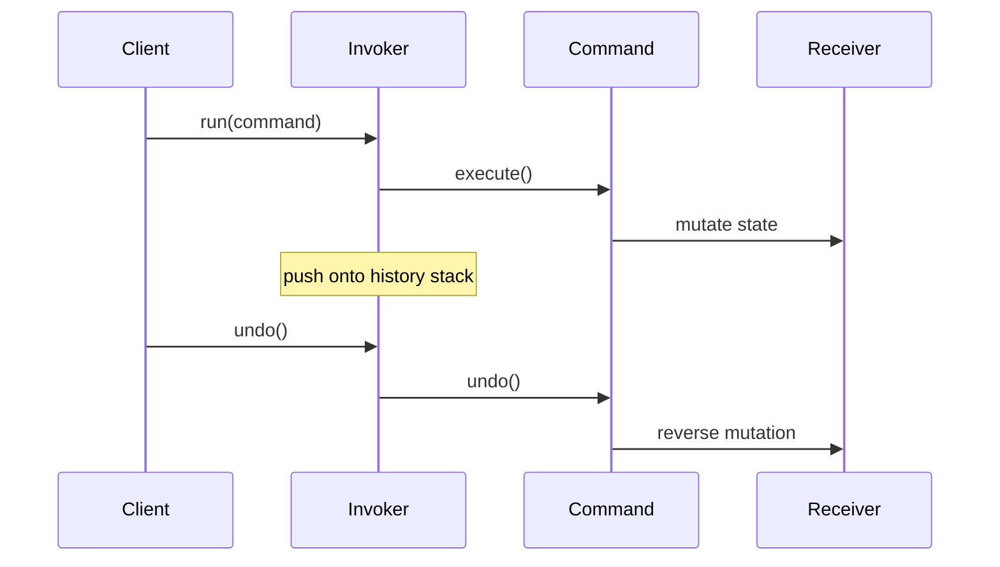

# Guide 10 — Command

**Lab:** [Requirements](../../phases/phase-10/requirements.md) · [Guided check](../../phases/phase-10/guided-check.md) · [Questions](../../phases/phase-10/questions.md)

## Chapter 10: "Undo at DraftDesk"

**DraftDesk** is a tiny text editor for support macros. Users type, delete, and hit **Undo**. The first build called `buffer.insert` / `buffer.delete` directly—nothing remembered enough to reverse.

You need the **Command** pattern: turn each request into an object that can `execute()` and `undo()`.

*Head First Design Patterns* Chapter 6. Refactoring Guru: ([Command](https://refactoring.guru/design-patterns/command)).

---

## Learning Objectives

By the end of this guide you will be able to:

- Explain Command as an objectified request
- Implement execute/undo with a history stack
- Contrast Command with a plain method call and with Strategy
- Bridge the idea to Phase 10 without copying DraftDesk types

---

## Theory

### Intent

**Command** encapsulates a request as an object, thereby letting you parameterize clients with different requests, queue operations, and support undo. The command object knows how to `execute()` the action and often how to `undo()` it. An **invoker** triggers commands; a **receiver** holds the state that changes.

*Head First Design Patterns* covers Command in Chapter 6 (remote control metaphor). Refactoring Guru: turn requests into objects ([Command](https://refactoring.guru/design-patterns/command)).

### The problem in plain language

Direct method calls (`buffer.delete(0, 1)`) are ephemeral—no record of what happened, no queue, no undo stack, no audit trail. When operators need **history**, **retry**, or **macro playback**, the caller must remember parameters and inverse operations scattered across the UI and services.

Actuator control has the same shape: “turn on pump 3” should be loggable, reversible where safe, and compatible with State guards.

### Analogy — restaurant order tickets

In a busy kitchen, waiters do not shout complex instructions that evaporate—they write **tickets**. Each ticket is a command: make dish X for table Y. The kitchen line executes tickets in order; if a dish is wrong, a compensating ticket (void/remake) reverses or replaces work. Tickets can be queued, logged, and replayed.

Software commands are those tickets: objects that capture intent and know how to apply and sometimes reverse it.

### Solution structure

| Role | Responsibility | In Phase 10 lab |
| ---- | -------------- | --------------- |
| **Command** | `execute()` / `undo()` (optional) | `StartActuatorCommand`, … |
| **Receiver** | Domain object that changes | `ActuatorContext`, hardware port |
| **Invoker** | Runs commands; may keep history | `CommandInvoker` |
| **Client** | Creates commands; passes to invoker | API handler, UI button |

Persist `command_log` for audit; integrate with State so illegal commands fail before execute.

### How collaboration works



### When to use / when to skip

**Use Command when:**

- Operations need **undo**, **redo**, **queue**, or **audit history**.
- You want to decouple “who triggers” from “what runs” (buttons, API, scheduler, macros).
- Commands compose with State (legal check) and Decorator (logged execution).

**Skip or simplify when:**

- Actions are fire-and-forget with no history requirement—a direct method call is fine.
- Undo is impossible or dangerous (send email)—log intent without reversible commands.
- Every command would be a one-liner wrapper—consider whether history truly matters.

### Related patterns

- **Strategy** — encapsulates algorithms; Command encapsulates **requests with side effects**. Strategy answers “how to compute”; Command answers “do this, remember it, maybe undo.”
- **Memento** — stores receiver state for undo; Command can embed memento data or inverse operations.
- **State** — commands trigger transitions; State decides legality before execute runs.

---

# Part 2 — Follow along

> **Follow along:** Stdlib Python only. Run the problem demo, then the complete command script.

## 1. The sticky problem

### 1.1 Smell: mutations with no memory

```python
# Smell: after delete, nothing stores what was removed
buffer.delete(0, 1)  # how do we undo?
```

**Root cause:** Invocations are not first-class objects.

### 1.2 Runnable problem demo

> **Follow along:** Save as `draftdesk_before.py`, run `python draftdesk_before.py`.

```python
"""Problem demo: direct buffer edits cannot undo."""


class TextBuffer:
    def __init__(self) -> None:
        self.text = ""

    def insert(self, index: int, chunk: str) -> None:
        self.text = self.text[:index] + chunk + self.text[index:]

    def delete(self, index: int, length: int) -> None:
        self.text = self.text[:index] + self.text[index + length :]


if __name__ == "__main__":
    buffer = TextBuffer()
    buffer.insert(0, "Hello")
    buffer.delete(0, 1)
    print("now:", repr(buffer.text))
    print("PAIN: no history — cannot restore the deleted 'H'")
```

**Expected output (problem):**

```text
now: 'ello'
PAIN: no history — cannot restore the deleted 'H'
```

### What goes wrong when requirements change

Audit logs, queues, and undo all need a *request object*. Plain method calls give you none of that.

---

## 2. Pattern in practice

The DraftDesk runnable example below wraps buffer edits in command objects with `execute()` and `undo()`, managed by an invoker with a history stack.

---

## 3. Building the solution (step by step)

### Step A — Command interface

```python
class Command(ABC):
    @abstractmethod
    def execute(self) -> None: ...

    @abstractmethod
    def undo(self) -> None: ...
```

### Step B — Store undo data before mutating

```python
class DeleteCommand(Command):
    def execute(self) -> None:
        self._deleted = self.buffer.text[self.index : self.index + self.length]
        self.buffer.delete(self.index, self.length)
```

### Step C — Invoker with history

```python
class Editor:
    def run(self, command: Command) -> None:
        command.execute()
        self._history.append(command)
```

---

## 4. Complete worked solution (runnable)

> **Follow along:** Save as `draftdesk_command.py`, run `python draftdesk_command.py`.

```python
"""Command demo — DraftDesk undo (stdlib only)."""

from abc import ABC, abstractmethod


class TextBuffer:
    def __init__(self) -> None:
        self.text = ""

    def insert(self, index: int, chunk: str) -> None:
        self.text = self.text[:index] + chunk + self.text[index:]

    def delete(self, index: int, length: int) -> None:
        self.text = self.text[:index] + self.text[index + length :]


class Command(ABC):
    @abstractmethod
    def execute(self) -> None: ...

    @abstractmethod
    def undo(self) -> None: ...


class InsertCommand(Command):
    def __init__(self, buffer: TextBuffer, index: int, chunk: str) -> None:
        self.buffer = buffer
        self.index = index
        self.chunk = chunk

    def execute(self) -> None:
        self.buffer.insert(self.index, self.chunk)

    def undo(self) -> None:
        self.buffer.delete(self.index, len(self.chunk))


class DeleteCommand(Command):
    def __init__(self, buffer: TextBuffer, index: int, length: int) -> None:
        self.buffer = buffer
        self.index = index
        self.length = length
        self._deleted = ""

    def execute(self) -> None:
        # Capture payload BEFORE mutate — required for undo
        self._deleted = self.buffer.text[self.index : self.index + self.length]
        self.buffer.delete(self.index, self.length)

    def undo(self) -> None:
        self.buffer.insert(self.index, self._deleted)


class Editor:
    def __init__(self, buffer: TextBuffer) -> None:
        self.buffer = buffer
        self._history: list[Command] = []

    def run(self, command: Command) -> None:
        command.execute()
        self._history.append(command)

    def undo(self) -> None:
        if not self._history:
            return
        self._history.pop().undo()


if __name__ == "__main__":
    buffer = TextBuffer()
    editor = Editor(buffer)
    editor.run(InsertCommand(buffer, 0, "Hello"))
    print("after insert:", repr(buffer.text))
    editor.run(DeleteCommand(buffer, 0, 1))
    print("after delete:", repr(buffer.text))
    editor.undo()
    print("after undo:", repr(buffer.text))
    editor.undo()
    print("after second undo:", repr(buffer.text))
```

**Expected output (solution):**

```text
after insert: 'Hello'
after delete: 'ello'
after undo: 'Hello'
after second undo: ''
```

---

## 5. Watch out for these traps

- Commands that bypass State guards
- Forgetting to store undo data before mutating
- Pasting DraftDesk classes into pump handlers

---

## 6. Try this

Add `ReplaceCommand(index, length, chunk)`. Run replace then undo twice (or undo once if you compose as one command). Re-run and print the buffer.

---

## Key Terms

| Term | Definition |
|------|------------|
| **Command** | Object representing a request to perform (and often undo) |
| **Invoker** | Triggers commands without knowing receivers in detail |
| **Receiver** | Object that performs the actual work |
| **History stack** | Sequence of executed commands for undo/redo |

---

## Reading Assignments

**Required:**

- *Head First Design Patterns* — Chapter 6
- [Refactoring Guru — Command](https://refactoring.guru/design-patterns/command)
- Lab: [Requirements](../../phases/phase-10/requirements.md) · [Guided check](../../phases/phase-10/guided-check.md) · [Questions](../../phases/phase-10/questions.md)

---

## Bridge to your lab

Phase 10 turns operator actions into commands that respect State and may run through decorated ports, with an audit trail.

| Teaching (this guide) | Your lab (greenhouse) |
| --------------------- | --------------------- |
| `InsertCommand` / `DeleteCommand` | `StartPumpCommand` / `StopPumpCommand` (lab types) |
| `Command.execute()` / `undo()` | `execute()` required; undo is optional extra |
| `Editor` invoker | `CommandInvoker.submit` |
| Text buffer mutation | Guard → decorated `ActuatorPort` → state transition → `command_log` |

**Do / don’t:** **Do** reject illegal-state commands in the domain and still persist `status=rejected`. **Don’t** implement start/stop in the router with `if command_type ==`, and don’t skip the Phase 9 port stack.

---

## Summary

- Bare method calls are hard to queue, log, and undo.
- Command makes requests objects with `execute` / `undo`.
- Combine with State so illegal actions fail in the domain.

**Next:** [Guide 11 — Observer](./11-observer.md)
