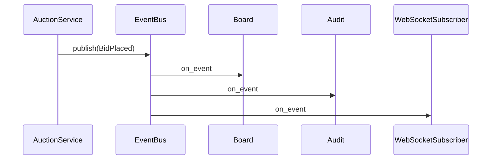

# Guide 11 — Observer

**Lab:** [Requirements](../../phases/phase-11/requirements.md) · [Guided check](../../phases/phase-11/guided-check.md) · [Questions](../../phases/phase-11/questions.md)

## Chapter 11: "Live bids at HammerTime"

**HammerTime** runs online auctions. When a new bid arrives, the **live board**, **audit log**, and **watchers** must update. The first code called all three from `place_bid`. Adding a fourth subscriber meant editing the core service again.

You need **Observer**: a subject publishes; subscribers register and react.

*Head First Design Patterns* Chapter 2. Refactoring Guru: ([Observer](https://refactoring.guru/design-patterns/observer)).

---

## Learning Objectives

By the end of this guide you will be able to:

- Explain subject/observer responsibilities
- Decouple producers from the set of consumers
- Sketch an in-process event bus
- Bridge the idea to Phase 11 (WebSocket arrives in Phase 12 as another subscriber)

---

## Theory

### Intent

**Observer** defines a one-to-many dependency between objects so that when one object changes state, all its dependents are notified and updated automatically. The subject maintains a list of observers and broadcasts events; observers subscribe and unsubscribe without the subject knowing their concrete types.

*Head First Design Patterns* covers Observer in Chapter 2. Refactoring Guru: publish-subscribe decoupling ([Observer](https://refactoring.guru/design-patterns/observer)).

### The problem in plain language

A core service (`place_bid`, `run_automation`, `actuator_fault`) directly calls the live board, audit log, push notifier, metrics, and—next sprint—a WebSocket bridge. Each new consumer edits the producer. Tests must construct every collaborator. Failure in one listener can break the whole operation. The domain event is tangled with presentation and infrastructure.

The smell: **the producer knows all consumers by name**.

### Analogy — event newsletter

A publisher sends a monthly newsletter. Readers **subscribe** and **unsubscribe**; the publisher does not maintain separate mail-merge logic per reader’s hobbies. When the issue ships, everyone on the list gets the same event; new readers join without rewriting the editorial workflow.

Observer (or an in-process **event bus**) is that subscription list for domain events: `BidPlaced`, `MoistureLow`, `ActuatorFault`.

### Solution structure

| Role | Responsibility | In Phase 11 lab |
| ---- | -------------- | --------------- |
| **Subject / EventBus** | `subscribe`, `unsubscribe`, `publish` | `EventBus` |
| **Observer / Subscriber** | Reacts to events | `AlertPersistenceSubscriber`, … |
| **Event** | Immutable payload | `reading.created` (`device_id`, `value`, `unit`, `source`, `recorded_at`); threshold-crossed; command-failed |
| **Publisher** | Raises events after domain action | Reading ingest, command invoker |

Phase 12 adds a **WebSocket subscriber**—same bus, different transport. Do not rebuild pub/sub inside the socket layer.

### How collaboration works



Subscribers should be **fast or async**; heavy work belongs in queued handlers, not blocking `publish`.

### When to use / when to skip

**Use Observer when:**

- One domain action must fan out to many independent reactions (UI, persistence, alerts, metrics).
- New subscribers appear frequently without changing producers.
- You want a single seam for real-time push later.

**Skip or simplify when:**

- Only one listener will ever exist—a direct call is simpler.
- Ordering guarantees are strict and complex—consider explicit workflows or message queues with contracts.
- Events become a hidden global dependency graph—document event types and keep catalogs small.

### Related patterns

- **Mediator** — observers often communicate only via the bus; Mediator centralizes interaction logic more aggressively.
- **Command** — command execution can **publish** events; Command captures intent, Observer propagates outcomes.
- **Pub/Sub messaging** — Observer at process scale; same idea with brokers (Kafka, RabbitMQ) between services.

---

# Part 2 — Follow along

> **Follow along:** Stdlib Python only. Run the problem demo, then the complete observer script.

## 1. The sticky problem

### 1.1 Smell: producer hard-wires consumers

```python
# Smell: AuctionService knows every listener by name
self.board.show(...)
self.audit.record(...)
self.push.notify_watchers(...)
```

**Root cause:** The producer is coupled to a fixed set of consumers.

### 1.2 Runnable problem demo

> **Follow along:** Save as `hammertime_before.py`, run `python hammertime_before.py`.

```python
"""Problem demo: place_bid hard-wires every listener."""


class LiveBoard:
    def show(self, bidder: str, amount: float) -> None:
        print(f"BOARD high={amount} by={bidder}")


class AuditLog:
    def record(self, bidder: str, amount: float) -> None:
        print(f"AUDIT {bidder} {amount}")


class PushNotifier:
    def notify_watchers(self, bidder: str, amount: float) -> None:
        print(f"PUSH {bidder} {amount}")


class AuctionService:
    def __init__(self, board: LiveBoard, audit: AuditLog, push: PushNotifier) -> None:
        self.board = board
        self.audit = audit
        self.push = push
        self.high_bid = 0.0

    def place_bid(self, bidder: str, amount: float) -> None:
        if amount <= self.high_bid:
            raise ValueError("bid too low")
        self.high_bid = amount
        # Hotspot: add metrics? edit this method again
        self.board.show(bidder, amount)
        self.audit.record(bidder, amount)
        self.push.notify_watchers(bidder, amount)


if __name__ == "__main__":
    AuctionService(LiveBoard(), AuditLog(), PushNotifier()).place_bid("sam", 120.0)
    print("PAIN: fourth subscriber requires editing AuctionService.place_bid")
```

**Expected output (problem):**

```text
BOARD high=120.0 by=sam
AUDIT sam 120.0
PUSH sam 120.0
PAIN: fourth subscriber requires editing AuctionService.place_bid
```

### What goes wrong when requirements change

Metrics, fraud checks, WebSocket bridges—all force edits to `place_bid`. Tests must construct every collaborator.

---

## 2. Pattern in practice

The HammerTime runnable example below replaces hard-wired listeners in `place_bid` with an `EventBus` that notifies board, audit, and push subscribers when a `BidPlaced` event is published.

---

## 3. Building the solution (step by step)

### Step A — Event + observer port

```python
@dataclass(frozen=True)
class BidPlaced:
    lot_id: str
    bidder: str
    amount: float


class Observer(ABC):
    @abstractmethod
    def update(self, event: BidPlaced) -> None: ...
```

### Step B — Subject notifies a list

```python
def notify(self, event: BidPlaced) -> None:
    for observer in list(self._observers):
        observer.update(event)
```

### Step C — Service only publishes

```python
self.events.notify(BidPlaced(...))  # no board/audit imports
```

---

## 4. Complete worked solution (runnable)

> **Follow along:** Save as `hammertime_observer.py`, run `python hammertime_observer.py`.

```python
"""Observer demo — HammerTime bids (stdlib only)."""

from abc import ABC, abstractmethod
from dataclasses import dataclass


@dataclass(frozen=True)
class BidPlaced:
    lot_id: str
    bidder: str
    amount: float


class Observer(ABC):
    @abstractmethod
    def update(self, event: BidPlaced) -> None:
        ...


class BidSubject:
    def __init__(self) -> None:
        self._observers: list[Observer] = []

    def subscribe(self, observer: Observer) -> None:
        self._observers.append(observer)

    def unsubscribe(self, observer: Observer) -> None:
        self._observers.remove(observer)

    def notify(self, event: BidPlaced) -> None:
        for observer in list(self._observers):
            observer.update(event)


class LiveBoard(Observer):
    def update(self, event: BidPlaced) -> None:
        print(f"BOARD lot={event.lot_id} high={event.amount} by={event.bidder}")


class AuditLog(Observer):
    def __init__(self) -> None:
        self.entries: list[BidPlaced] = []

    def update(self, event: BidPlaced) -> None:
        self.entries.append(event)
        print(f"AUDIT size={len(self.entries)}")


class WatcherNotifier(Observer):
    def update(self, event: BidPlaced) -> None:
        print(f"PUSH watchers: new bid {event.amount} on {event.lot_id}")


class MetricsObserver(Observer):
    """Extension: subscribe without editing AuctionService."""

    def update(self, event: BidPlaced) -> None:
        print(f"METRICS bid_amount={event.amount}")


class AuctionService:
    def __init__(self, events: BidSubject) -> None:
        self.events = events
        self.high_bid = 0.0

    def place_bid(self, lot_id: str, bidder: str, amount: float) -> None:
        if amount <= self.high_bid:
            raise ValueError("bid too low")
        self.high_bid = amount
        self.events.notify(BidPlaced(lot_id=lot_id, bidder=bidder, amount=amount))


if __name__ == "__main__":
    events = BidSubject()
    events.subscribe(LiveBoard())
    audit = AuditLog()
    events.subscribe(audit)
    events.subscribe(WatcherNotifier())
    events.subscribe(MetricsObserver())  # fourth listener — no service change

    AuctionService(events).place_bid("lot-42", "sam", 120.0)
    print("audit entries:", len(audit.entries))
```

**Expected output (solution):**

```text
BOARD lot=lot-42 high=120.0 by=sam
AUDIT size=1
PUSH watchers: new bid 120.0 on lot-42
METRICS bid_amount=120.0
audit entries: 1
```

---

## 5. Compare & contrast

| | Observer | Facade (Guide 07) |
|--|----------|-------------------|
| Goal | Fan-out notifications | Simplify calling a subsystem |
| Change style | Add subscribers | Add façade methods carefully |

---

## 6. Watch out for these traps

- One observer throwing and aborting the notify loop
- Re-implementing the bus inside WebSocket handlers in Phase 12
- Using auction types as your greenhouse alert model by paste

---

## 7. Try this

Add a `FraudGuard` observer that prints `FRAUD?` when `amount > 1.5 *` previous high (track previous on the observer). Subscribe it and place 100 then 200. Re-run.

---

## Key Terms

| Term | Definition |
|------|------------|
| **Observer / subscriber** | Object notified of events |
| **Subject / publisher** | Maintains subscribers and notifies them |
| **Event** | Immutable message describing what happened |
| **Fan-out** | One event delivered to many listeners |

---

## Reading Assignments

**Required:**

- *Head First Design Patterns* — Chapter 2
- [Refactoring Guru — Observer](https://refactoring.guru/design-patterns/observer)
- Lab: [Requirements](../../phases/phase-11/requirements.md) · [Guided check](../../phases/phase-11/guided-check.md) · [Questions](../../phases/phase-11/questions.md)

---

## Bridge to your lab

Phase 11 introduces in-process pub/sub for readings/events → alerts, metrics, feeds. WebSocket in Phase 12 should subscribe to the same seam.

| Teaching (this guide) | Your lab (greenhouse) |
| --------------------- | --------------------- |
| `BidSubject` / `AuctionService` | Application services that **publish** after persist |
| `BidPlaced` | `reading.created` (`device_id`, `value`, `unit`, `source`, `recorded_at`); also threshold-crossed and command-failed |
| `LiveBoard` / `AuditLog` / `WatcherNotifier` | `AlertSubscriber` (and optional metrics) |
| Observer list on the subject | `EventBus.subscribe` / `publish` |

**Do / don’t:** **Do** publish `reading.created` from ingest only when `tracking_enabled` is true. Manual read, the sampler, and MQTT translation share that publish. Wire the bus once in the composition root; publishers must not import `AlertRepository`. **Don’t** open WebSockets in this phase (the feed polls; `realtime.ts` is a stub), and don’t call alert persistence from the reading router.

---

## Summary

- Hard-wiring listeners into producers blocks extension.
- Observer lets subjects broadcast; subscribers opt in.
- Later realtime transports plug into the same event model.

**Next:** [Guide 12 — API, WebSocket & hardening](./12-api-websocket-hardening.md)
