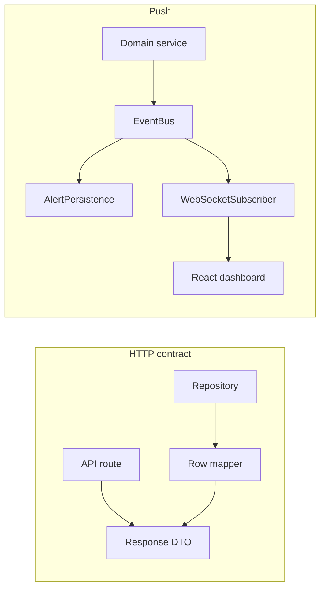

# Guide 12 — Production API, WebSocket & schema hardening

**Lab:** [Requirements](../../phases/phase-12/requirements.md) · [Guided check](../../phases/phase-12/guided-check.md)

## Chapter 12: "Opening night at ArenaTickets"

**ArenaTickets** has been a weekend prototype: loose routes, unstable JSON, aggressive polling. Opening night needs stable contracts and a push feed. Phase 12 is **convergence**—harden what you built. This guide uses ArenaTickets for ideas; your lab applies them to the greenhouse system.

---

## Learning Objectives

By the end of this guide you will be able to:

- Explain why prototype APIs fail under load and change
- Stabilize response/error shapes as a contract
- Connect Observer-style events to a push transport without reinventing pub/sub
- Prefer migrations/seeds over hand-edited databases
- Bridge the hardening checklist to Phase 12

---

## Theory

### Intent

Phase 12 is about **production convergence**: turning a pattern-rich prototype into something operators and frontends can rely on. The core idea is that HTTP and WebSocket endpoints are **contracts**—explicit, versioned shapes that decouple persistence internals from clients. Schema changes flow through **migrations**; live updates flow through **push** (WebSocket) subscribed to domain events, not duplicated business logic.

This is not a new GoF pattern—it is engineering discipline applied to the seams you built in Phases 2–11.

### The problem in plain language

Prototype APIs often return raw ORM rows, English error strings, or inconsistent status codes. The dashboard polls aggressively because nothing pushes. When WebSocket arrives, teams re-implement hold logic inside socket handlers instead of reusing the Observer event bus. Schema drift is fixed by hand-editing production databases. Each change breaks a different client assumption.

Under load and change, **implicit contracts fail silently** until opening night.

### Analogy — building inspection before opening

A venue can run rehearsals with temporary wiring and handwritten seat charts. Opening night requires **certified exits, labeled circuits, and a public address system** everyone trusts. Hardening is that inspection pass: label what the public may depend on (DTO fields, error codes), remove leaky internals (`extra_db_column`), and connect the PA system (WebSocket) to the same announcements the staff already uses (domain events)—not a second, conflicting script.

### Solution structure

| Concern | Practice | In your lab |
| ------- | -------- | ----------- |
| **API contract** | Stable request/response DTOs; documented in Scalar | Pydantic models; no raw row leakage |
| **Errors** | Machine-readable `code` + HTTP status | `422`, `409`, consistent JSON error body |
| **Persistence** | Alembic migrations; seeds for demo data | Indexes, FKs, idempotent seeds |
| **Realtime** | WebSocket hub as Observer subscriber | Fan-out `MoistureLow`, alert events |
| **Mapping** | Repository row → public DTO at the boundary | Drop internal columns before JSON |

Treat WebSocket as **transport**, not a second domain layer. If `EventBus.publish` already exists, a `WebSocketSubscriber` listens and broadcasts JSON—domain rules stay in services.

### How collaboration works



HTTP serves pull queries with stable shapes; events drive push updates over the same canonical event types.

### When to invest in hardening / when to defer

**Invest now (Phase 12) when:**

- Multiple UI panels depend on the same endpoints.
- Operators need live alerts without polling.
- Schema has grown across many incremental migrations—indexes and FKs matter.

**Defer or keep minimal when:**

- A route is still experimental and has no consumers—do not gold-plate unused APIs.
- Push adds complexity before any subscriber exists—Observer in-process is enough first.

### Related topics

- **Observer (Guide 11)** — event bus is the seam WebSocket extends; do not fork pub/sub.
- **Facade (Guide 07)** — overview endpoints should return contract DTOs, not ad-hoc joins.
- **DTO discipline (Phase 3+)** — hardening makes DTO boundaries non-negotiable at the API edge.

---

# Part 2 — Follow along

> **Follow along:** Most demos here are **stdlib Python** (no FastAPI required). WebSocket hub notes are observe-only unless you already have the course stack running.

## 1. The sticky problem

### 1.1 Smell: unstable payloads

```python
# Smell: callers get whatever the DB row looks like today
return db_row  # field names and nesting can change without notice
```

### 1.2 Runnable problem demo (contract chaos)

> **Follow along:** Save as `arenatickets_before.py`, run `python arenatickets_before.py`.

```python
"""Problem demo: ad-hoc payloads and string errors."""


def hold_seat_prototype(seat_id: object) -> object:
    # No validation, no stable error shape
    if not isinstance(seat_id, int) or seat_id <= 0:
        return "bad seat"  # UI must parse English strings
    return {"seat": seat_id, "held": 1, "extra_db_column": "xyz"}  # leaky shape


if __name__ == "__main__":
    print("ok-ish:", hold_seat_prototype(12))
    print("fail:", hold_seat_prototype("A-12"))
    print("PAIN: clients cannot rely on keys or status codes")
```

**Expected output (problem):**

```text
ok-ish: {'seat': 12, 'held': 1, 'extra_db_column': 'xyz'}
fail: bad seat
PAIN: clients cannot rely on keys or status codes
```

### What goes wrong when requirements change

Dashboard polls every 2s. Schema drifts. Error strings change. WebSocket later duplicates hold logic instead of reusing events.

---

## 2. Pattern in practice

The ArenaTickets runnable example below replaces leaky dict returns with explicit success/error DTOs and status codes—the same contract discipline you will express with Pydantic and FastAPI in the lab.

---

## 3. Building the solution (step by step)

### Step A — Explicit success / error dicts (stdlib)

```python
def ok_seat(seat_id: int, status: str) -> dict:
    return {"id": seat_id, "label": f"S-{seat_id}", "status": status}


def err(code: str, message: str) -> dict:
    return {"code": code, "message": message}
```

### Step B — Validate at the edge

```python
def create_hold(seat_id: object) -> tuple[int, dict]:
    if not isinstance(seat_id, int) or seat_id <= 0:
        return 422, err("invalid_seat", "seat_id must be a positive int")
    return 201, ok_seat(seat_id, "held")
```

### Step C — WebSocket as subscriber (observe)

When you have FastAPI in the lab, a hub `broadcast`s JSON that an Observer-style handler already produced. Do not open sockets inside every use case.

---

## 4. Complete worked solution (runnable contract demo)

> **Follow along:** Save as `arenatickets_contract.py`, run `python arenatickets_contract.py`.

```python
"""Hardening demo — ArenaTickets seat hold contracts (stdlib only)."""

from typing import Any


def ok_seat(seat_id: int, status: str) -> dict[str, Any]:
    # Stable DTO: only fields the UI is allowed to depend on
    return {"id": seat_id, "label": f"S-{seat_id}", "status": status}


def err(code: str, message: str) -> dict[str, str]:
    return {"code": code, "message": message}


def create_hold(seat_id: object) -> tuple[int, dict[str, Any]]:
    if not isinstance(seat_id, int) or seat_id <= 0:
        return 422, err("invalid_seat", "seat_id must be a positive int")
    return 201, ok_seat(seat_id, "held")


def list_seats(rows: list[dict[str, Any]]) -> list[dict[str, Any]]:
    # Map persistence rows -> public contract (drop internal columns)
    return [ok_seat(int(r["id"]), str(r["status"])) for r in rows]


if __name__ == "__main__":
    status, body = create_hold(12)
    print(status, body)
    status, body = create_hold("A-12")
    print(status, body)
    print(
        "mapped:",
        list_seats([{"id": 1, "status": "available", "internal_cost": 9.99}]),
    )
```

**Expected output (solution):**

```text
201 {'id': 12, 'label': 'S-12', 'status': 'held'}
422 {'code': 'invalid_seat', 'message': 'seat_id must be a positive int'}
mapped: [{'id': 1, 'label': 'S-1', 'status': 'available'}]
```

In the lab you express the same idea with Pydantic/FastAPI status codes and wire WebSocket to domain events.

---

## 5. Compare & contrast

| Phases 2–11 | Phase 12 |
|-------------|----------|
| Introduce pattern seams | Stabilize contracts around seams |
| Polling may be fine | Prefer push for live operator views |

---

## 6. Watch out for these traps

- Re-implementing Observer inside WebSocket handlers
- One mega-migration nobody can review
- Copying ArenaTickets seat tables into the greenhouse schema

---

## 7. Try this

Extend `create_hold` to reject seats already in a `held_ids` set with status `409` and code `seat_taken`. Re-run with a held id.

---

## Key Terms

| Term | Definition |
|------|------------|
| **API contract** | Agreed shapes, status codes, and behaviors |
| **DTO** | Explicit inbound/outbound data model |
| **WebSocket** | Persistent channel for push updates |
| **Migration / seed** | Versioned schema change / known starter data |

---

## Reading Assignments

**Required:**

- Lab: [Requirements](../../phases/phase-12/requirements.md) · [Guided check](../../phases/phase-12/guided-check.md)
- [FastAPI WebSockets](https://fastapi.tiangolo.com/advanced/websockets/)
- [MDN — WebSocket API](https://developer.mozilla.org/en-US/docs/Web/API/WebSocket)

---

## Bridge to your lab

Apply this hardening mindset to **your** greenhouse APIs, persistence, and realtime feed. Do not invent a ticketing domain in the project.

| Teaching (this guide) | Your lab (greenhouse) |
| --------------------- | --------------------- |
| ArenaTickets leaky dict / status demo | Stable Pydantic DTOs under `/api` only |
| Seat-hold logic inside a socket handler | Alert rules stay in Phase 11 subscribers |
| PA system / `WebSocketSubscriber` | Connection manager subscribed to `EventBus` |
| Hand-edited venue charts | Alembic indexes/FKs; gate `/dev` if needed |

**Do / don’t:** **Do** broadcast `{ "type": "alert.created", ... }` from a hub that **subscribes**. **Don’t** insert `alerts` inside the WS handler, and don’t open sockets from use cases.

---

## Summary

- Phase 12 hardens and connects; it is not greenfield sprawl.
- Explicit contracts beat “return whatever.”
- WebSocket should subscribe to domain events, not rewrite them.

**Core course complete.** You have finished the required track (Phases 1–12).

**Optional:** Want operator-grade polish? Continue with [Guide 13 — Dashboard polish](./13-dashboard-polish.md). For proof-and-demo rigor, see [Guide 14 — Tests, docs & demo](./14-tests-docs-demo.md).
