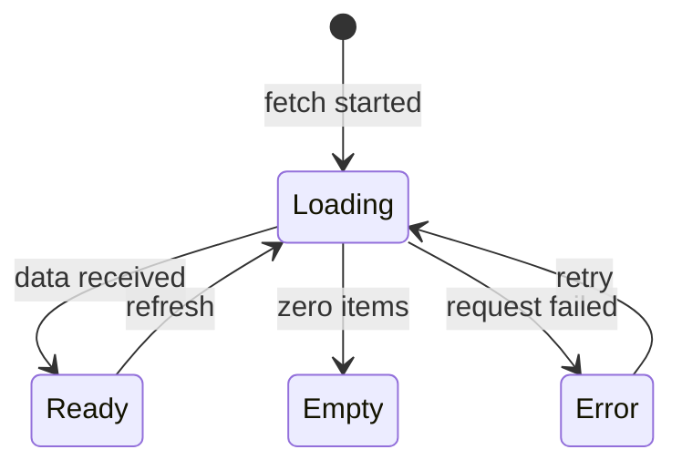

# Guide 13 — Dashboard polish *(Optional enrichment)*

**Lab:** [Requirements](../../phases/phase-13/requirements.md) · [Guided check](../../phases/phase-13/guided-check.md)

> **Optional enrichment** — Not required for course completion. Complete Phases 1–12 (and read Guide 12) first.

## Chapter 13: "Operator calm at ArenaTickets"

The API is trustworthy; the seat-map UI is not. Operators see crashes on `undefined`, empty white holes, and silent stale data when the socket drops.

Phase 13 is **optional polish** after the required track: refine the operator experience. ArenaTickets is the teaching metaphor; your lab polishes the greenhouse dashboard.

---

## Learning Objectives

By the end of this guide you will be able to:

- Treat loading, empty, and error as first-class UI states
- Surface realtime connection health
- Prefer refining existing panels over a rewrite
- Bridge polish principles to Phase 13

---

## Theory

### Intent

Phase 13 is **optional operator UX engineering** after the required track (Phases 1–12): refining the dashboard so it communicates state honestly—loading, empty, error, ready, and live connectivity. Polish is not a rewrite; it is making existing panels **trustworthy** under real network and data conditions.

### The problem in plain language

Demo UIs often assume the happy path: data always arrives, arrays are never empty, WebSockets never drop. In production, operators see `undefined` crashes, blank panels that look broken, and stale readings that look current because nothing signals offline mode. A powerful backend with a fragile UI erodes confidence faster than missing features.

The root issue: **UI state is implicit**—inferred from absence of errors rather than modeled explicitly.

### Analogy — aircraft cockpit instrumentation

Pilots do not guess whether altimeter data is live. Instruments show **valid**, **flagged**, or **no data** states clearly; connection loss triggers known procedures, not silent wrong readings. A greenhouse operator dashboard is a small cockpit: moisture charts, alert feeds, and actuator controls must say whether they are loading, empty, failed, or live—not leave operators inferring from white space.

### Solution structure

| UI state | Operator need | Implementation hint |
| -------- | ------------- | ------------------- |
| **Loading** | “System is working” | Skeleton/spinner; disable destructive actions |
| **Empty** | “Nothing here yet” + next step | Honest copy; link to config wizard |
| **Error** | What failed + retry | Surface API message; don’t swallow 500s |
| **Ready** | Actionable data | Typed models from API contract |
| **Live / offline** | Trust in realtime | WebSocket badge: connected / reconnecting / offline |

Extract view-state logic into **pure functions** (or hooks) you can unit test—`seats_view(loading, error, seats)` in Python mirrors a TypeScript discriminated union in React.

### How collaboration works



Parallel **connection state** (`connected | connecting | offline`) prefixes or badges realtime panels without conflating data errors with socket drops.

### When to polish / when to stop

**Polish when:**

- Core flows work end-to-end but operators report confusion or mistrust.
- WebSocket is live—connection health must be visible.
- Charts and alert workflows need consistent Tailwind spacing and hierarchy.

**Stop short of:**

- Rebuilding the entire frontend—refine panels in place.
- Adding new domain features “while we’re in the UI”—Phase 13 is clarity, not scope creep.
- Copying teaching-example components verbatim into the greenhouse repo.

### Related topics

- **Incremental UI (Phases 2–11)** — each phase added a component; Phase 13 unifies loading/error patterns across them.
- **API contract (Guide 12)** — polish assumes stable DTOs; fix contracts before styling around broken payloads.
- **Facade overview endpoint (Guide 07)** — overview panels benefit most from explicit view-state mapping.

---

# Part 2 — Follow along

> **Follow along:** Run the **Python view-state** demo with stdlib. TypeScript snippets are for reading / sandbox paste; expected UI states are described in prose.

## 1. The sticky problem

### 1.1 Smell: happy path only

```tsx
// Smell: assumes seats is always a ready array
{seats!.map((s) => <li key={s.id}>{s.label}</li>)}
```

**Root cause:** Demo UI assumed perfect data and perfect connectivity.

### What goes wrong

Loading crashes. Empty looks broken. Offline looks “fine” with yesterday’s seats.

---

## 2. Pattern in practice

The runnable `seats_view` function below maps raw fetch inputs to explicit view states—the same discriminated-union idea you will apply in React panels for the greenhouse dashboard.

---

## 3. Building the solution (step by step)

### Step A — Decide view status in a pure function (runnable)

Map raw fetch results → a small status union. You can unit-test this without React.

### Step B — Render by status (TypeScript sketch)

```tsx
if (view.status === "loading") return <p>Loading seats…</p>;
if (view.status === "empty") return <p>No seats published yet.</p>;
if (view.status === "error") return <p>Could not load: {view.message}</p>;
// ready → list seats
```

### Step C — Connection badge

Wire `connected | connecting | offline` from WebSocket `onopen` / `onclose`.

---

## 4. Complete worked solution (runnable view-state logic)

> **Follow along:** Save as `arenatickets_view_state.py`, run `python arenatickets_view_state.py`.

```python
"""Dashboard polish demo — map fetch results to view states (stdlib only)."""

from typing import Any, Literal

Seat = dict[str, Any]
ViewStatus = Literal["loading", "empty", "error", "ready"]


def seats_view(
    *,
    loading: bool,
    error: str | None,
    seats: list[Seat] | None,
) -> dict[str, Any]:
    # Pure decision logic — same idea as a TS discriminated union
    if loading:
        return {"status": "loading"}
    if error:
        return {"status": "error", "message": error}
    if not seats:
        return {"status": "empty"}
    return {"status": "ready", "seats": seats}


def render(view: dict[str, Any]) -> str:
    status: ViewStatus = view["status"]
    if status == "loading":
        return "UI: Loading seats…"
    if status == "empty":
        return "UI: No seats published for this event yet."
    if status == "error":
        return f"UI: Could not load seats: {view['message']} [Retry]"
    return "UI: " + ", ".join(f"{s['label']} ({s['status']})" for s in view["seats"])


if __name__ == "__main__":
    print(render(seats_view(loading=True, error=None, seats=None)))
    print(render(seats_view(loading=False, error=None, seats=[])))
    print(render(seats_view(loading=False, error="network down", seats=None)))
    print(
        render(
            seats_view(
                loading=False,
                error=None,
                seats=[{"label": "A-12", "status": "available"}],
            )
        )
    )
```

**Expected output (solution):**

```text
UI: Loading seats…
UI: No seats published for this event yet.
UI: Could not load seats: network down [Retry]
UI: A-12 (available)
```

### TypeScript panel shape (read / sandbox)

```tsx
type SeatsView =
  | { status: "loading" }
  | { status: "empty" }
  | { status: "error"; message: string }
  | { status: "ready"; seats: { id: number; label: string; status: string }[] };

type Conn = "connected" | "connecting" | "offline";

function LiveBadge({ conn }: { conn: Conn }) {
  const label =
    conn === "connected" ? "Live" : conn === "connecting" ? "Connecting…" : "Offline";
  return <span>{label}</span>;
}
```

**Observe in the UI:** loading copy → empty copy → error+retry → list; badge flips on socket close.

---

## 5. Watch out for these traps

- Rebuilding the entire frontend “because polish”
- Hiding socket failures behind stale data
- Porting ArenaTickets components into the greenhouse repo as-is

---

## 6. Try this

Add a `conn: Conn` argument to `render` and prefix offline views with `[Offline]`. Re-run.

---

## Key Terms

| Term | Definition |
|------|------------|
| **View state** | Explicit UI mode: loading / empty / error / ready |
| **Connection health** | Visible realtime transport status |
| **Polish** | Clarity and trust without new domain scope |

---

## Reading Assignments

**Required:**

- Lab: [Requirements](../../phases/phase-13/requirements.md) · [Guided check](../../phases/phase-13/guided-check.md)
- [MDN — Writing WebSocket client applications](https://developer.mozilla.org/en-US/docs/Web/API/WebSockets_API/Writing_WebSocket_client_applications)

---

## Bridge to your lab

Polish the **greenhouse** operator dashboard: charts, alerts, connection status, resilient panels. Follow the lab’s required sections.

| Teaching (this guide) | Your lab (greenhouse) |
| --------------------- | --------------------- |
| ArenaTickets seat-map empty/error/loading | Same four UI states on existing greenhouse panels |
| Silent socket drop on a venue board | Connection badge (connected / retrying / offline) |
| Placeholder occupancy chart | Charts from persisted `sensor_readings` |
| New ticketing screens | Refine `#overview`, sensors, alerts — don’t rewrite the app |

**Do / don’t:** **Do** model loading/empty/error explicitly. **Don’t** invent ArenaTickets entities, and don’t treat a blank panel as “no data” without a label.

---

## Summary

- Operators need truth about loading, emptiness, errors, and connectivity.
- Polish refines existing features; it is not a greenfield UI rewrite.

**Next (optional):** [Guide 14 — Tests, docs & demo](./14-tests-docs-demo.md)
