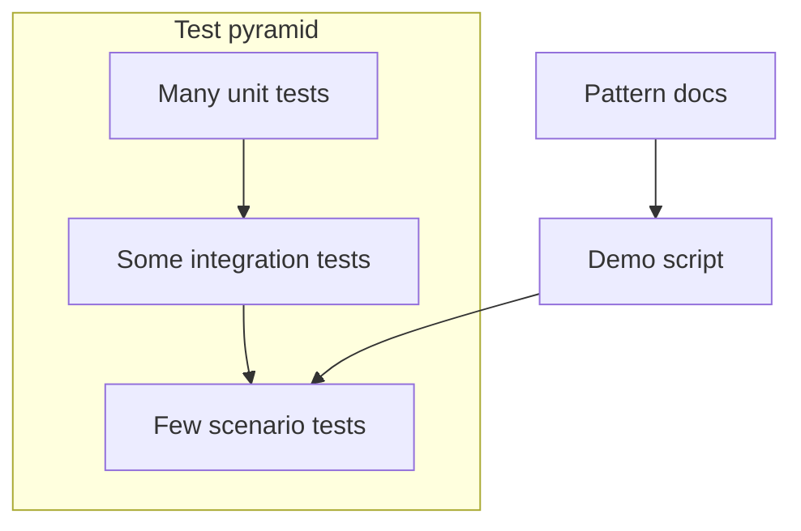

# Guide 14 — Tests, documentation & end-to-end demo *(Optional enrichment)*

**Lab:** [Requirements](../../phases/phase-14/requirements.md) · [Guided check](../../phases/phase-14/guided-check.md)

> **Optional enrichment** — Not required for course completion. Complete Phases 1–12 first (Phase 13 recommended but not required).

## Chapter 14: "Prove it — then show it"

Features and patterns exist. What is missing is **evidence**: automated tests, short pattern notes pointing at *your* modules, and a demo script a classmate can follow.

This guide uses CartNest shipping quotes (Guide 06 theme) for runnable proof; your Phase 14 applies the same mindset to the greenhouse system—**no new product features**.

---

## Learning Objectives

By the end of this guide you will be able to:

- Place unit, integration, and scenario checks on a simple pyramid
- Lock a pattern seam with a focused test
- Document patterns by pointing at real modules
- Structure a repeatable demo spine
- Apply the same evidence mindset to Phase 14

---

## Theory

### Intent

Phase 14 closes the **optional enrichment** track with **evidence and narrative**: automated tests that protect pattern seams, concise documentation mapping GoF names to _your_ modules, and a repeatable demo script. The goal is not more features—it is proving the system works and telling the design story in a fixed order.

Martin Fowler’s [test pyramid](https://martinfowler.com/bliki/TestPyramid.html) guides proportion: many fast unit tests at the base, fewer integration tests crossing modules/DB, a thin top of end-to-end scenarios.

### The problem in plain language

Teams ship pattern-rich code but cannot **demonstrate** or **defend** it. Demo day becomes click-and-hope. Refactors break Strategy or State silently because nothing asserts the seam. Pattern notes restate Wikipedia without pointing at `src/domain/...`. New teammates cannot replay the story.

Building forward without closing loops leaves learning incomplete—you implemented patterns but did not **own** them as maintainable design.

### Analogy — flight checklist and black box

Commercial aviation relies on **preflight checklists** (repeatable human procedure) and **flight recorders** (machine evidence of what happened). Your demo script is the checklist—same steps, same seed data, same expected signals every time. Your tests are the recorder—when someone changes irrigation policy or actuator state guards, CI shouts before the demo breaks live.

Documentation links the checklist item (“show Strategy”) to the actual switch (`ConservativeMoisturePolicy` in `application/policies.py`).

### Solution structure

| Artifact | Purpose | In your lab |
| -------- | ------- | ----------- |
| **Unit tests** | Lock one class/algorithm in isolation | Strategy quote, State transition guard, Builder `build()` rejection |
| **Integration tests** | Cross module + DB/API | Repository + service; health + migrate |
| **Scenario / E2E** | Operator-visible path | Seed → reading → alert → command → UI signal |
| **Pattern docs** | Name → your files (1 paragraph each) | `docs/patterns/strategy.md` with real paths |
| **Demo spine** | Ordered 8–10 step walkthrough | Greenhouse narrative, not feature tour |

Tests should target **seams**—the extension points patterns created—not every getter.

### How collaboration works



CI runs unit + integration on every push; demo spine is rehearsed against seeded environment before presentation.

### When to write which test

**Unit** — pure domain: `build()` rejects empty zones; `IdleState` rejects `start` when already faulted; `EconomyShipping` minimum floor.

**Integration** — persistence + service: create sensor via API persists row; command log entry after actuator action.

**Scenario** — story arc: low moisture reading → Observer alert → dashboard feed → operator command blocked by State.

**Skip** — testing framework boilerplate, trivial getters, or third-party libraries you do not own.

### Related topics

- **Every pattern phase (2–11)** — each seam is a candidate for one focused unit test plus a demo step.
- **Guide 12 contracts** — integration tests assert stable JSON shapes, not accidental columns.
- **Guide 13 polish** — scenario tests can assert view-state strings or DOM labels for loading/error.

---

# Part 2 — Follow along

> **Follow along:** Run the evidence kit with stdlib `assert` (no pytest required). Optionally re-run under pytest later.

## 1. The sticky problem

```text
Demo day.
"Show Strategy."
*clicks around* "It is in here somewhere."
Tests: none. docs/patterns: empty.
```

**Root cause:** Built forward, never closed with proof and narrative.

---

## 2. Pattern in practice

The CartNest evidence kit below locks Strategy behavior with unit asserts and a registry integration check—the same pyramid mindset you will apply to greenhouse policies, state guards, and demo spine in Phase 14.

---

## 3. Building the solution (step by step)

### Step A — Unit: lock one strategy

```python
assert EconomyShipping().quote(Parcel(0.1, 1)) == 3.0
```

### Step B — “Integration-ish”: registry + context

```python
assert quote_for("express", Parcel(2, 100)) == 18.0
```

### Step C — Demo spine (manual checklist on *your* app)

Walk Adapter → Observer → Strategy → Command/State → UI/WS in a fixed order with seed data.

---

## 4. Complete worked solution (runnable evidence kit)

> **Follow along:** Save as `cartnest_evidence.py`, run `python cartnest_evidence.py`. All asserts must pass (prints `ALL CHECKS PASSED`).

```python
"""Tests/docs demo — shipping Strategy evidence kit (stdlib only)."""

from abc import ABC, abstractmethod
from dataclasses import dataclass


@dataclass(frozen=True)
class Parcel:
    weight_kg: float
    distance_km: float


class ShippingStrategy(ABC):
    @abstractmethod
    def quote(self, parcel: Parcel) -> float:
        ...


class StandardShipping(ShippingStrategy):
    def quote(self, parcel: Parcel) -> float:
        return 5.0 + 0.02 * parcel.distance_km


class ExpressShipping(ShippingStrategy):
    def quote(self, parcel: Parcel) -> float:
        return 12.0 + 0.05 * parcel.distance_km + 0.5 * parcel.weight_kg


class EconomyShipping(ShippingStrategy):
    def quote(self, parcel: Parcel) -> float:
        return max(3.0, 0.01 * parcel.distance_km + 0.2 * parcel.weight_kg)


class CheckoutService:
    def __init__(self, strategy: ShippingStrategy) -> None:
        self._strategy = strategy

    def shipping_quote(self, parcel: Parcel) -> float:
        return self._strategy.quote(parcel)


STRATEGIES: dict[str, ShippingStrategy] = {
    "standard": StandardShipping(),
    "express": ExpressShipping(),
    "economy": EconomyShipping(),
}


def quote_for(method: str, parcel: Parcel) -> float:
    return CheckoutService(STRATEGIES[method]).shipping_quote(parcel)


def test_economy_has_minimum_floor() -> None:
    # Unit: one algorithm, no HTTP/DB
    assert EconomyShipping().quote(Parcel(0.1, 1)) == 3.0


def test_quote_for_express_uses_registry() -> None:
    # Crosses registry + context (still fast, no framework)
    assert quote_for("express", Parcel(2, 100)) == 18.0


def test_standard_quote() -> None:
    assert quote_for("standard", Parcel(2, 100)) == 7.0


if __name__ == "__main__":
    test_economy_has_minimum_floor()
    test_quote_for_express_uses_registry()
    test_standard_quote()
    print("ALL CHECKS PASSED")
    print(
        "Pattern doc (good style): Strategy — path/to/your/policies.py "
        "(YourPolicyA, YourPolicyB). Selected in YourEvaluateService."
    )
```

**Expected output (solution):**

```text
ALL CHECKS PASSED
Pattern doc (good style): Strategy — path/to/your/policies.py (YourPolicyA, YourPolicyB). Selected in YourEvaluateService.
```

### Demo spine template (your greenhouse app)

```text
0. Reset DB / migrate / seed
1. Dashboard health / connection badge
2. Location config (Builder)
3. Device family / sensors (Abstract Factory / Factory Method)
4. Reading via adapter (Adapter)
5. Alert / feed (Observer; WebSocket if live)
6. Strategy recommendation
7. Allowed vs blocked command (Command + State)
8. Decorator/audit trail
9. Scalar hardened endpoint
10. Stop. Questions.
```

---

## 5. Watch out for these traps

- Adding features “to make the demo cooler”
- Pattern docs that restate Wikipedia and never cite your code
- A demo that requires editing `.env` live and hoping

---

## 6. Try this

Add `test_unknown_method_raises` that expects `KeyError` (or your chosen error) for `quote_for("nope", ...)`. Re-run the evidence kit.

---

## Key Terms

| Term | Definition |
|------|------------|
| **Unit test** | Fast test of a small unit |
| **Integration test** | Crosses modules / DB / HTTP |
| **Scenario / E2E** | End-to-end user-visible path |
| **Demo spine** | Ordered script of actions and expected signals |

---

## Reading Assignments

**Required:**

- Lab: [Requirements](../../phases/phase-14/requirements.md) · [Guided check](../../phases/phase-14/guided-check.md)
- [Martin Fowler — TestPyramid](https://martinfowler.com/bliki/TestPyramid.html)
- [pytest](https://docs.pytest.org/) if that is your runner

---

## Bridge to your lab

Phase 14 is evidence and story for the **greenhouse** system. Do not implement CartNest in the project—use it only as the teaching kit above.

| Teaching (this guide) | Your lab (greenhouse) |
| --------------------- | --------------------- |
| CartNest shipping-quote unit checks | Tests on Factory/Strategy/State/Command seams you already wrote |
| Stdlib “evidence kit” | pytest + test DB + Alembic smoke (lab stack) |
| Pattern note pointing at CartNest files | `docs/patterns/*.md` pointing at **your** `src/` modules |
| Demo spine of quote → ship | Demo: read → evaluate → command → alert (your features) |

**Do / don’t:** **Do** protect seams with tests and a repeatable demo order. **Don’t** add CartNest types to the greenhouse repo, and don’t treat this phase as new product features.

---

## Summary

- Optional enrichment means proof, not more required features.
- Tests protect seams; docs map names to files; demos tell the story in order.

**Optional enrichment track complete** — return to the [guide index](./README.md). Required course completion is at Phase 12 / [Guide 12](./12-api-websocket-hardening.md).
