# Smart greenhouse project — phased implementation

This folder contains **one directory per implementation phase**. Follow phases **in numerical order**.

### Course tracks

| Track                   | Phases    | What you get                                                                  |
| ----------------------- | --------- | ----------------------------------------------------------------------------- |
| **Required**            | **1–12**  | Skeleton, all 10 GoF patterns, production REST + WebSocket + schema hardening |
| **Optional enrichment** | **13–14** | Dashboard polish; tests, documentation, and demo narrative                    |

**Course completion:** you have met the required course when **Phase 12** acceptance criteria pass. Phases 13–14 are for students who want extra UX polish or proof-and-demo rigor—they are not required for credit.

### Files in each `phase-NN/` folder

| File | When to use |
|------|-------------|
| **`requirements.md`** | **Start here.** Detailed outcomes, architecture, and acceptance criteria. No implementation code. |
| **`guided-check.md`** | Use **after** you have a design (or if you are stuck). File layout, commands, signatures, and partial snippets so you can check your solution. Not a copy-paste answer. |
| **`questions.md`** | Phases **1–11**. Answer after the lab, in your own words. The same items may reappear on the exam. |

Typical week: read the learning guide → implement from **requirements** → compare against **guided check** → answer **questions** (Phases 1–11).

### Your project path

Commands in these materials use **`yourpath\project\`** as a placeholder for the folder that contains `docker-compose.yml`, `backend/`, and `frontend/`. Replace it with **your** clone path before you run anything. Do not copy an instructor’s `C:\Users\...` location.

**Compose growth:** Phase 1 runs **PostgreSQL only** in Compose (backend/frontend on the host). From **Phase 2** onward, Compose also runs **backend** and **frontend** (dev containers with bind mounts). Prefer `docker compose up --build -d` and `docker compose exec backend alembic ...` for the rest of the course.

Phases **2–11** follow a **build-optimized** sequence. Each phase adds **backend + React UI + database changes only when the model needs them** (via forward-only migrations).

### Full-stack + incremental database rule

| Layer                         | Rule                                                                                                                                             |
| ----------------------------- | ------------------------------------------------------------------------------------------------------------------------------------------------ |
| **PostgreSQL**                | Introduced in Phase 1 (tooling + connectivity). **New migration(s) in phases that need new tables/columns**—not one big schema dump in Phase 12. |
| **Backend**                   | After Phase 2, prefer **repositories** reading/writing the DB for the feature introduced that phase.                                             |
| **React**                     | UI calls real persisted data as soon as the phase’s tables exist.                                                                                |
| **Phase 12**                  | **Production REST + WebSocket**, route cleanup (`/dev` → `/api`), indexes/FKs/seeds—not “first time we add a database.”                          |
| **Phases 13–14** _(optional)_ | Polish and full-stack tests against a migrated database—see optional enrichment track above.                                                     |

**Migration discipline:** one (or more) numbered migration per phase when schema changes; never edit applied migrations—add a new one. Document each in the phase **requirements** file under the database step.

Suggested paths: `backend/migrations/` (Alembic/Flyway/SQL files—pick one tool in Phase 1 and keep it).

Suggested frontend layout: `frontend/src/features/`, `frontend/src/services/api.ts`, `frontend/src/services/realtime.ts` (WebSocket client completed in Phase 12). **Phase 1 stack:** Tailwind CSS v4 + **Scalar** API docs at `/scalar` — see [Phase 1 requirements](phase-01/requirements.md).

---

## How the phases chain together (build order)

```mermaid
flowchart LR
  subgraph required [Required track]
    p01[01_Skeleton]
    p02[02_FactoryMethod]
    p03[03_AbstractFactory]
    p04[04_Builder]
    p05[05_Adapter]
    p06[06_Strategy]
    p07[07_Facade]
    p08[08_State]
    p09[09_Decorator]
    p10[10_Command]
    p11[11_Observer]
    p12[12_API_WS_Hardening]
  end
  subgraph optional [Optional enrichment]
    p13[13_Polish]
    p14[14_Tests]
  end

  p01 --> p02 --> p03 --> p04 --> p05 --> p06 --> p07 --> p08 --> p09 --> p10 --> p11 --> p12
  p12 --> p13 --> p14
```



### Required phases (1–12)

|                                                     Phase | Pattern / focus      | Database (cumulative)                               |
| --------------------------------------------------------: | -------------------- | --------------------------------------------------- |
|                 [01](phase-01/requirements.md) | Skeleton             | Tooling only; DB reachable                          |
|           [02](phase-02/requirements.md) | Factory Method       | `devices` (sensors); full-stack Compose (backend + frontend) |
|         [03](phase-03/requirements.md) | Abstract Factory     | `device_family` on devices; actuator rows           |
|                  [04](phase-04/requirements.md) | Builder              | `locations`, `zones` (`location_id`), config fields |
|                  [05](phase-05/requirements.md) | Adapter              | `sensor_readings`                                   |
|                 [06](phase-06/requirements.md) | Strategy             | `automation_rules` / strategy on location           |
|                   [07](phase-07/requirements.md) | Facade               | _(no schema change—read models only)_               |
|                    [08](phase-08/requirements.md) | State                | `actuator_states`                                   |
|                [09](phase-09/requirements.md) | Decorator            | `actuator_execution_log`                            |
|                  [10](phase-10/requirements.md) | Command              | `command_log`                                       |
|                 [11](phase-11/requirements.md) | Observer             | `alerts`                                            |
| [12](phase-12/requirements.md) | API + WS + hardening | Indexes, FKs, seeds; drop `/dev` routes             |

### Optional enrichment (13–14)

|                                                         Phase | Pattern / focus | Database (cumulative)          |
| ------------------------------------------------------------: | --------------- | ------------------------------ |
|   [13](phase-13/requirements.md) _(optional)_ | Polish          | Optional view/index for charts |
| [14](phase-14/requirements.md) _(optional)_ | Tests + demo    | Test DB + migration smoke      |

---

## React UI growth by phase

|           Phase | New or updated UI                        |
| --------------: | ---------------------------------------- |
|              01 | Layout, routes, health badge             |
|              02 | Sensor list (from DB)                    |
|              03 | Device family switcher + actuators list  |
|              04 | Config wizard (persisted)                |
|              05 | Live readings on cards (from DB history) |
|              06 | Strategy panel                           |
|              07 | Overview page                            |
|              08 | State badges                             |
|              09 | Execution log                            |
|              10 | Controls + command history               |
|              11 | Event feed + alerts                      |
|              12 | Production API paths + WebSocket         |
| 13 _(optional)_ | Charts, polish                           |
| 14 _(optional)_ | E2E / integration tests                  |

---

## Schema overview (reference)

Evolves across phases; exact columns live in each phase doc.

```text
locations ─┬─ zones (location_id)
           └─ automation_rules (or embedded config on location)

devices (sensors + actuators, family, type)
  ├─ sensor_readings
  ├─ actuator_states
  ├─ actuator_execution_log
  └─ command_log

alerts
```

---

## Device I/O strategy (simulation-first)

**No physical greenhouse hardware is required** for the required track (Phases 1–12). Sensor reads and actuator applies go through adapters behind domain **ports**. Simulation devices generate values in code. An ESP32 can attach later over HTTP, or through an optional MQTT broker. The course demo still runs on the sampler alone. The dashboard WebSocket is not a device channel.

| Layer | Role | Phases |
| ----- | ---- | ------ |
| **Device metadata** | `device_family` (`simulation` \| `edge`), `default_config.protocol` (`simulation` \| `http` \| `mqtt`) | 3; `simulation` \| `mqtt` selector in 5; `http` in 12 |
| **Sampling config** | `sampling_interval_seconds` (default 300, minimum 5), `tracking_enabled` (default true). Columns are the source of truth after Phase 5 backfills interval from `default_config` | 5 |
| **I/O (read / apply)** | `SensorPort` + `ActuatorPort`. Simulation sampler records enabled simulation devices when the interval has elapsed. Phase 12 device HTTP and the optional MQTT subscriber call the same ingest. Vendor stub stays a translation exercise | 5 (sensors, sampler, MQTT translate, actuator stub); 9–10 decorate actuator port; 12 HTTP + optional broker |
| **Live UI** | Ingest publishes `reading.created` only when tracking is on. Phase 12 dashboard WebSocket fans that out. Sensor cards poll latest readings until then | 11 publish; 12 push |
| **Business logic** | Strategy, State, Command, Observer use **persisted** readings and state—not GPIO, a broker client, or vendor SDKs | 6–12 |

**Terminology map**

| Course term | Meaning |
| ----------- | ------- |
| `simulation` family / adapter | In-process generated values on the device interval; `source: "simulation"` |
| `edge` family + `protocol: http` | Direct ESP32 kit. The device GETs sampling config and POSTs readings. No broker |
| `edge` family + `protocol: mqtt` | Broker kit. Phase 5 translates a payload dict. Phase 12 subscribes only when a broker URL is set |
| Vendor-stub adapter | Legacy/vendor SDK shape, same normalized `Reading`; `source: "vendor"`. Not the ESP32 path |
| `tracking_enabled` false | Sampler skips the device. Ingest does not publish `reading.created`. A device payload may still be stored |

The backend clock drives simulation devices. It does not poll the ESP32. An `http` device reads `{ sampling_interval_seconds, tracking_enabled }` with GET and posts on its own clock. An `mqtt` device gets the same JSON as a retained config message (`greenhouse/devices/{device_id}/config`) when the broker is configured. Topics use the prefix `greenhouse/` as a channel name, not a `greenhouse_id` column. Mosquitto is a Compose profile, not part of the default stack.

Phases **6 onward** consume `sensor_readings`, `actuator_states`, and logs from the database. They do not care whether the row came from the sampler, a manual read, device HTTP, or MQTT ingest.

### Other hardware later

HTTP for ESP32-style controllers is in this track. MQTT is the optional broker path. Other buses stay optional. Do **not** rewrite application services or automation rules. Extend infrastructure only:

1. Implement new adapters (`GpioSensorAdapter`, `DmxActuatorAdapter`, …) that implement the same `SensorPort` / `ActuatorPort`.
2. Extend the adapter selector (e.g. `protocol == "gpio"` → GPIO adapter).
3. Optionally add a live `DeviceFamilyFactory` or config flag; keep `sensor_readings` and related schemas unchanged.
4. Leave Strategy, State, Command, and Observer on persisted data—they already abstract away I/O.

Details and acceptance criteria: [Phase 5 requirements](phase-05/requirements.md) (ports, sampler, sampling columns) and [Phase 12 requirements](phase-12/requirements.md) (device HTTP, optional broker, dashboard WebSocket).

---

## Learning docs (per pattern)

Add `docs/patterns/<pattern-name>.md` when you implement that pattern (start at Phase 2).

**Student learning guides** (read before each lab): [`docs/materials/guides/README.md`](../materials/guides/README.md)

**Phase questions** (answer after each lab, Phases 1–11): `questions.md` in that phase folder. Instructor keys: [`docs/phases/keys/`](./keys/).

---

## Phase index

Each phase folder lists **requirements** first, then the **guided check**. Phases **1–11** also include **questions**.

1. Phase 1 — Skeleton
   - [Requirements](phase-01/requirements.md)
   - [Guided check](phase-01/guided-check.md)
   - [Questions](phase-01/questions.md)
2. Phase 2 — Factory Method
   - [Requirements](phase-02/requirements.md)
   - [Guided check](phase-02/guided-check.md)
   - [Questions](phase-02/questions.md)
3. Phase 3 — Abstract Factory
   - [Requirements](phase-03/requirements.md)
   - [Guided check](phase-03/guided-check.md)
   - [Questions](phase-03/questions.md)
4. Phase 4 — Builder
   - [Requirements](phase-04/requirements.md)
   - [Guided check](phase-04/guided-check.md)
   - [Questions](phase-04/questions.md)
5. Phase 5 — Adapter
   - [Requirements](phase-05/requirements.md)
   - [Guided check](phase-05/guided-check.md)
   - [Questions](phase-05/questions.md)
6. Phase 6 — Strategy
   - [Requirements](phase-06/requirements.md)
   - [Guided check](phase-06/guided-check.md)
   - [Questions](phase-06/questions.md)
7. Phase 7 — Facade
   - [Requirements](phase-07/requirements.md)
   - [Guided check](phase-07/guided-check.md)
   - [Questions](phase-07/questions.md)
8. Phase 8 — State
   - [Requirements](phase-08/requirements.md)
   - [Guided check](phase-08/guided-check.md)
   - [Questions](phase-08/questions.md)
9. Phase 9 — Decorator
   - [Requirements](phase-09/requirements.md)
   - [Guided check](phase-09/guided-check.md)
   - [Questions](phase-09/questions.md)
10. Phase 10 — Command
    - [Requirements](phase-10/requirements.md)
    - [Guided check](phase-10/guided-check.md)
    - [Questions](phase-10/questions.md)
11. Phase 11 — Observer
    - [Requirements](phase-11/requirements.md)
    - [Guided check](phase-11/guided-check.md)
    - [Questions](phase-11/questions.md)
12. Phase 12 — Production API, WebSocket, schema hardening _(required course completion)_
    - [Requirements](phase-12/requirements.md)
    - [Guided check](phase-12/guided-check.md)

**Optional enrichment** (not required for course completion):

13. Phase 13 — Dashboard polish _(optional)_
    - [Requirements](phase-13/requirements.md)
    - [Guided check](phase-13/guided-check.md)
14. Phase 14 — Tests, docs, demo _(optional)_
    - [Requirements](phase-14/requirements.md)
    - [Guided check](phase-14/guided-check.md)
