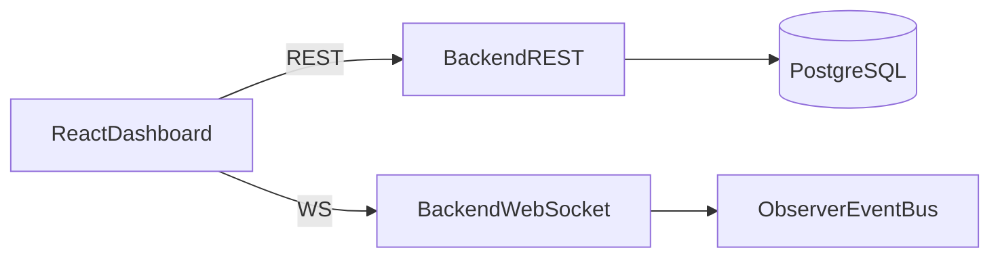

# Phase 13 — Dashboard polish (Guided check) *(Optional enrichment)*

Complete the [requirements](requirements.md) first. Use this document if you are stuck or to check shapes and queries. Snippets are **not** a complete solution.

> **Optional enrichment** — Not required for course completion. Complete Phases 1–12 first.

This phase is **not** a GoF pattern lab.

---

## Connection graph



---

## API for charts

If missing, add:

`GET /api/sensors/{id}/readings?from=<iso>&to=<iso>`

Response: array of `{ value, unit, recorded_at }` oldest-to-newest (or document sort). Use this — not a hardcoded array — in the chart.

Optional: `alembic revision --autogenerate -m "readings_chart_index"` only if you add a new index.

---

## Tokens (example direction)

In `index.css` `@theme` or a small set of repeated utilities:

- ok: emerald
- warn: amber
- error: red
- cards: `rounded-xl border border-slate-200 bg-white shadow-sm`

Do not paste a full design system file; match Phases 1–3.

---

## Chart check

Pick one moisture `device_id` from the dashboard. Call the range endpoint. Plot `recorded_at` vs `value`. Empty → message “No readings in this range”.

---

## Alerts

Filter control: `status=active` vs omit/all. PATCH body example:

```json
{ "status": "resolved" }
```

---

## WS backoff (sketch)

```typescript
let attempt = 0;
function connect() {
  const ws = new WebSocket(url);
  ws.onclose = () => {
    const delay = Math.min(1000 * 2 ** attempt, 15000);
    attempt += 1;
    setTimeout(connect, delay);
  };
  ws.onopen = () => { attempt = 0; };
}
```

Header must reflect connected vs down.

---

## Confirm dialog

Pump **start** (not necessarily stop): `window.confirm` is acceptable; a Tailwind modal is better.

---

## Non-goals

- Auth/roles
- Visual rule editor

---

## Optional next step

→ [Phase 14 — Tests, docs, demo (optional)](../phase-14/requirements.md) · [guided check](../phase-14/guided-check.md)

Return to the phase index: [`docs/phases/README.md`](../README.md)
